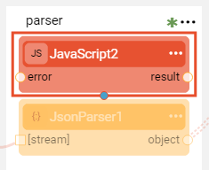
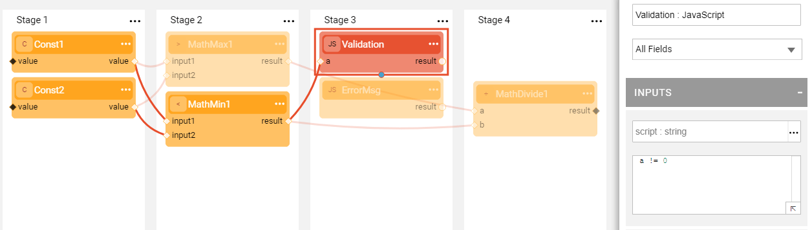
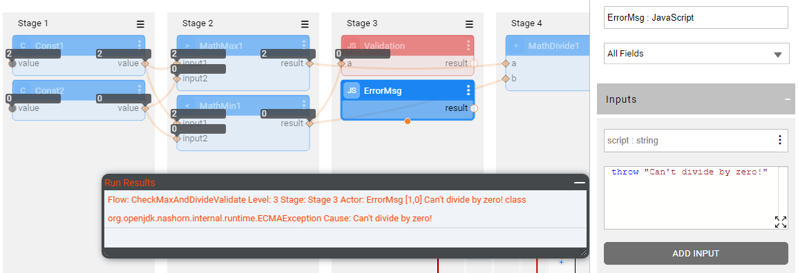
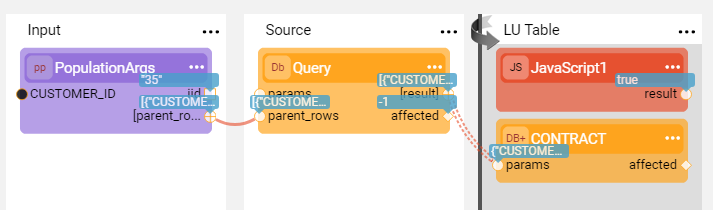
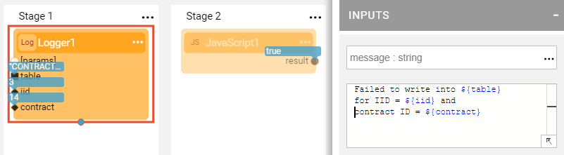
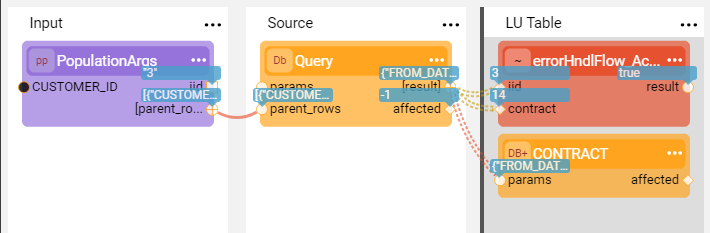
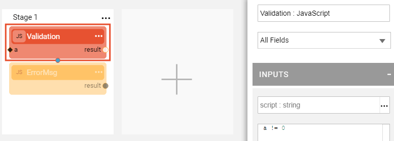
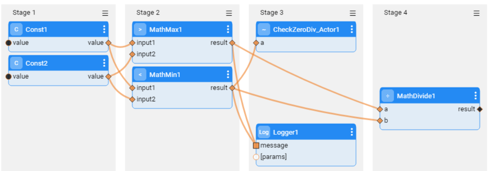
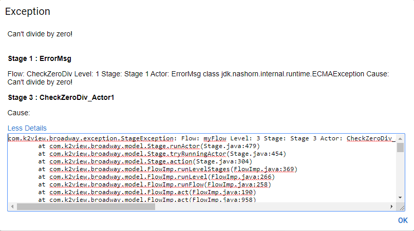

#  Error Handling

Broadway has a built-in error handling mechanism that handles exceptions in a flow using **error handlers**. 

An error handler can be assigned to each flow's [Stage](19_broadway_flow_stages.md)  to catch its exceptions and to decide whether to continue or to stop the flow. An error handler is defined using a Broadway [Actor](03_broadway_actor.md). Any Actor or an [Inner flow](22_broadway_flow_inner_flows.md) can act as an error handler. If the selected error handler is a [**JavaScript** Actor](actors/01_javascript_actor.md), custom logic can be included in the **script's** input parameter. 

Broadway provides two dedicated Actors that enable configuring different types of behavior depending on the exception type. These Actors are **ErrorHandler** and **ErrorFields**. To learn more about them, refer to the [Error Handling Actors](actors/06_error_handling_actors.md) article.

Error handling in Broadway is similar to the **Java try and catch** mechanism and works as follows:

* If an exception is thrown during the execution of a Stage, an error handler is triggered.
* The error handler catches the exception.
* The Actor's logic is then validated by the error handler: 
  * When an error handler returns true, the flow continues.
  * When an error handler returns false, the flow stops.

To analyze the exception, Broadway exposes the **error** object with the following properties:

~~~javascript
error.message
error.actor
error.stage
error.className
error.rootClassName
~~~

An [Inner flow](22_broadway_flow_inner_flows.md) can be used as a powerful error handler since it can include complex logic as part of the error handling process. The **error** object can be passed to the inner flow for analysis and further handling, for example, writing an error message into the DB.

It is recommended to use inner flows as error handlers when the same error validation is required in several flows or in several Stages of a flow.

### How Do I Add an Error Handler to a Stage?

Click  > **Error Handler** in the [Stage context menu](18_broadway_flow_window.md#stage-context-menu) to [add an Actor to the Stage](03_broadway_actor.md#how-do-i-add-actor-to-stage). The added Actor has a red background to indicate that it is an error handler.

**Example 1 - Using an Error Handler in a Flow** 

1. Create a flow which divides a higher number by a lower number. Before the division in Stage 4, using the **Validation** error handler in Stage 3 of the flow, check that the lower number does not equal zero. 

   

3. If the lower number equals zero, throw an error using the **ErrorMsg** **JavaScript** Actor. Stage 4 is not executed since the error handler stops the flow's execution. 

   

**Example 2 - Catching an Exception using an Error Handler**

1. Create a flow that inserts an entry into the target DB using the **DbLoad** Actor. If the same data already exists in the target table, the flow should continue without a failure.

2. To catch the DB exception, add the **DbExeptionCheck** error handler using the **JavaScript** Actor to the **LU Table** Stage as follows:

   

3. The following validation is performed by the **JavaScript** error handler:

   ~~~javascript
   if (error.rootClassName == "SQLiteException") {
       print("The entry already exists! Continue...");
       true;
   }
   else
       false;
   ~~~

4. When the **DbLoad** Actor attempts to insert the data that already exists in the table, the *SQLiteException* is thrown, the error handler catches it and returns **true** to continue the flow.

**Example 3 - Catching an Exception using an Error Handler Implemented by an Inner Flow**

The following is an example of error handling using an inner flow as an error handler. Use the flow created in Example 2 and replace the **JavaScript** error handler with the **Inner Flow** error handler. 

The flow inserts an entry into the target DB using the **DbLoad** Actor. If the same data exists in the target table, the error handler is triggered by the SQLite exception and performs the inner flow logic - print a message into the log and continue without a failure.

1. Create an inner flow as follows:
   -  Stage 1, add the **Logger** Actor to print the message into the log file.
   -  Stage 2, add the **JavaScript** Actor to return **true** to prevent failure in the main flow. Note that the **result** output argument should be set as **External**. 

2. Set the **message** input argument of the **Logger** Actor to **Const** and write the following in it:

   ~~~
   Failed to write into ${table} 
   for IID = ${iid} and 
   contract ID = ${contract}
   ~~~

3. The **Logger** Actor receives the table name, IID and contract ID input arguments. Set the arguments to **External** population type.

4. Add an **error** input argument to the  **JavaScript** Actor and set it to **External**. Using the **error** object, analyze the error and handle it as needed.

   

5. [Save the flow as an Actor](22_broadway_flow_inner_flows.md#save-as-actor) named **errorHndlFlow_Actor**. 

6. Use the flow in Example 2 as the main flow. Modify it to use an **errorHndlFlow_Actor** as an error handler in the LU Table Stage. 

   

7. When the **DbLoad** Actor attempts to insert data that already exists in the table, an *SQLiteException* is thrown and the error handler catches and executes an inner flow which returns **true** to continue the flow.

**Example 4 - Handling an Error Using in an Inner Flow**

1. Create a simple flow that performs a validation and throws an error. For example, check that the input number is not zero and if it is, throw an exception. 

   - Throw an exception using a **JavaScript** Actor: *throw "Can't divide by zero!"*.
   - Validate the input using a **JavaScript** error handler which checks: *a != 0*.

   

2. Save the flow as **CheckZeroDiv** and then [save the flow as an Actor](22_broadway_flow_inner_flows.md#save-as-actor) named **CheckZeroDiv_Actor**.

3. Create another flow that requires the validation of a zero division. Name it **myFlow** and then add a new **CheckZeroDiv_Actor** to it as an inner flow. If during the flow's execution the error occurs (min number = 0), the exception is thrown and the flow stops.

   

   The exception displays a message that identifies the flow and the Stage where the error occurred. If the error occurred in the inner flow, it also displays the name and the Stage of the inner flow.

   In the example below, the following information is displayed in the error message:

   **Flow**: myFlow **Level**: 3 Stage: **Stage 3 Actor**: CheckZeroDiv_Actor1  

   **Cause**:  InnerFlowException: **Flow**: CheckZeroDiv **Level**: 1 Stage: **Stage 1 Actor**: ErrorMsg  class jdk.nashorn.internal.runtime.ECMAException **Cause**: Can't divide by zero!

   

4. Several types of validations can be performed using different inner flows. For example, add a validation that input numbers are not negative and if yes - throw an exception and stop the flow. This check is also implemented by creating another flow, saving it as an Actor and adding it to the current flow.

   

