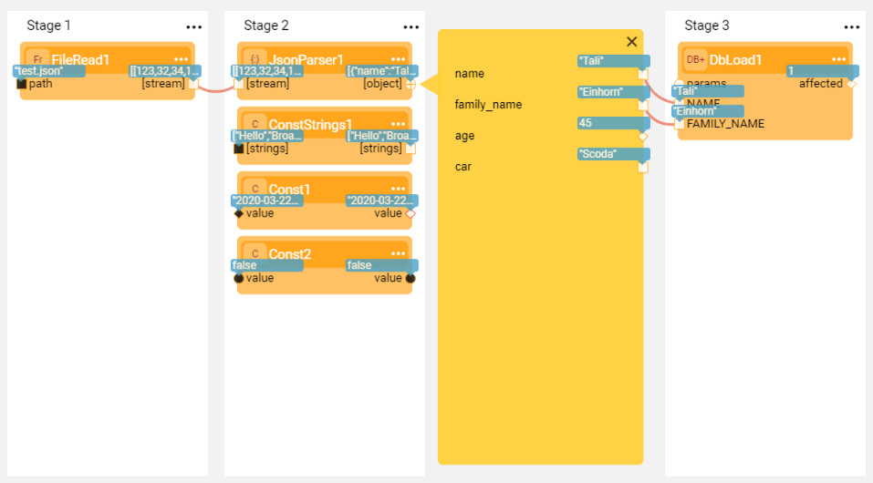

# Run and Debug Broadway Flow

### Setting Run and Debug Arguments

Setting the input arguments types and values is necessary when a flow has arguments with **External** [population type](03_broadway_actor_window.md#input-parameters-properties). Do the following:

1. Click **Actions** > **Debug / Run Arguments** in the [Main menu](18_broadway_flow_window.md#main-menu) toolbar to open a window displaying a list of external input arguments.

2. Select the **Type** of each input argument.

   

3. Set the **value** of each input argument. The value's format is defined by the selected argument type.

   <table>
   <tbody>
   <tr>
   <td>

</td>
   <td>

</td>
   </tr>
   </tbody>
   </table>

4. Click **OK** to save the types and the values.

### Running and Debugging a Broadway Flow

The Broadway flow execution can be performed from the [Main menu](18_broadway_flow_window.md#main-menu) of the flow window by either:

- Running the entire flow and displaying the results.
- Debugging the flow by adding break points. Debug can only be performed when Debug is ON.

Running the flow or debugging it saves a local copy of the flow in the Fabric project. If the changes were done to the flow, they will be automatically saved even if they were not saved explicitly. For example, when a [Tutorial flow](17_tutorial_and_flow_examples.md) is run or debugged, a local copy of the flow is saved in the Fabric project.

To run the flow do either: 

- Click **Run Flow** to run the entire flow and display the results. 
  - If the Debug is ON , the flow can be debugged.
  - If the Debug is OFF , the flow cannot be debugged.
  - If the break points were added to the flow, the flow will stop at the first break point.
  - Clicking **Resume Debug** will resume the flow from the place where it stopped.
- Clicking **Debug Step** to debug the current step and move to the next step.
- Clicking **Stop Run** to stop the flow run.

Note that when Debug is ON, the flow can be debugged when invoked by any Fabric entity and not necessarily by another Broadway flow, for example - when invoked by a Job.

### Displaying Input and Output Data During the Debug

When Debug is ON, the values of input and output arguments of each executed step are displayed in blue balloons.

To view a step's data, click the blue balloon to open the data and its displayed format. To set another data display format, click the format and make your selection.

### Updating a Schema

The Broadway Debug process *learns* the Schema of complex output parameters and can suggest how to update it based on a parameter's value.

When debugging an Actor with a complex output parameter, the parameter port is red:

  

1. Click the **parameter's port** (red) to open the Compare Schema window.

  

2. Click **Update** to update the output parameter's Schema. To open the [Data Inspector](27_broadway_data_inspection.md), click  adjacent to the Actor's output argument. The **yellow segment** is expanded and displays the Schema on the left and the data values on the right.

3. [Link](20_broadway_flow_linking_actors.md) the output parameters of the Schema to another actor.

  

Note:
- To reset an Actor's Schema settings to the Actor original state, click **Actions** > **Reset Parameters Schemas**.  Removing the output Schema of complex types erases the lines originating from the Schema. 

