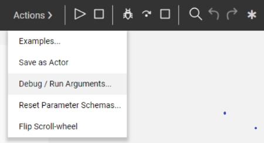
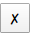
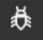
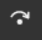

# Broadway Flow Window - Run and Debug Flow

The Broadway flow can be run from the [Main menu](18_broadway_flow_window.md#main-menu) of the flow window by either:
- Clicking **Run Flow** to run the entire flow and display the results.
- Clicking **Debug Play** whereby the flow stops at the first break point and continues when clicking **Debug Step**.

Note that running the flow or debugging it saves a local copy of the flow in the Fabric project. If the changes were done to the flow, they will be automatically saved even if they were not saved explicitly. For example, when a [Tutorial flow](17_tutorial_and_flow_examples.md) is run or debugged, a local copy of the flow is saved in the Fabric project.

The [Main menu](18_broadway_flow_window.md#main-menu) of the Broadway flow is at the top of the window and has the following options:

## Setting Run and Debug Arguments

1. Click **Actions** > **Debug/Run Arguments** to set an external input argument value with an **External** [population type](03_broadway_actor_window.md#input-parameters-properties). A window opens displaying a list of external input arguments.

2. Set the **Type** of the **external** input arguments.

   

   
3. Select the **Type** of each input argument.

   

4. Select the **value** of each input argument. The value's format is defined by the selected type of argument.

   

   

5. Click **OK**.

### Resetting Run/Debug Arguments

Click **Actions** > **Debug/Run Arguments** and then click  adjacent to the argument to redefine its **type** and **value**.

## Running and Stopping a Broadway Flow

Click **Play** or **Stop** to run or stop the Broadway flow.

## Debugging a Broadway Flow

- Click  to run the entire process in Debug mode. The Debug process runs the Broadway flow and stops during Stages with breakpoints. 
To add a breakpoint to a Stage, click **...** in the Stage > Breakpoint.

- Click  to debug the current step and move to the next step.  

- Click **Stop Debug** to stop the debug process.

### Debug: Displaying Input and Output Data

The input and output data of each executed step is displayed and highlighted blue. 
To view a step's data, click the input or output parameter to open the data and its displayed format. To set another data display format, click the format and make your selection.

### Updating a Schema

The Broadway Debug process *learns* the Schema of complex output parameters and can suggest how to update it based on a parameter's value.

When debugging an Actor with a complex output parameter, the parameter port is red:

  

1. Click the **parameter's port** (red) to open the Compare Schema window.

  

2. Click **Update** to update the output parameter's Schema. To open the [Data Inspector](27_broadway_data_inspection.md), click  adjacent to the Actor's output argument. The **yellow segment** is expanded and displays the Schema on the left and the data values on the right.

3. [Link](20_broadway_flow_linking_actors.md) the output parameters of the Schema to another actor.

  

Note:
- To reset an Actor's Schema settings to the Actor original state, click **Actions** > **Reset Parameters Schemas**.  Removing the output Schema of complex types erases the lines originating from the Schema. 

