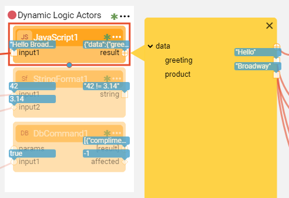
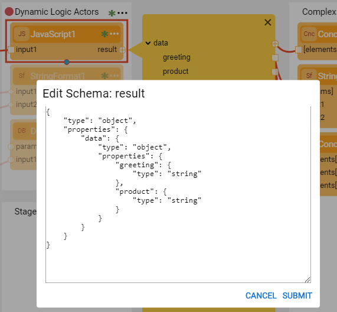

# Broadway Data Inspector

The Broadway **Data Inspector** is used to identify and display complex **Object** data type structures, their Schemas and the values that are transferred between two Stages. 

To open the Data inspector, click  adjacent to the Actor's output argument to expand the **yellow segment** and display the Schema on the left and the data values on the right. To display the data values, [debug the flow](25_broadway_flow_window_run_and_debug_flow.md#debug-broadway-flow). 

### How Do I Edit the Schema Using the Data Inspector?

A Schema can be edited during runtime. To do so, click the yellow segment next to the Schema element which you want to edit to open the context menu. 

<table style="width: 900px;">
<tbody>
<tr>
<td width="200">Link</td>
<td style="width: 465px;">Link the element to a target Actor using the <strong>Field Type Editor</strong>.</td>
</tr>
<tr>
<td width="200">Copy Element</td>
<td style="width: 465px;">Copy a schema element in order to paste it in another Actor’s schema. When an element is complex (it has additional nested levels), the whole complex schema is copied. Paste is available to any Actor in any of the open flows.

 Paste should be performed manually by clicking <strong>Edit Schema</strong> on the required Actor’s argument.

</td>
</tr>
<tr>
<td width="60pxl">Add Child</td>
<td width="430pxl">

Add a child to the selected element using the <strong>Field Type Editor</strong>. The Field Type Editor is available in the <a href="18_broadway_flow_window.md#main-menu">Main menu</a> area and can be used to define the new element's Name and the Type.

Note that the <strong>Add Child</strong> menu item is available in the context menu when clicking on the parent node.

</td>
</tr>
<tr>
<td width="200">Add Sibling</td>
<td style="width: 465px;">

Add a sibling to the selected element using the <strong>Field Type Editor</strong>.

</td>
</tr>
<tr>
<td width="200">Edit</td>
  <td style="width: 465px;">Edit the element's name or type using the <strong>Field Type Editor</strong>.</td>
</tr>
<tr>
<td width="200">Delete</td>
<td style="width: 465px;">Delete the element from the Schema.</td>
</tr>
<tr>
<td width="200">Move Up</td>
<td style="width: 465px;">Move the element up the Schema.</td>
</tr>
<tr>
<td width="200">Move Down</td>
<td style="width: 465px;">Move the element down the Schema.</td>
</tr>
</tbody>
</table>

### How Do I Edit the Schema Using the Editor?

The schema can also be edited using the Schema Editor. To do so, click **Edit Schema** in the output argument's properties to open the **Edit Schema** window. Edit the Schema manually and then click **Submit** to refresh the yellow segment and update the Schema. 

