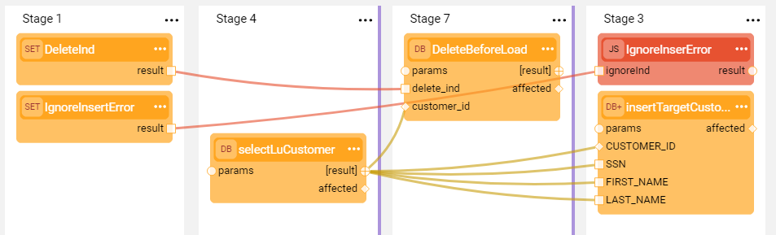
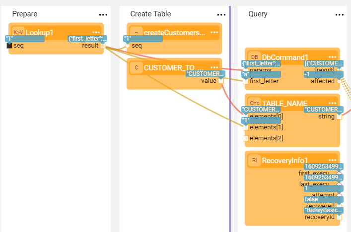

# Recovery Point

### Overview

Broadway flows and jobs can serve complex systems with hundreds of processes for data movement across various systems. For example, populating Logical Units with data from external sources, moving data from Fabric to external systems or consuming messages. If a flow crashes before it reaches the end, the system should enable the recovery mode to avoid re-running a flow from the beginning.  

Setting a **Recovery Point** in a Broadway flow enables marking the Stage where the flow's data is serialized and saved in the Cassandra **broadway_recovery_point** table under the [k2system keyspace](/articles/02_fabric_architecture/06_cassandra_keyspaces_for_fabric.md). If a flow fails, for example, due to outage, the flow can be re-run using the serialized data and start from the last saved recovery point rather than from the beginning. Once the flow is completed, the recovery information is deleted from Cassandra.

The recovery point should be used to save the persistent data in the flow. For example, in a complex flow after completing a sub-process and before starting another. 

Note that setting a recovery point on a Stage with DB result set, on a [transactional Stage](23_transactions.md) or inside an [iteration](21_iterations.md) is not supported. 

### How Do I Set a Recovery Point?

Click > **Recovery Point** in the [Stage context menu](18_broadway_flow_window.md#stage-context-menu) to display  icon. Do the same in additional Stages if more than one recovery point should be set in the same flow. 

**Example**

The following flow prepares the data, creates a table, selects data from a DB and then inserts the data into the created table.

Set the recovery point at the **Simple Method** Stage. If the flow crashes after this Stage, it can be re-run and will start from the **Start Loop** Stage. 

### How Do I Run the Flow with a Recovery Point?

The flow can be executed in one of the following ways:

* By running the flow using a [BROADWAY command](/articles/02_fabric_architecture/04_fabric_commands.md#fabric-broadway).
  
  * When running a Broadway command, it is mandatory to provide a Recovery ID in order to enable the Broadway Recovery mechanism. If the flow crashes, it should be re-run  with the same Recovery ID.
* By running a [Broadway job](/articles/20_jobs_and_batch_services/05_create_a_new_broadway_job.md) using the STARTJOB command. 
  
  * When running a Broadway job, there is no need to provide a Recovery ID since the Recovery mechanism is enabled automatically for the jobs.
* From the Fabric Studio by simulating the flow's crash and stopping Fabric. Do the following:
  * Set a breakpoint in the flow at a Stage after the Recovery Point.
  
  * Click **Actions** > **Run with Recovery Point** in the [Main menu](18_broadway_flow_window.md#main-menu) toolbar.
  
  * When the flow gets to the breakpoint, click **Stop Run** to abort the debug session from the [Main menu](18_broadway_flow_window.md#main-menu) toolbar. 
  
  * Then run the flow again by clicking **Actions** > **Run with Recovery Point** in the [Main menu](18_broadway_flow_window.md#main-menu) toolbar. 
  

The **RecoveryInfo** Actor can be used to receive the recovery information, such as the Recovery ID and the number of attempts to recover. To get the recovery information, place the Actor in a flow after a Recovery Point.

