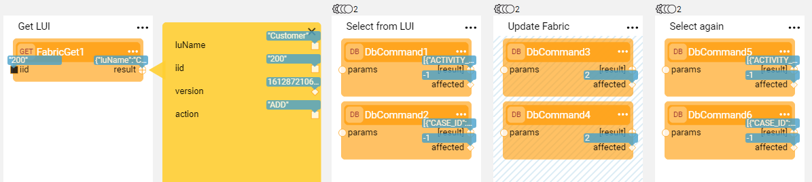
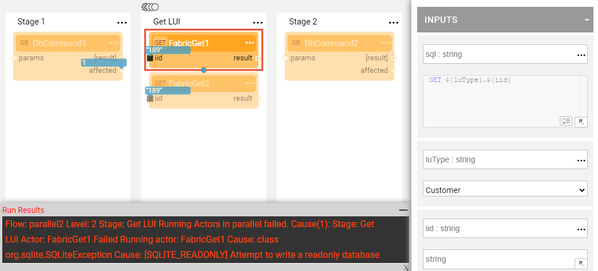

# Support Parallel Execution

Broadway enables running several Actors of the same Stage parallelly.

To define parallel execution, click  in the right corner of the Stage to open the [Stage context menu](18_broadway_flow_window.md#stage-context-menu) and select **Parallel** to populate the number of parallel threads. Once submitted, the orange mark is displayed above the Stage name:

To remove parallel execution, click  > **Parallel** and set the number to zero. 

### Parallel Execution Examples

##### Example 1 - Read from LUI and Write into Target DB

The following example displays a flow with two Inner Flows in Stage 2 that are executed parallelly. Each inner flow in Stage 2 reads data from the LUI and then writes it into the target DB.

##### Example 2 - Read and Update LUI

The following example displays a flow which synchronizes an LUI into Fabric and then reads from two different LU tables and writes into two different LU tables parallelly. 

##### Example 3 - Invalid Usage of Parallel Execution

The following example of performing two GET Instance commands parallelly is invalid. The attempt to execute the flow causes an exception. 

