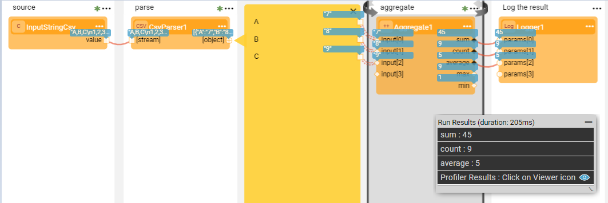
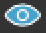
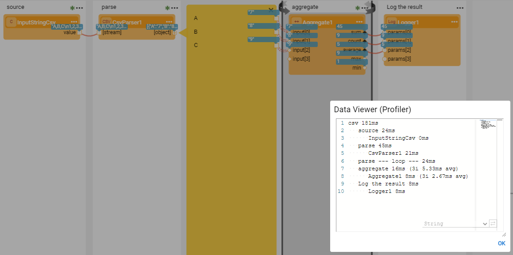

# Broadway Profiler

When running a Broadway flow, the Profiler can be enabled so that a results breakdown per Flow / Stage / Actor / Iteration can be seen. The Profiler is enabled either via the Fabric Studio, or by using the **broadway** command. 

The Profiler provides the metrics per a single flow execution. However, when you need to monitor the behavior across many executions, you can use [JMX Statistics](/articles/34_JMX_statistics/02_JMX_format.md), which also provides performance metrics per Flow / Stage / Actor / Iteration.

[Trace](/articles/29_tracing/01_tracing_overview.md) can also be enabled on Broadway flows and can help to analyze the flow results.

### How Do I Enable the Profiler in the Studio?

1. To enable the Profiler, click **Actions** > **Profiler** in the [Main menu](18_broadway_flow_window.md#main-menu) toolbar and run the flow. 
2. Once the flow is completed, "Profiler Results: Click on the Viewer icon" line is displayed in the [Run Results](18_broadway_flow_window.md#run-results-window) window below the flow results. 

3. Click on the  icon to view the Profiler results:

### How Do I Run the Profiler Via the Broadway Command?

To invoke the Profiler when running the flow using the **broadway** command, set the **profilerTelemetry** argument to **true** . This will add the Profiler results to the command results.

~~~
fabric>broadway CRM.callGraphIt profilerTelemetry=true;
|column           |value                                                       |
+-----------------+------------------------------------------------------------+
|profilerTelemetry|callGraphIt 37ms
   Stage 1 6ms
      Http1 4ms
   Stage 2 18ms
      Http2 18ms|
(1 rows)
~~~

