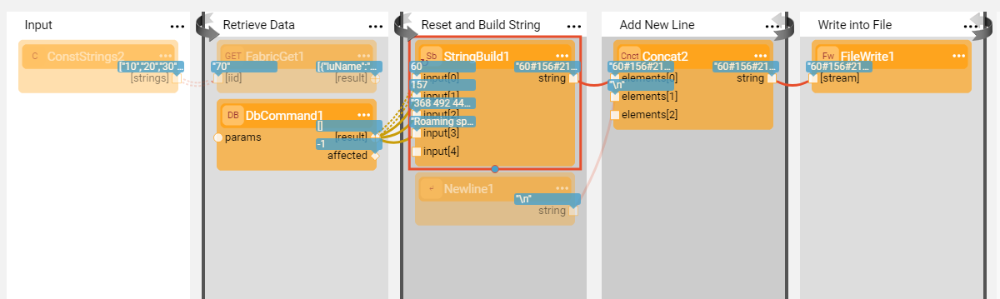
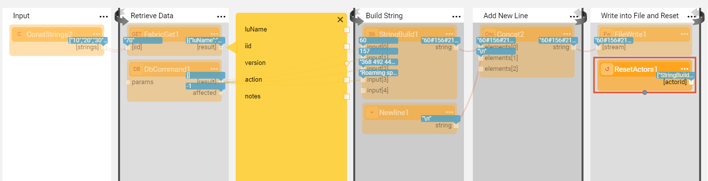

# Reset Actor State

Broadway enables resetting the Actor's state within the flow. This functionality might be needed when your flow has a loop within a loop. For example, let's say you need to aggregate a string across multiple iterations using the **StringBuild** Actor. The aggregation is done in the inner loop and should be reset on each inner loop start.

### How to Reset the Actor State?

The reset can be performed by one of the following options:

1. Click  > **Reset on iteration 0** in the [Actor's context menu](18_broadway_flow_window.md#actor-context-menu) to reset the Actor's state on the inner loop start (zero iteration). 
   - The menu option is visible only when the Actor is inside an internal iteration (level 2 or more).
   - Once the menu option is selected, the  icon will appear on the Actor's badge. Its state is reset during the flow run just before the Actor is executed. 
   - The reset is performed on the Actors that have a state.
2. Use **ResetActors** Actor that receives a list of Actor IDs (names) and resets their state.

**Example of Reset on Iteration Zero** 

**Example Using ResetActors Actor**

