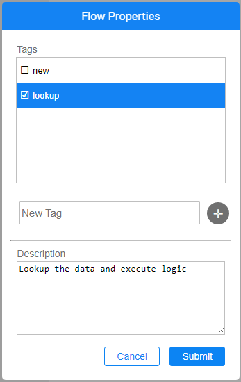

# Flow Properties

The Flow Properties window enables viewing and editing the flow's tags and description. Each flow can have zero, one or multiple tags, as tagging a flow is optional. Setting the flow description is optional as well. 

When the flow is created under a category (i.e., a folder), the category name is set as the default tag.

To view and edit the flow's description and tags, take the following steps:

1. Click **Actions** > **Flow Properties** in the [Main menu](18_broadway_flow_window.md#main-menu) toolbar to open the Flow Properties window. 
    * All existing tags are presented in the Tags list. 
    * The flow's tags are marked. 
2. To add a new tag, assign the new tag name by typing it in the 'New Tag' box and click on the  icon. 
3. To remove an existing tag, unmark it in the Tags list.
4. To update the flow's description, populate the Description area.
5. Click on **Submit**.

Note that both the tags and the description are saved only upon saving of the flow.

 

