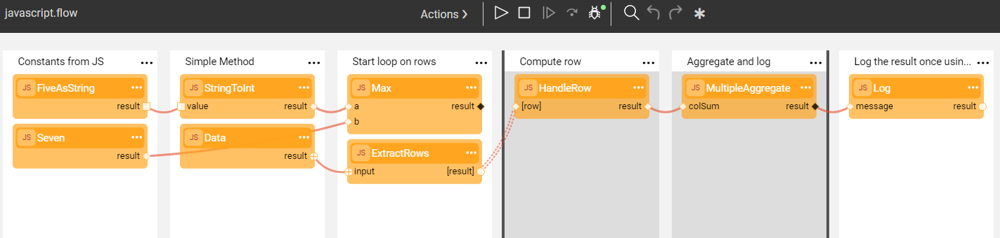
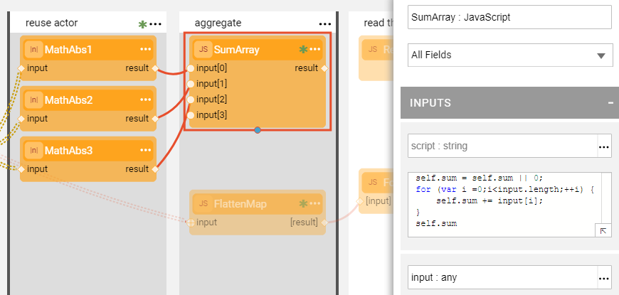

# JavaScript Actor

### JavaScript Actor Overview

The **JavaScript** Actor is an important and useful [built-in Actor type](../04_built_in_actor_types.md) that can be used to simplify a flow by writing JavaScript business logic or validation code in the **script** input parameter.

To improve the usability of an Actor and an entire flow, we recommend writing only short sections of JavaScript code even though an Actor can include any number of  JavaScript rows.  

The **javascript.flow** and **javascript-advanced.flow** examples show various ways to use a **JavaScript** Actor in a flow.

Click **Actions** > **Examples** in the [Main menu](../18_broadway_flow_window.md#main-menu) to open the examples. 




### Special Keywords and Conventions

The Actor's description includes the detailed explanation of the Actor's capabilities. Click  > **Description** in the right corner of the Actor.

- The return value of a **JavaScript** Actor is the last expression in the **script** input parameter. The **return** keyword should not be written in the script whereby the **result** output parameter is used to return the Actor's result. For example, when the following code is written in the **JavaScript** Actor's last line, the value of either **a** or **b** is returned. 

```javascript
  a > b ? a : b
```

- Use the **self** keyword to maintain a state across script executions, such as a loop aggregation. 

```javascript
  self.agg += value 
```

To summarize the values of an array, use the **self** keyword to access the Actor's state. The state is maintained between the executions of the same Actor in the flow. For example, when the **SumArray** Actor is invoked in an [Iteration](../21_iterations.md) in the flow, its JavaScript code is executed across all the Actor's executions.



- To access iteration data, use the **contextLoop** object's methods **contextLoop.index()**, **contextLoop.stop()** or **contextLoop.skip()**. 

  For example, if you need to stop the iteration when a condition is true:

```javascript
  if ( xxx ) {
     contextLoop.stop();
  }
```

- To read data from the flow's arguments, use the **flowArgs** keyword. You can also use **flowArgs** to write data to the flow's context and refer to it in other Actors. The access to **flowArgs** arguments can be done using one of the following syntaxes: 

```javascript
  print(flowArgs.v3); //read the value of argument v3 - Access by name
  flowArgs["v3"] = "Hello"; //write into the argument v3

  for (var i in flowArgs) {  // Enumerate all arguments
     print(flowArgs[i]); //read the value
     flowArgs[i] = null; //remove the value
     flowArgs[i] = "abc"; //write the value
  }

  flowArgs;  // Expose all flow args as Actor result 
```

- To iterate over a collection, use standard syntax: 

```javascript
  rows.forEach(row => {...}) 
```

- The **for...each** syntax is also supported and it enables JavaScript to iterate over an Iterable instance: 

```javascript
  var sum = 0;
  for each (var i in input) {
     sum += Math.abs(i);
  }
  sum;
```

- To write to the log at INFO level, use **print()**. For example:

```javascript
  print("The value of Const1 is: " + Const1.value); 
```

- An error is communicated by throwing an exception. For example: 

```javascript
  throw "Invalid Data Received" 
```

- The **JavaScript** Actor can access the data of previous Actors in the flow. To read data from completed Actors, access their ID as a local variable and read the output ports. For example:

```javascript
  SumArray.result == ForEach.result && ForEach.result == 21 
```

   where the **SumArray** and **ForEach** Actors precede the current Actor in the flow.


[](02_stream_actors.md)
