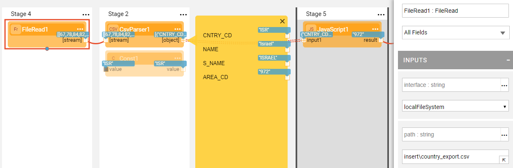
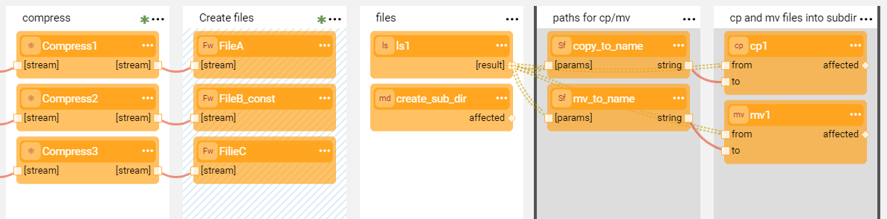

# Stream Actors

Broadway has a **streams** category of Actors that handle streams such as reading from and writing to a file or compressing and decompressing  data.  

For example:
* The **FileRead** Actor reads data from a file in a defined interface and path and returns a collection of blobs. The **path** input argument expects to receive the relative path and filename.
* The **FileWrite** Actor writes the data into a file. 
* The **Http** Actor sends an HTTP request to a Web server.

To prevent memory overload, when Broadways reads from a stream or file, the data is split into blocks of a constant size of 8K. As a result, data can be cut in the middle of an object (e.g. in the middle of a line in the file), whereby the stream must then be handled by a [Parser Actor](03_parsers_actors.md). 

### FileRead Examples

The following example shows a flow where the **FileRead** Actor reads the data from a CSV file followed by the **CsvParser** Actor which parses the data into separate lines.

Since the **FileRead** Actor can only work on one file in the flow at a time, it can be preceded by the file system handling Actors. For example, using the **ls** Actor to list the files in a given directory and iterating over the files using the **FileRead** Actor. 

Another way to handle multiple input files is by creating an [Interface Listener Job](../09_broadway_integration_with_Fabric.md#interface-listener-for-broadway-flows) that listens to the predefined interface and path and invokes the Broadway flow when a file arrives. 

The **file.flow** example shows a flow with various steps that handle streams including compressing data, creating a directory and files, listing the files and moving them between directories.

Click **Actions** > **Examples** in the [Main menu](../18_broadway_flow_window.md#main-menu) to open the **file.flow** example. 

