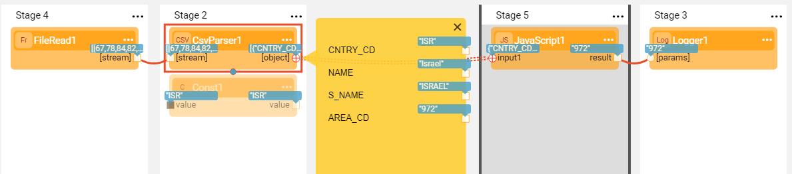

# Parser Actors

Broadway has a **parsers** category of Actors that parse input stream into different formats like JSON, CSV and XML.

When reading input stream, they parse it into valid objects based on the specific delimiters of each input format while holding only one object in the memory at a time.

### JsonParser Actor

The **JsonParser** Actor analyzes input streams, represented by an iterable collection of blobs or strings, and returns a collection of the JSON objects found in the stream. If the **single** input attribute is set to True, the Actor expects only a single object in the input stream. Otherwise, the parser can handle input with multiple JSON objects.


The **json.flow** example shows how the **JsonParser** handles two types of inputs - a single JSON object and one with multiple objects.

Click **Actions** > **Examples** in the [Main menu](../18_broadway_flow_window.md#main-menu) to open the **json.flow** example. 


### CsvParser Actor

The **CsvParser** Actor analyzes an input stream and returns an array of objects whereby each array row is a row of the input CSV stream. The parser runs until it detects the end of the stream.

If the **header** input argument is set to True, the Actor uses the first row as a header row. In this case, the labels in the header are used to mark the row object.

Parsers are usually followed by an iteration that allow iterating over each row in the parser's output object consecutively.

### Parser Flow Example

The following example shows how to read and parse a CSV file which includes a list of countries and their area codes, to find an area code of a specific country provided as external input argument. 



The parser processes the file's rows consecutively by validating the data in Stage 5 using the [**JavaScript** Actor's code](01_javascript_actor.md#special-keywords-and-conventions) via access to the **flowArgs** arguments and the **contextLoop** object. When the required country is found, the iteration stops.

```java
if (input1.SUBSCRIBER_TYPE == flowArgs["input_subs_type"]) {
    contextLoop.stop();
    input1.SUBSCRIBER_DESC;
}
```

### Other Supported Parsers

Additional parsers supported by Broadway are:

* **Base64Decode** / **Base64Encode** Actor, analyzes an input and outputs it as an encoded string or a decoded buffer.
* **FixedColumnParser** Actor, traverses an incoming stream and for each line parses the columns using their fixed position in the line.
* **LinesParser** Actor, traverses an incoming stream and outputs individual lines.
* **XmlParser** Actor, analyzes an input stream and outputs the objects found in the stream.

The Actor's description includes the detailed explanation of the Actor's capabilities. Click  in the right corner of the Actor to open the [Actor's context menu](../18_broadway_flow_window.md#actors-context-menu) and select **Description** to view it.

Checkout **xml.flow** for the **XmlParser** example and **lines.flow** for the **LinesParser** example. To do so, go to **Actions** > **Examples** in the [Main menu](../18_broadway_flow_window.md#main-menu).

[](02_stream_actors.md)[](04_queue_actors.md)

