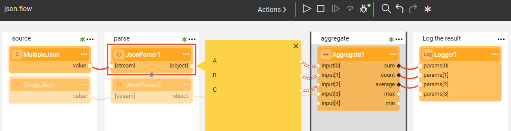

# Parser Actors

Broadway provides a groups of [built-in Actors](../04_built_in_actor_types.md) to parse the input stream provided in various formats: JSON, CSV, XML and more. These Actors belong to a **parsers** category. The Actors read the input stream and parse it into valid objects based on the delimiters specific per each input format, keeping only one object at a time in the memory. Memory consideration should be taken when an individual object is taking much memory. 

### JsonParser Actor

The purpose of this Actor is to analyze an input stream represented by an iterable collection of blobs or strings and to return a collection of JSON objects found in the stream. If the **single** input attribute is set to true, the Actor will expect only a single object in the input stream. Otherwise, the parser can handle an input with multiple JSON objects.

The **json.flow** example shows how **JsonParser** can handle two types of inputs - a single object JSON and a multiple object one.

Click **Actions** > **Examples** in the [Main menu](../18_broadway_flow_window.md#main-menu) to open the **json.flow** example. 

### CsvParser Actor

**CsvParser** Actor analyzes an input stream and returns an array of objects whereby each array row is a row of the input CSV stream. The parser will keep running until the end of the stream is detected.

If the **header** input argument is set to true, the Actor will use the first row as a header row. In this case, the labels in the header are used to mark the row object.

The parsers are usually followed by the iteration, that allow to iterate over the parser's output object row by row.

The following example shows how to read and parse a CSV file which includes a list of countries with their area codes and to find an area code of one specific countries provided as external input argument.

Check out **xml.flow** for **XmlParser** example and **lines.flow** for **LinesParser** example. To do so, go to **Actions** > **Examples** in the [Main menu](../18_broadway_flow_window.md#main-menu).

