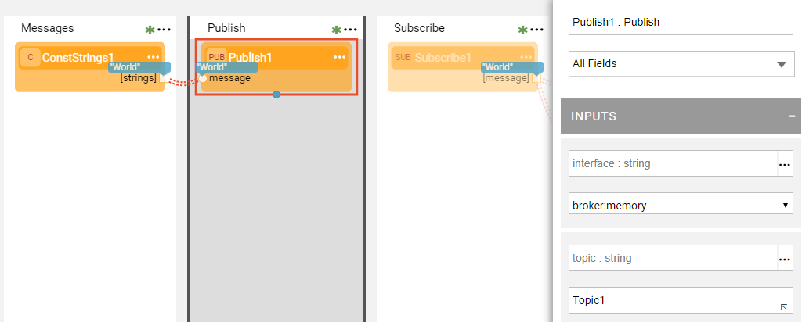
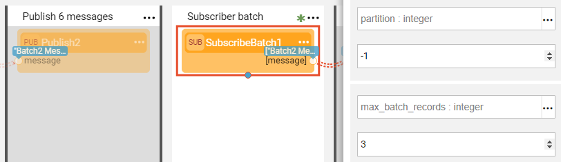
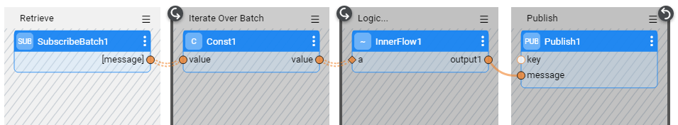
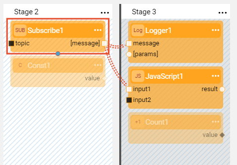

# Pub / Sub Actors

Broadway has a group of [built-in Actors](../04_built_in_actor_types.md) that manage Pub / Sub asynchronous message handling. 
These Actors belong to the **queue** category and they are:

- **Publish** Actor, publishes messages using a message provider.
- **Subscribe** Actor, subscribes to messages provided by a message provider.
- **SubscribeBatch** Actor, subscribes to messages and reads them in batches. 

Message provider types supported in Broadway are:
* Apache Kafka.
* JMS Queue and Topic by any JMS provider (for example, RabbitMQ or Active MQ).
* Broker memory (in-memory queue), a Fabric internal queue without partitions that manages messages using a key.  

### Pub / Sub Input Arguments

The **queue** category Actors enable the Pub / Sub services functionality of the supported message providers, whereby their input arguments correspond to the functionality of these message providers. Some input arguments are relevant only for Kafka and some only for JMS. For example:
-  The **key** input argument of the **Publish** Actor is relevant only for Kafka and is the key commonly used for partitioning. 
-  The **correlation_id** input argument is only used by JMS publishers. This is a unique identifier that correlates the request message and its reply. When left empty, the server generates a reply. 

Publisher and Subscriber applications must be defined in Fabric as an [Interface](/articles/05_DB_interfaces/01_interfaces_overview.md) and then be set in the Actor's **interface** input argument. 

The **topic**, **group_id** and few other input arguments have a default configuration on the interface level, thus they can be left empty in the Actor. However when a value is defined in the Actor, it is used in the flow instead of the value defined in the interface. 

The **Subscribe** Actor should always listen to the same topic. The **Publish** Actor can send messages to different topics thus the **topic** argument of the Actor can be overridden during the flow.
**Subscribe** Actor can listen to multiple topics by using regex in the **topic** argument.

Arguments not supported by the message provider can be left empty and be ignored. For example, the batch size is set by the **max_batch_records** input argument. This parameter is ignored by interfaces that do not support batches (such as JMS) which consider all batches to have a size of 1.

The message type to be processed by the Broadway Pub / Sub functionality must be aligned with the **Data type** defined on the [Interface](/articles/05_DB_interfaces/01_interfaces_overview.md) and is limited to: String, byte[], JSON, long. The message type of an in-memory broker is not limited to any specific types.

Starting from V6.5.1, **transaction_mode** input argument is added to the **Publish** Actor and it determines how the Publisher handles transactions on supported interfaces (currently supported by Kafka interface only). **Async** transaction mode (default) means that messages are sent asynchronously and only on commit Kafka sends an acknowledgement for a success or failure. Note that **Async** transaction mode is applicable only when the **Publish** Actor runs inside the transaction. 

### Timeout Setting

The timeout must be defined for the **Subscribe** Actor to indicate the time to wait for a new message. If the timeout elapses, the collection ends.

The **Subscribe** Actor has two timeout related settings:
* **poll_timeout**, the time to wait for a new message or the first message in a batch. If the timeout elapses, the collection ends. If set to -1, it waits forever.
* **batch_timeout**, the duration the system waits to accumulate messages in a batch. After the first message, the system accumulates additional messages until the batch_timeout is reached or the batch is full (max_batch_records). If the timeout elapses, the system returns a batch with at least one available message and no more than the max_batch_records).

When debugging the flow, the **Subscribe** Actor waits only 1 sec to prevent the [Debug run](../25_broadway_flow_window_run_and_debug_flow.md) from getting stuck.
In a regular run, timeout can be controlled by setting it to the required elapsed time. It can also be set to -1, meaning an infinite wait for messages.

### Acknowledgement in Broadway Pub / Sub

The **Subscribe** Actor sends an acknowledgement to the Pub / Sub service for each message received:
- In a [Transaction](../23_transactions.md), the acknowledgment is performed during the commit. 
- When not in Transaction, the acknowledgement is performed during the next received message. If the server fails after reading the message, the same message is processed again.  

### Pub / Sub Examples 

Check out **message-broker-pubsub.flow** for Pub / Sub examples. To do so, go to **Actions** > **Examples** in the [Main menu](../18_broadway_flow_window.md#main-menu).

The following section of the example flow shows how to publish messages to an in-memory queue using a **Publish** Actor and then reading them from a queue using the **Subscribe** Actor.

To read messages in batches, use the **SubscribeBatch** Actor and set **max_batch_records** to the required batch size.

### Examples of Pub/Sub Processing in Transaction

**Example 1 - Retrieve from DB and Publish to Kafka**

The following example shows a Publish flow which includes a transaction. The performance of such flow is better in a transaction due to **Async** transaction mode because the acknowledgement is performed at commit only.

**Example 2 - Retrieve Data in Batches and Publish to Kafka**

The following example shows a flow where the data is retrieved in batches using the **SubscribeBatch** Actor. The flow iterates over the messages of each batch, performing the required logic and publishing the results using the **Publish** Actor. 

Since the flow includes a transaction and due to **Async** transaction mode, the commit is performed after completing a batch and before moving to another one. This behavior enables a quick processing of messages because the messages are published to Kafka asynchronously and the acknowledgement is performed once for the whole batch, rather than message by message.

**Example 3 - Retrieve Data in Batches and Load to DB**

Similar to the previous example behavior will be when at the end of the flow the messages are loaded to a DB. The commit to the Database is performed once for each batch and before moving to another one.

