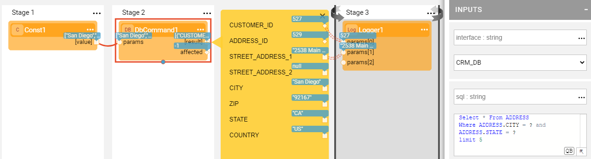
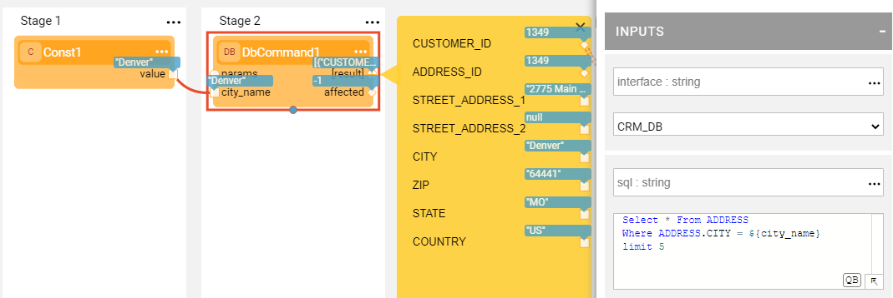

# DB Command Actors 

Broadway has a category of **db** Actors that are useful for performing DB commands and actions like creating a new table, loading data or fetching it and executing other DB commands. These Actors are:
- **DbLoad** Actor, loads data into a database using an INSERT, UPDATE or UPSERT command.
- **DbCommand** Actor, performs database commands on a DB interface. It has two extensions: 
  - **DbFetchField** Actor, returns the first field of the first row or null if this is empty.
  - **DbFetchFirstRow** Actor, returns the first row or an empty row if there is no result.
- **DbCreateTable** Actor, creates a new database table.

Each Actor in the **db** category requires an **interface** input argument that can be defined either as a reference to the Fabric [DB Interface](/articles/05_DB_interfaces/03_DB_interfaces_overview.md) or as a JDBC URL. 

The **schema**, **table**, **fields** and **sql** input arguments of **db** Actors are case-insensitive. 

The SQL statement defined in the Actor's **sql** input argument can contain either ordered parameters using **?** or named parameters using **${}** notation. The values of named parameters are taken from the Actor's input parameters or from the **params** input argument and only if it is a map. For ordered parameters, the **params** input argument should be an array or a single value (not a map).

If the DB command fails, the actual SQL statement is sent to the log file. For example:

~~~
Caused by: java.sql.SQLException: [SQLITE_CONSTRAINT]  Abort due to constraint violation (UNIQUE constraint failed: CONTRACT_COPY.CONTRACT_ID)
INSERT INTO "main"."CONTRACT_COPY" ("CUSTOMER_ID","CONTRACT_ID","CONTRACT_REF_ID") VALUES (?,?,?)
~~~

### How Can I Load the Data?

Data can be loaded into a Broadway flow using either a **DbLoad** Actor or a **DbCommand** Actor.

To load the data, use the **DbLoad** Actor by populating the Actor's input arguments as follows:

* **command**, select INSERT, UPDATE or UPSERT from the dropdown list.
* **schema**, **table**, either type it in or click the **DB** button to select it from the DB Table Selection popup. 
* **fields, keys**, if a table has been selected, the fields and keys are automatically populated from the DB schema. If not, type in the field names.

Note that when performing an UPDATE or an UPSERT command, you can set the **ignoreNull** input argument to true. In this mode, the SQL statement will not contain fields that have null values.

Another way to load the data in a Broadway flow is by using the **DbCommand** Actor and writing the SQL INSERT statement in the **sql** input argument. The values to be populated in the table can be taken from the input arguments using the named parameters. For example:

​	`INSERT INTO DATA (TEXT) VALUES (${text} )`

Where **${text}** is replaced with the value of the **text** input argument in the prepared statement.

### Support for Non-Prepared Statement Parameters 

The DbCommand Actor’s **sql** input argument includes an SQL statement which must be executed by the Actor. The SQL statement can be created dynamically using prepared and non-prepared statement parameters. 

The syntax is:

**${param_value}** - for prepared statement parameters.

**${@param}** - for non-prepared statement parameters.

For example, the SQL statement:

~~~sql
Select * From CASES where STATUS = 'Open'
~~~

Can be written in the following way:

~~~sql
Select * From ${@table} where ${@column} = ${case_sts}
~~~

The values for the **table**, **column** and **case_sts** input arguments are passed to the Actor where they are translated into an SQL statement. When the Actor is called several times, if the resulting SQL is the same as in the previous run, the prepared statement is not recalculated.

### DB Command Examples

### Examples
The **db-commands.flow** example shows how the **DbCommand** Actor can be used to perform various DB actions, including:

* Creating a table using the SQL provided in the **sql** input argument.
* Inserting the data into the table using the **sql** input argument with named parameters marked as **${text}**. The parameter's values are populated from the **params** input argument.
* Selecting the data from the table using the **sql** input argument with an ordered parameter marked as **?**. 

Click **Actions** > **Examples** in the [Main menu](../18_broadway_flow_window.md#main-menu) to open the **db-commands.flow** example. 

**Example of Passing Parameters to SQL**

The following example shows how to execute a SELECT statement which includes a WHERE clause using **ordered params**:

The parameters for the WHERE clause are transferred using the **Const** Actor's [values] object that is connected to the **params** input argument of the **DbCommand** Actor.

~~~javascript
[
  "Denver",
  "CO"
]
~~~

The following example shows how a SELECT statement is executed using **named params**:

When the above query is written in the **sql** input parameter, a new **city_name** input argument is added to the **DbCommand** Actor and the parameter is transferred to it. 

