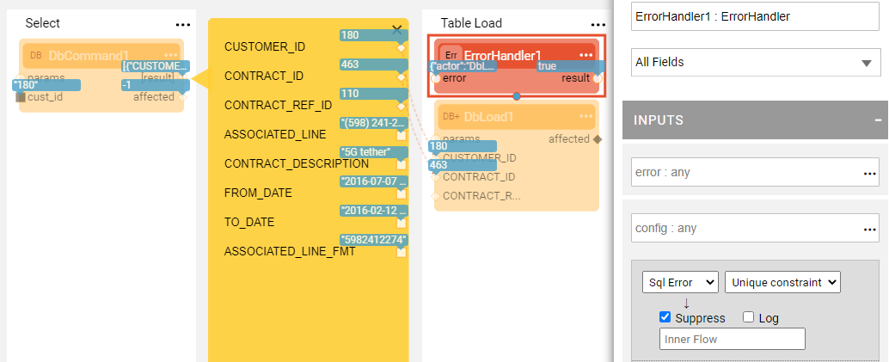
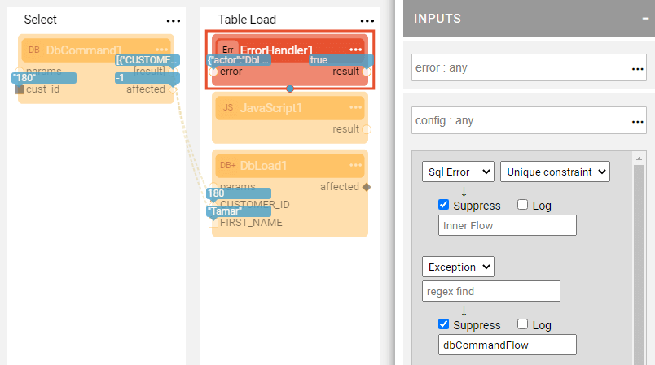
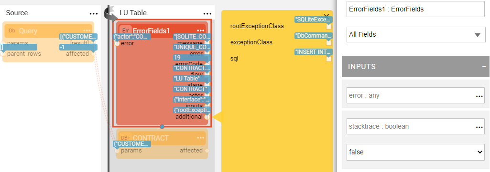
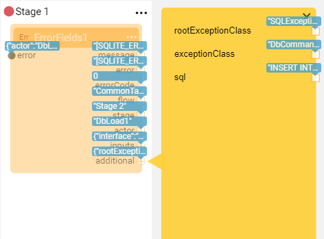

# Error Handling Actors

Broadway has a built-in error handling mechanism that handles exceptions in a flow using **Error Handlers**. An error handler is defined using a Broadway Actor. Any Actor or [Inner flow](/articles/19_Broadway/22_broadway_flow_inner_flows.md) can act as an error handler. 

This article describes the **ErrorHandler** and **ErrorFields** Actors which are dedicated for error handling.

For information about the basic Broadway Error Handling mechanism, refer to [Error Handling](/articles/19_Broadway/24_error_handling.md) article.

### How Do I Use the ErrorHandler Actor?

The **ErrorHandler** Actor can be used as an error handler to enable different handling of various exceptions. It can be configured to suppress one type of exception and not to suppress others, or to invoke an inner flow when an exception is thrown. When the error is suppressed, the **ErrorHandler** returns **true** and the flow continues. When the inner flow is invoked, the **error** object is passed to it and it includes all the exception details, such as the error code and message, the flow, Stage and the Actor where the error occurred.

The exceptions are classified into three types: SQL error, HTTP error and exception. The SQL errors are divided into Unique constraint or other. Note that the Unique constraint exception validation is only done for Oracle, DB2, SQLite and SQL servers. 

The following example shows how an **ErrorHandler** Actor is used as an error handler in the **LU Table** Stage. In the following configuration only **Unique Constraint** SQL errors are caught and suppressed. Any other error causes the flow to fail. 

The following example shows how different types of errors are handled whereby error handling is performed according to the order of the Actor's execution.

* On the **Unique Constraint** SQL error, suppress the exception.
* On any other exception, suppress the exception and invoke the **errorHndlFlow** [Inner Flow](../22_broadway_flow_inner_flows.md) .

### How Do I Use the ErrorFields Actor?

The **ErrorFields** Actor can be used to get detailed information about an exception. The Actor can be used either as an error handler or as a regular Actor in an inner flow to access error information. The **ErrorFields** Actor always suppresses exceptions. 

When the **ErrorFields** Actor is used in an inner flow that is invoked from the **ErrorHandler** Actor, the **error** input argument must be defined as External. Then the error details are automatically passed from the calling flow.

