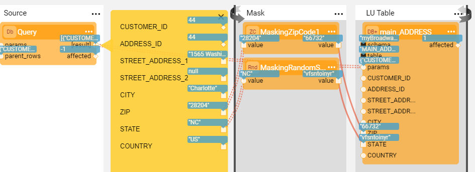
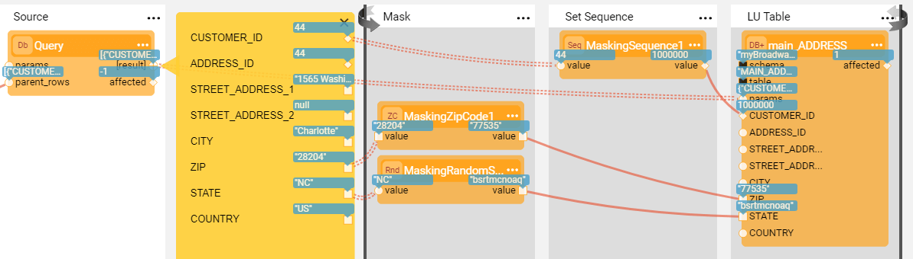

# Masking and Sequence Actors

Data Management Systems like **TDM** often handle sensitive data. To be compliant with Data Protection and Privacy laws, Fabric provides a **masking** category of Actors that can mask sensitive fields like SSN, credit card numbers and email addresses before they are loaded into the target DB.

The masking process contains the generation (manufacturing) of a random synthetic value that replaces the real value, and the caching of the hashed original value and the masked value to keep the referential integrity of the data. Starting from V7.1, Fabric separates data generation (manufacturing) of synthetic data from the hashing and caching capabilities. Broadway provides the following Actors:

1. Various data generation Actors under the **generators** category to generate a random synthetic value. For example: RandomString, RandomNumber, Sequence...
2. **Masking**  - this Actor can wrap any data generation Actor and add the hashing and caching capabilities on top of the data generation Actor.
3. Broadway still keeps the existing masking Actors for backward compatibility reasons. For example, **MaskingSSN** and **MaskingCreditCard**. 

Note that if data need to be masked before they are loaded to Fabric, masking Actors can be used in Broadway population flows.

Another important functionality for systems that need to frequently load data to target DBs is the ability to generate and populate a unique sequence ID: the **MaskingSequence**  and the **Sequence** Actors generate a unique sequence ID based on the provided input arguments.

[Click for more information about the data generation Actors](07a_data_generators_actors.md).

[Click for more information about TDM](/articles/TDM/tdm_overview/01_tdm_overview.md). 

### How Do I Set Masking Input Arguments?

Common input arguments of masking Actors are:

* **maskingId**: a unique masking identifier used to generate a target value. Populated by a String. To use the same masking Actor in different flows of the same project, use this parameter to refer to the same masking cache. By default, the masking's specific ID is used across different DCs.
* **flowName**: the name of the flow or Actor to be execute to obtain the masked value. This parameter has been added to the **Masking** Actor to enable the execution of the data generation flow or Actor to generate the fake value.
  
* **category**, this parameter has been added by Fabric 6.5.3 and indicates when the masking Actor needs to generate a new value. For example, when masking sensitive data or replacing the ID (sequence). The following values can be set in the category:
  
  - **enable_sequences**: generate a new ID value
  - **enable_masking**: mask sensitive data
  - Any custom string value 
  
   By default, the category is set to **enable_masking** on all masking Actors except for the **MaskingSequence** Actor where the category is set by default to **enable_sequences**.
  
   The masking Actor inspects the **value of the session level key, set in the category** (enable_sequences or the enable_masking session for example):
  
   - If the related session level key **is not set**, or is set to **true** - it generates a new value.    
   - Else, if the related session level key is set to **false** - it returns the original value.
  
   Note that TDM implementation sets the **enable_masking** and **enable_sequences** session level keys to either **true** or **false** based on the TDM task's attributes. For example, the **MaskingSequence** Actor generates a new ID value when the task replaces the sequences of the copied entities. Else, the original ID is returned. 
  
* **useEnvironment**, indicates whether to separate the masked value per environment. When set to **true**, it generates a new masked value in each environment. When set to **false**, the same masked value is used across all environments. 
* **useExecutionId**, indicates whether to use the Execution ID during the flow run whereby the Execution ID is a unique string generated each time the flow is run. When set to **true**, it generates a new masked value in each execution. When set to **false**, the same masked value is used across different executions.
* **useInstanceId**, indicates whether to use the Instance ID as part of the masking cache. 
* **hashedInputValue**, indicates whether to store the original or the hashed input value. By default, the hashed value is stored. When set to **false**, it disables caching and stores the original value.
* **interface**, the interface to be used to cache the masked values. This interface might be either any SQL DB interface defined in Fabric or the Fabric server memory. 
  * When the SQL DB interface is set, the **masking_cache** table under the [k2masking keyspace](/articles/02_fabric_architecture/06_cassandra_keyspaces_for_fabric.md) is used to cache the masked values. The data kept in this table reflects the settings of the Actor's input arguments.
  * If the **k2masking** keyspace does not exist, create it using the **masking-create-cache-table.flow** example or using the installation SQL script provided as part of the Masking library. 
  * IN-MEMORY interface is useful for testing only since it can only be used in a single node configuration.
* **verifyUnique**, determines whether different input values can be masked to the same masked value. The uniqueness is checked per **maskingId**, environment and execution ID. Set this parameter to **true** if the masked value should be unique. For example, when masking an SSN, the masked value must be unique.
  * If interface is **IN-MEMORY**, uniqueness is checked on a single node only and not across DC or Cluster.
  * If interface is **NONE**, no uniqueness check is done.

* **onEmpty**, determines what to do with the input value when it is either an empty string or NULL:

  * **LEAVE_EMPTY** - return the input value as is.
  * **MASK_NO_CACHE** - mask an empty value but don't cache it.
  * **MASK_AND_CACHE** - mask an empty value and cache it.

 Note: the **MaskingSequence** has specific arguments. Click [here](08_sequence_implementation_guide.md#sequence-next-value) for more information.

The following input arguments are specific to the **MaskingSequence** Actor:

* **sequenceInterface**, the interface where the sequence is defined with the name stored in the **sequenceId** input argument if set. If the sequenceId is empty, the sequence name is taken from the **maskingId** input argument. The sequence next value implementation method depends on the sequence definition set by the **sequenceInterface** input argument. [Click for more information about Sequence Next Value](08_sequence_implementation_guide.md#sequence-next-value).
* **initialValue** and **increment**, define the initial value of the sequence and the value of the increment. 

### How Do I Mask Data using Masking Actors?

The following example shows how to mask an Address description and ZIP Code using two masking Actors in the population flow. 

The same masking can be implemented in several flows of the same project. For example, if the ZIP Code is populated in several LU tables in Fabric, use the same Actor in the flows and specify the same Masking ID.

### How Do I Use the MaskingSequence Actor?

The purpose of the **MaskingSequence** Actor is to enable the implementation of a sequence's solution when creating Broadway flows that load data into a target DB.

The following example shows how to use a **MaskingSequence** Actor to generate a new sequence for a Customer ID instead of the original one.

[Click for more information about the sequence Actors](08_sequence_implementation_guide.md).

