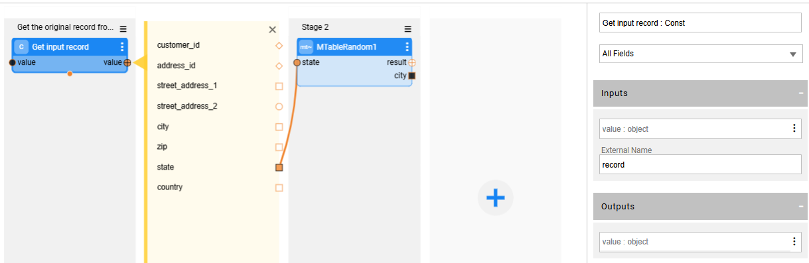
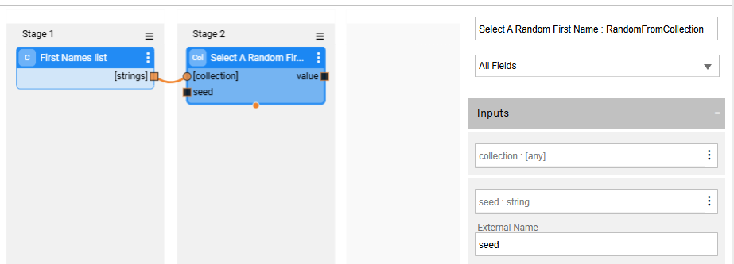

# Data Generation Actors

Starting from V7.1, Fabric separates the data generation of the masked value from the hashing and caching parts. Data generation Actors can be used to either generate synthetic entities (rule-based generation) or mask sensitive data. Broadway provides various built-in data generation Actors (under the **generators** category) - e.g., RandomString, RandomNumber, Sequence - to generate a random synthetic values.

A data generator Actor can be either executed by the Broadway flow ('as is') for generating new data, invoked by the **Masking** Actor for caching the generated data or activated by the [Catalog masking mechanism](/articles/39_fabric_catalog/11_catalog_masking.md). 

## Main Data Generation Actors

### RandomRegexGenerator

This Actor generates a random string that matches the input regular expression.

The **regex** input argument can get any regular expression.

**Examples**:

- Populate the **regex** with [a-z0-9\.]{6,20}@[a-z\.]{4,10}\.(com|net|org) to generate an email address.
- Populate the **regex** with '\w{10}' to generate a random String with 10 characters.
- Populate the **regex** with '\d' to generate a random number.

### RandomDistribution

This Actor generates random values according to input distribution settings. The supported distribution types are **normal**, **uniform**, **weighted** and **constant** (returns one value).

The distribution parameters are set based on the selected distribution type:

- **Normal** distribution (gaussian) works using **mean** and **stddev** (standard deviation), and can be bound by **minimum** and **maximum** values, both inclusive.

- **Uniform** distribution returns a random value between the **minimum** and **maximum** values.

- **Weighted** distribution returns a value from the list, based on the value's weight. For example, 30% of the generated customers are based in Miami, 20% in LA and 50% in NY. Weighted distribution uses a 'weights' map, where the keys are the results and the values are positive numbers indicating the entry's weight as a porportion of the whole list.

  See example:

  

    Fabric 8.1 has added the option to set the values in the list based on a selected [MTable](09_MTable_actors.md). This option is available for a weighted distribution of string values. Do the following in order to define a weighted distribution based on an MTable:
    1. Set the distribution type to **string** with **weighted distribution**.
    2. Then select an MTable and choose one key of the selected MTable to enable the selection of the key's values for the values listed in the weighted distribution.
    3. After selecting the MTable and the key within it, you can populate the Actor's weighted values based on the selected MTable. 

- **Costant** distribution returns the populated constant value. For example: set the number of generated addresses to 1 address per customer.

### RandomFromCollection

This Actor returns a random value from the input collection.

### RandomCreditCard

This Actor generates a fake but valid credit card number based on the input **value** and **prefixLength** input arguments:

-  **value** - defines the credit card template. For example: 4580111122223333. The length of this argument defines the generated credit card number length. Note that if this argument is empty, the generated credit card number contains 16 digits.
-  **prefixLength** - the length of the prefix in an input template.

Example:

- value is 4580111122223333.
- prefixLength is 4.
- The generated credit card number starts with 4580 (the first 4 digits of the template).

### RandomDecimal

This Actor generates a random number in a given range. The precision of the number can be set in the **precision** input argument. Note that a random decimal number can also be generated using the RandomDistribution Actor.

### RandomString

This Actor generates a random String with a specified length. The String's length is set based on the **minLength** and **maxLength** input arguments. Note that a random String can also be generated using the RandomRegexGenerator and RandomDistribution Actors.

### Sequence

This sequence implements a unique sequential number. 

Click [here](08_sequence_implementation_guide.md) for more information about the sequence implementation.

### RandomUUID

This Actor generates a random UUID.

### RowsGenerator

This Actor has been added to support a generation of synthetic data into the LU table and is a framework for generating random rows given a set of parent rows, a distribution and an inner flow. It relies on the inner flow to generate the actual rows data.

This Actor is invoked by the **SourceDbQuery** Actor in the LU population flow. The **SourceDbQuery** Actor checks the ROWS_GENERATOR key:  

- If the ROWS_GENERATOR is **false**, the SourcebQuery runs the SQL query that is set in this Actor to get the data from the source DB. 
- If the ROWS_GENERATOR is **true**, the SourcebQuery runs the **RowsGenerator** Actor to activate the data generator flow and populate the LU table with generated synthetic data. The data generation inner flow is identified by its naming convention: [LU population flow name].generator. For example: the data generation flow of the score LU table is called score.population.generator.flow.

For every parent row, the **RowsGenerator** Actor calls the data generation inner flow a random number of times, according to the given distribution. 

The following values are passed to the inner flow:

- total - the total number of rows for the current parent row.

- count - the current iteration within the current parent row, starting at 0.
- parent_row - the current parent row. 
- parent_rows - the remaining parent rows, including the current parent_row. Reading rows from this container means they will not be available to the actor.

There are several options to develop the inner flow:

- Row by row - the inner flow can return a single row and let the RowsGenerator Actor handle parent rows and number of rows per parent. The flow can return either multiple results that will serve as the row columns or a single result named **result** of a map type. 
- Rows per parent - if the inner flow returns a single result named **result** with a **collection of maps**, the actor will collect them and move to the next parent row.
- Handle all parent rows - a flow can traverse the parent_rows and return a **collection of maps**. The actor will return these rows and will not call the inner flow again.

**Example:**

A customer has 2 activities. The data generation inner flow needs to generate 3 case records for each activity.

**Row by row** mode: the data generation inner flow is called 6 times (2*3) to generate the cases for the customer. It generates one case record on each call.

**Rows per parent** mode: the data generation inner flow is called 2 times (there are 2 parent activities) - each call is set with a different parent activity ID and it generates 3 cases on each call.

**Handle all parent rows** mode: the data generation inner flow is called once for the customer and generates 6 case records (2*3) for the customer: 3 case records for each parent activity ID.

## Customized Data Generators
Defining Broadway flows or Actors for customized data generation logic is possible. 
### Customized Data Generation Flows - Implementation Guidelines
- Set the output generated value to be an external variable. 

- Add an external input named **value** to the data generator. The **value** must be the first input argument in the flow. This is needed since the Masking Actor always sends the input **value** (i.e. the original value) to the data generator. For example, a Masking Actor gets the original full address as an input value and calls a data generator in order to generate a new masked value based on an input State. The address data generator flow needs to get the **value** and **state** as input parameters. The Masking Actor will send both parameters to the data generator.  

- From Fabric 8.2 and onwards, **the catalog masking can send the entire record to the data generator**. The record is sent with the **original values**. This can be beneficial to enable data generation where the generated value of one field can be determined based on other fields within the same record. For example, generating an SSN based on the customer type. 

 - Add an external variable, named **record**, to the flow in order to get the entire record from the Catalog masking.

  Example: The following flow gets the original address record as an input and generates a masked city based on the original state:

  

   

### Customized Data Generators - Supporting [Data Consistency Using Seed](/articles/41_masking/02_data_masking_flow.md#data-consistency-using-seed)

The data generator must support generating a random value from a seed and include the **seed** as **external input parameter** to enable the Data Consistency Using Seed method.

#### Creating new Data Generator Actor

- The new Actor must inherit the **AbstractRandomGeneratorActor** and import the **MaskingRandom** and **broadway.model.Data** classes as well:

  ```java
  import com.k2view.broadway.actors.masking.random.AbstractRandomGeneratorActor;
  import com.k2view.broadway.actors.masking.random.MaskingRandom;
  import com.k2view.broadway.model.Data;

  public class customGeneratorTest extends AbstractRandomGeneratorActor { ...
  ```


- Override the **generate** method in the new Actor:

  ```java
  @Override
  public Object generate(Data input, MaskingRandom maskingRandom) {
  ```

- Add the **seed** as an input parameter to the Actor. The Masking actor sends the seed and original values to the **generate** method in the **Data input** parameter.

- Use the **seed** value taken from the **Data input** parameter to generate the masked value. Example:

  ```java    
  input.string("seed")
  ```

#### Customized Data Generator Flow

- The customized flows support seed-based data consistency by using the built-in product data generator Actors:  set the data generator Actor's input **seed** parameter to be an **external variable**. The following example flow gets a random first name from a Collection. The RandomFromCollection Actor's **seed** input parameter must be set as **external** variable: 

  

- Alternatively, you can implement a **Java function** that generates a deterministic value based on a seed and invoke it from the flow using the **LuFunction** Actor. The function must accept the seed as an input parameter. Configure the seed as an **external** input parameter.

[](07_masking_and_sequence_actors.md)[](08_sequence_implementation_guide.md)


