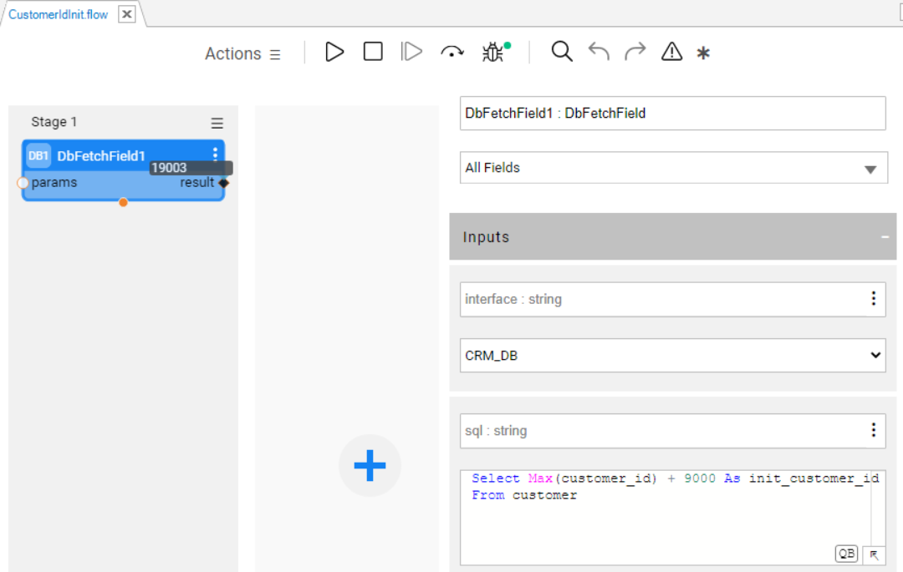
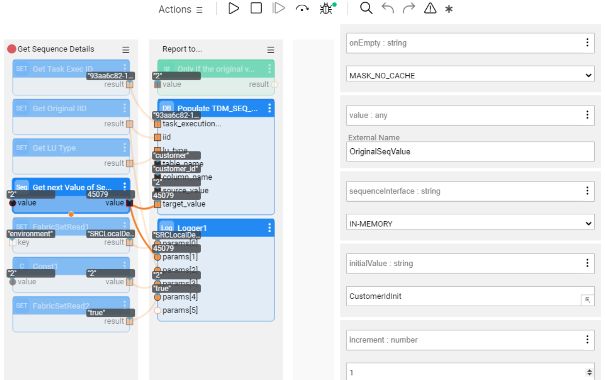
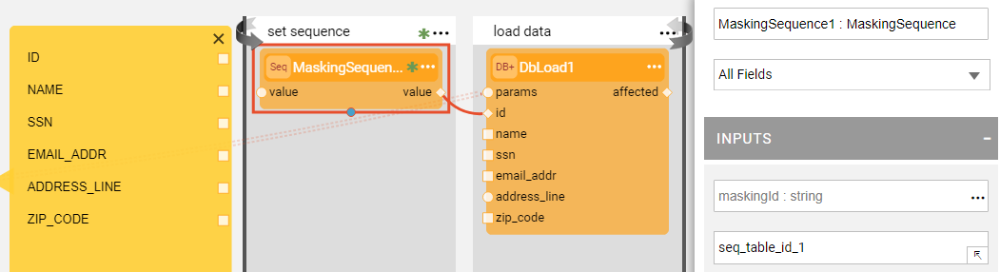
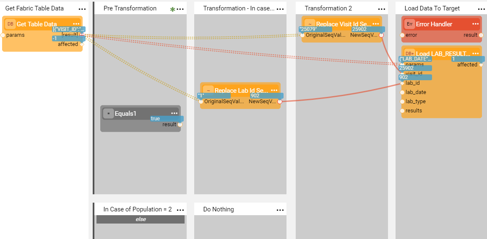

# Sequence Implementation Guide

Broadway enables generating and setting new sequences before loading data into a target database. Various sequence patterns can be implemented via the **Sequence** and **MaskingSequence** Actors and other Broadway features.

This article describes the most useful use cases of sequence implementation by Broadway. 

### Sequence Caching

A common scenario of sequence implementation is when the same sequence needs to be used per entity across several flows during the same execution. In order to use the caching capabilities, use the **MaskingSequence** Actor, or wrap the **Sequence** Actor with the **Masking** Actor. 

The following use cases of sequence caching are supported:

* Using a sequence across several tables of the same LU. For example, Customer ID is a sequential field in the CUSTOMER LU and is populated in several LU tables such as CUSTOMER and SUBSCRIBER. 
* Using a sequence across different LUIs within the same LU. For example, the same ADDRESS ID can be used for different customers during the same execution.
* Using a sequence across different LU types. For example, the same CUSTOMER ID can be used in both a CUSTOMER LU and a Billing LU during the same execution.

To implement the above use cases, set a unique **maskingId** and populate it on either the **MaskingSequence** or the **Masking** Actors, where the same sequence is used. Keep the **useEnvironment** as **true** and the **useExecutionID** as **true** in each Actor's settings in order to generate a new masked value in each execution, in the same environment. Setting these arguments to **false** allows you to use the same masked value across different executions and environments.

### Sequence Next Value

The sequence next value implementation method depends on the sequence definition set by the **sequenceInterface** input argument of the **MaskingSequence** and the **Sequence** Actors. The following use cases are supported:

* IN-MEMORY, useful for testing as it can only be used in a single node configuration.
* Redis or DB sequence. *Getting the next value from the DB sequence* is supported for Oracle, DB2 and PostgreSQL DBs. To implement the DB sequence, set the **sequenceId** input argument to hold the sequence name defined in the **sequenceInterface** DB. If the **sequenceId** is not set, the sequence name would be taken from the **maskingId** input argument. Note that in case the sequence interface is DB, the Actor creates the sequence in the DB if it does not exist (lazy initiation).

### Sequence Initiation Method

Sequence initiation can be performed using the **initialValue** and the **increment** settings of the Actor and is only relevant for in-memory or [Redis interface](/articles/24_non_DB_interfaces/09_redis_interface.md). In a DB sequence, these attributes are managed by the DB. Note that the initial value is cached upon the Actor's first execution. The following use cases are supported:

* Initialize the sequence using the constant initial value, e.g., 1000000.
* Initialize the sequence using another Broadway flow by setting the flow name in the **initialValue** argument. The Actor invokes the flow to calculate the sequence's initial value. Note that the flow must return an external variable, named **initialValue**. View the figures below: 

### Sequence Mapping

In Broadway, sequences can be mapped in a number of ways. The following use cases are supported:

* Map the old value to the new value: send the old ID to the input value parameter of the **Sequence** Actor. 

* When there is no old value to be mapped to, and the target table requires a sequence, leave the input value empty and set the **onEmpty** parameter of the **Sequence** Actor to be MASK_NO_CACHE. The Actor generates a new sequence and returns it in its output, as in the below example: 

  

* Set the sequence as part of the attributes list. An example for an attributes list can be a string that concatenates several pairs of keys and values that include the sequence as one of them. To do so, generate the sequence and then create the concatenated attributes list using the [JavaScript actor](01_javascript_actor.md) or actors belonging to the **strings** category.

* Set the sequence value based on a condition. For example, generate the sequence value only for some entries, based on a given condition. To do so, define a [Stage Condition](../19_broadway_flow_stages.md#what-is-a-stage-condition) in the Broadway flow. The below example shows a replacement of the customer ID with a new sequence, if the customer ID equals to 1. When no condition is given, it maps the original customer ID: 

  

* When parent-child relationships exist across Logical Units, the same sequence can exist in both the parent and children. The updated flow can be executed on the parent LU to add a child sequence. For example, if the Customer LU is a parent while the Order LU is a child. After the population of both the Customer and Order LUs is completed, update the Customer LU with the sequence from the Order LU.

* Store the relationship between the old and the new sequence. To do so, create a flow that stores these values in the Cassandra **TDM_SEQ_MAPPING** table under the [k2masking keyspace](/articles/02_fabric_architecture/06_cassandra_keyspaces_for_fabric.md), for example for reporting purposes. 

* Clone the entities when required. Different sequence values are generated for each cloned entity. This functionality is supported as part of the [TDM7 implementation](/articles/TDM/tdm_implementation/02_tdm_implementation_flow.md). 

#### Custom Sequence Mapping

Create your own function or Broadway flow to generate a new ID using the **MaskingLuFunction** or **MaskingInnerFlow** actors. Set the [category](/articles/19_Broadway/actors/07_masking_and_sequence_actors.md#how-do-i-set-masking-input-arguments) to **enable_sequences** to use the actor for sequence (ID) replacement.

Click for more information about the [custom masking actors](/articles/26_fabric_security/06_data_masking.md#customized-masking-logic).

