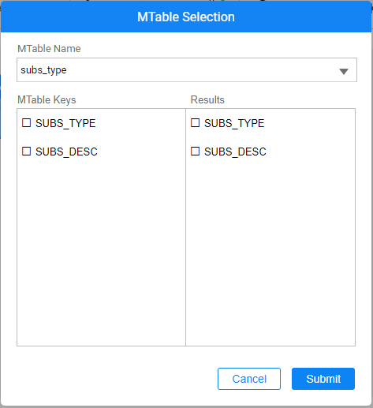

<web>
# MTable Actors

Broadway has a group of Actors that allow working with [MTables](/articles/09_translations/06_mtables_overview.md):

* **MTableLookup** Actor, to fetch data from MTable by the provided key creating indices as needed. If no key is supplied, the entire MTable dataset is returned.
* **MTableRandom** Actor, to fetch data from MTable creating indices as needed and randomly returning one of the rows.
* **MTableLoad** Actor, to create or replace an MTable dataset.

### How Do I Use MTable Actors?

To fetch data from MTable requires to first define the MTable name in the Actor's input. The name can be either set manually or by selecting it from the list using the editor. The MTable editor opens a popup to select an MTable and mark the keys for the lookup:

Once selected, the keys are added to the Actor. Switching the link type of the key from Link (default) to Const allows choosing a valid value from this key, rather than typing it manually. 

</web>
