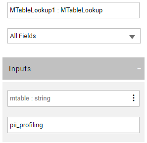
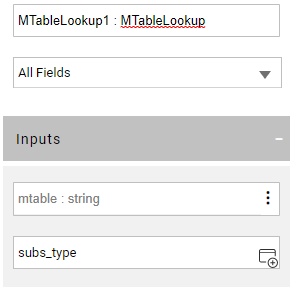
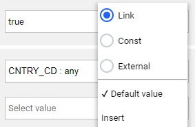

# MTable Actors

Broadway has several Actors that allow working with [MTables](/articles/09_translations/06_mtables_overview.md):

* **MTableLookup** Actor, for fetching data from an MTable by the given key(s). If no keys are supplied, the entire MTable dataset is returned. This Actor returns an array of objects. The search indices are created on-the-fly during the first search. 
* **MTableRandom** Actor, for fetching a random row from an MTable. The random selection can be limited by providing input key(s). This Actor returns one object only. The search indices are created on-the-fly during the first search.
* **MTableLoad** Actor, for either creating a new MTable dataset or replacing an existing one in the Fabric memory. The MTable is then created on one node and must be distributed to other nodes.

### How Do I Use MTable Actors?

**Using MTableLookup and MTableRandom Actors**

**MTableLookup** and **MTableRandom** Actors require an MTable name to perform the data lookup. In addition, a map of keys and their values can be passed at run time, to limit the selection dataset. This is optional. If no keys are supplied, the entire MTable dataset is returned.

The MTable name, keys and the keys' values can be set during the flow design time as follows:

<studio>

1. Start by manually defining the MTable name in the Actor's input:

   

2. Next, if needed - click **Add Input** to add the required keys as input arguments. 

</studio>

<web>

1. Start by defining the MTable name in the Actor's input, either manually or via the editor:

​		

2. The MTable editor popup opens and displays a list of all deployed MTables and the list of keys per each MTable. Select a name from the list and mark the key(s) to be used as a lookup key:

​		

3. Once selected, the keys are added to the Actor as new input arguments. When a key's link type is set to **Const**, the input becomes a list containing this column's distinct values. You can then choose a value, rather than manually type it in. 

​		

4. The same capability of selecting a value from the list is also available when you need to set a **default** value for an MTable key (when it has an **External** or **Link** link type).

   

</web>

**Using MTableLoad Actor**

The purpose of an **MTableLoad** Actor is to dynamically create a new MTable or replace the data of an existing one in the Fabric memory. Note that the MTable is created on one node and must be distributed to other nodes. The Actor is using the **data** input argument to create the MTable object. Optionally, a list of **columns** can be passed to the Actor, if, for example, only a sub-set of columns needs to be used from the given data set or if some columns don't have any data and should be created empty. 

