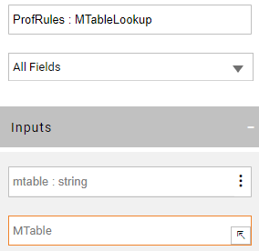

<web>

# MTable Actors

Broadway has a category of Actors that allow working with [MTables](/articles/09_translations/06_mtables_overview.md):

* **MTableLookup** Actor, to fetch data from an MTable by the given key(s). The search indices are created on-the-fly during the first search. If no key(s) are supplied, the entire MTable dataset is returned. This Actor returns an array of objects.
* **MTableRandom** Actor, to fetch a random row from an MTable creating indices as needed. The random selection can be limited by providing input key(s). This Actor returns one object only.
* **MTableLoad** Actor, to either create a new MTable dataset or replace an existing one in Fabric memory.

### How Do I Use MTable Actors?

Each of the above MTable Actors receives an MTable name as input parameter. An MTable name can be passed at run time together with a map of keys & values in order to perform the lookup. Alternatively, the MTable name, keys and the key's valid values can be set during the flow design time using the dedicated editors:

1. Start from defining the MTable name in the Actor's input, either manually or via the editor:

2. The MTable editor opens a popup which displays a list of all deployed MTables and their keys. 
3. Select a name from the list and mark the key(s) to be used as input for the lookup:

4. Once selected, the keys are added to the Actor as new input arguments. Switching the link type of the key from Link (default) to Const allows choosing a value from the list, rather than typing it manually. This list provides a distinct collection of this column's values in the selected MTable:

5. The same ability of selecting from the list is available when a default value should be set for a key (with the link type External or Link).

</web>
