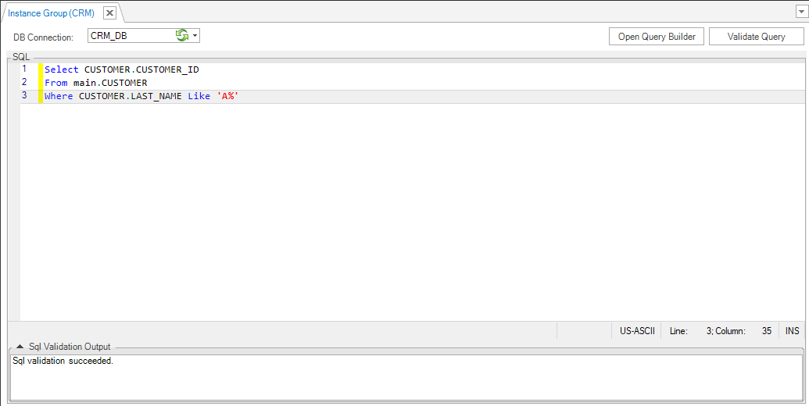
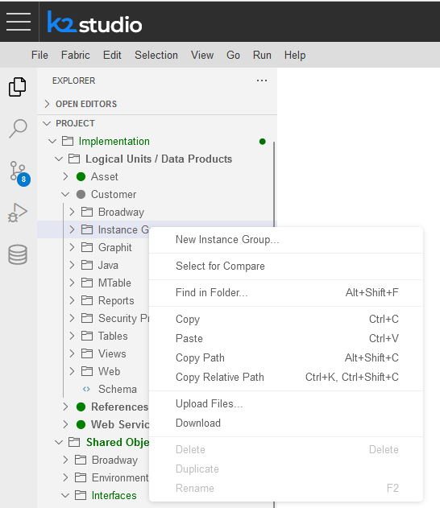
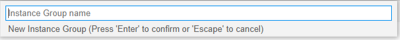
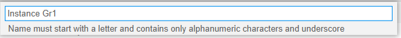

# Instance Groups

## How Do I Create a New Instance Group?

<studio>

1. Go to the **Fabric Studio**, select the **LU** > **Instance Groups** and right click and select **New Instance Group**.
2. Write a valid **SQL query** to select the instances to be included in the Instance Group.
   * The query can be written using the Query Builder by clicking **Open Query Builder**.
3. Validate the query by clicking **Validate Query**.
4. Save the **Instance Group**.



The Instance Group is deployed together with its LU.

</studio>

<web>

1. Go to Project Tree > Implementation > Logical Units / Data Products

   - Choose Logical Units / Data Products by clicking anywhere along the line

   - Choose any one of the available Logical Units / Data Products (recognizable by a green circle on the left of each) by clicking on it

   - Choose/highlight the *Instance Groups* component of the selected Logical Unit / Data Product and right-click on it

   -  Choose/click on *New Instance Group* from the opened context menu (top option, as seen below)

     

   -  A message pops up, asking you to name the new instance group. When done, press **Enter** to confirm or **Escape** to cancel.

      

      Note:

      1. The field is prepopulated with *Instance Group name*, which you should change.

      2. The name should start with a letter and should contain only alphanumeric characters and underscore.

         

      ​

2. Following the new instance group creation, go to DB Instance Group Explorer ( icon on the vertical left panel, as seen below)


</web>

<studio>

## How Do I Invoke an Instance Group from the Batch Command

**Example** 

    BATCH Customer.customer_IG_600To700 FABRIC_COMMAND="sync_instance CUSTOMER.?" with JOB_AFFINITY='10.21.2.102' async='true';

The Instance Group is defined from Fabric Studio - *customer_IG_600To700*

Result:

All instances with ID values between 600 and 700 are synced into Fabric.

```fabric>BATCH Customer.customer_IG_600To700 FABRIC_COMMAND="sync_instance CUSTOMER.?";```

```
|Added|Updated|Unchanged|Failed|Total|Duration|
+-----+-------+---------+------+-----+--------+
|99   |0      |0        |0     |99   |875     |
```


[](/articles/20_jobs_and_batch_services/13_migrate_commands.md)[](/articles/20_jobs_and_batch_services/15_batch_broadway_commands.md)

</studio>

