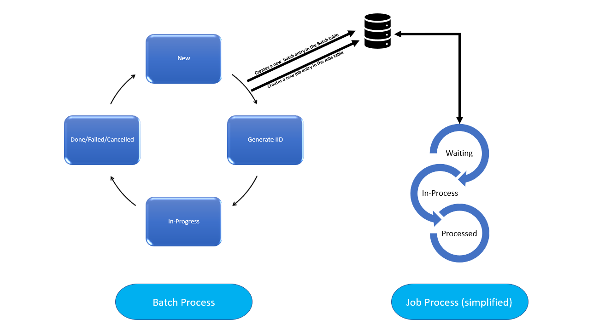
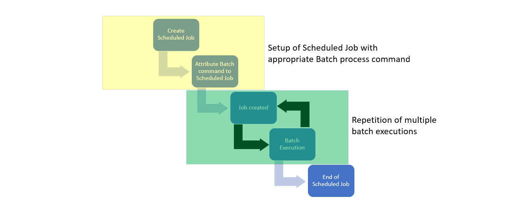
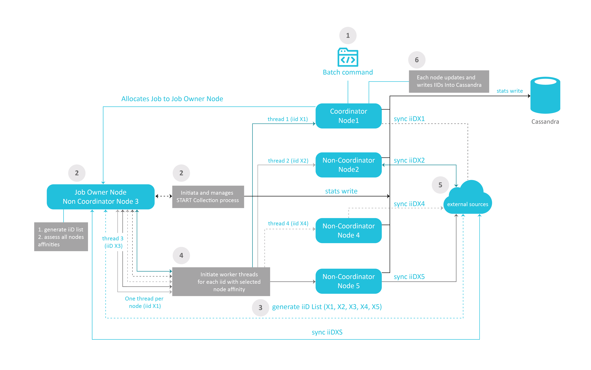

# **Fabric Batch Processes Architecture**

## **Fabric Batch Processes Flow**  

The following activities are automatically triggered when a new Batch process is executed:
-  A new Batch entry is added in Cassandra.
-  A new Job entry is recorded in also the k2system_jobs table with the following parameters:
   
   -  Name = the name of the Batch process.
   -  Type = BATCH PROCESS.
   
-  The WAITING_FOR_JOB status is then assigned to the Batch process.  

After this, any available node, or any node whose affinity has been specified in the Batch command, handles the execution of the Job and of the subcommand as specified in the Batch command.

Once the corresponding Job begins, and is set to an **IN_PROCESS** stage, the Batch process undergoes the following stages:
1. NEW
2. GENERATE_IID
3. IN_PROGRESS
4. FAILED/CANCELLED/PAUSED/DONE


The illustration below shows how, once triggered from the command line, an asynchronous batch process is automatically encapsulated into a Job process. 

The Job Process then launches the batch command which, in turn, is executed through its lifecycle phases. 
 



## **Scheduling Batch Processes**


To schedule that a Batch process be executed either at a given time or recurrently, a scheduled Job process must be created. This can be achieved using a user job, containing the batch command that needs to be repeatedly invoked. 

Basically, this consists in creating a scheduled Job that calls a Batch process - which in turn will create multiple or scheduled one-time Jobs (each one parametered thanks to the execution settings parsed in the Batch command).

The illustration below describes the following steps:

### Step 1 
User defines a job scheduled job to run a specific batch command. 
Fabric assigns a job process for this batch command.

### Step 2 
The dedicated job runs the scheduled or multiple instances of the batch command.
The Batch process triggers a new (temporary) job dedicated for this specific process as described in the [section above](17_batch_process_flow.md#fabric-batch-processes-flow).  
The new job runs the batch command.

### Step 3
The Jobs table is updated for next run and the dedicated job will wait for the next instance of the scheduled batch process.




 

## **Batch Process Table in Cassandra**
All batch-related information is displayed in the **k2batchprocess** keyspace in the **batchprocess_list** table.

### Example 

```cassandra@cqlsh:k2batchprocess> select * from batchprocess_list;```


<table width="900pxl">
<tbody>
<tr>
<td valign="top" width="300pxl">
<p><strong>Field</strong></p>
</td>
<td valign="top" width="400pxl">
<p><strong>Value</strong></p>
</td>
<td valign="top" width="400pxl">
<p><strong>Description</strong></p>
</td>

</tr>
<tr>
<td valign="top" width="300pxl">
<p><strong>bid</strong></p>
</td>
<td valign="top" width="400pxl">
<p>35408af6-b26a-4243-bc95-f114335bfa5e</p>
</td>
<td valign="top" width="400pxl">
<p>Unique ID generated by the system upon batch execution.</p>
</td>
 
 
</tr>
<tr>
<td valign="top" width="300pxl">
<p><strong>creation_time</strong></p>
</td>
<td valign="top" width="400pxl">
<p>2020-08-12 12:20:07.894000+0000</p>
</td>
<td valign="top" width="400pxl">
<p>Timestamp of when the Batch process was created.</p>
</td>
</tr>

<tr>
<td valign="top" width="300pxl">
<p><strong>end_time</strong></p>
</td>
<td valign="top" width="400pxl">
<p>2020-08-12 12:20:09.176000+0000</p>
</td>
<td valign="top" width="400pxl">
<p>Timestamp of when the Batch process ended.</p>
</td>
</tr>

<tr>
<td valign="top" width="300pxl">
<p><strong>lut_name</strong></p>
</td>
<td valign="top" width="400pxl">
<p>AUTODATA_DELTA</p>
</td>
<td valign="top" width="400pxl">
<p>Name of the LUT recieving the instances.</p>
</td>
</tr>


<tr>
<td valign="top" width="300pxl">
<p><strong>start_time</strong></p>
</td>
<td valign="top" width="400pxl">
<p>2020-08-12 12:20:07.907000+0000</p>
</td>
<td valign="top" width="400pxl">
<p>Timestamp of when the Batch process started.</p>
</td>
</tr>


<tr>
<td valign="top" width="300pxl">
<p><strong>status</strong></p>
</td>
<td valign="top" width="400pxl">
<p>Done</p>
</td>
<td valign="top" width="400pxl">
<p>Stage of the Batch process.</p>
</td>
</tr>


<tr>
<td valign="top" width="300pxl">
<p><strong>total_entities</strong></p>
</td>
<td valign="top" width="400pxl">
<p>200</p>
</td>
<td valign="top" width="400pxl">
<p>Number of entities processed.</p>
</td>
</tr>

</tbody>
</table>

Additional fields featuring in the table:

**Command**  

```
BATCH AUTODATA_DELTA FROM idsFile USING ('select id from ids  limit 100') FABRIC_COMMAND="sync_instance AUTODATA_DELTA.?" with JOB_AFFINITY='10.21.2.102' ASYNC='true';
```

In this case the command describes a synchronization process of a list of IDs with affinity set to Node: 10.21.2.102 


**extra_stats**  

This field shows the slowest-processed entities, along with their ID, processing time, status, and fields changes: 

```
{"slowestProcessed":[{"entityId":"4","processTimeMS":572,"status":"COMPLETED","result":"{\"Added\":1,\"Updated\":0,\"Unchanged\":0}"},{"entityId":"5","processTimeMS":573,"status":"COMPLETED","result":"{\"Added\":1,\"Updated\":0,\"Unchanged\":0}"},{"entityId":"47","processTimeMS":645,"status":"COMPLETED","result":"{\"Added\":1,\"Updated\":0,\"Unchanged\":0}"}
```


## **Batch Process Execution & Resiliency**


When executed asynchrounously (*async* flag set to *true*), the batch process inherits from the Jobs ability to transfer the process to a different node when a node is no longer active or no longer responding. 

This handover mechanism uses the [*hearbeats*](09_jobs_configuration.md#heartbeat) and [*keepalive*](09_jobs_configuration.md#keepalive) parameters defined within the node.id file.

The next handling node picks up the batch process (via its associated job) and resumes its execution from the latest known recorded stage.   

Each Fabric node uses its Fabric built-in BatchProcessAPI and [Job Manager](02_jobs_flow_and_status.md#jobs-logic) classes to manage the Batch process through its different lifecycle stages, as defined in the illustrations above.


## **How Does Fabric Handle the Migration Process?**

When a migration process is initiated, it is treated as a batch of multiple entities [synchronization processes](13_migrate_commands.md#migrate-commands).

The illustration below shows the sequence of actions involved in this process.




### Step 1 

- The batch command (or migrate) is executed from a Fabric node. This node (Node 1) will assume the role of Coordinator all along this process. 
- A job process for this batch command is started.


### Step 2

- The node responsible for the overall execution of the migration process is selected in the Fabric cluster as per the nodes allocation rules described in the [Affinity](10_jobs_and_batches_affinity.md#affinity-properties) article. 
- This node (Node 3) is referred to as the Job Owner node.
- The job Owner Node initiates the migration's statistic collection process


### Step 3

- The Job Owner node (Node 3) generates a list of iiDs to migrate from the External Sources systems. In our example, the iiDs are X1, X2, X3, X4, and X5, referred to as iiDX1, iiDX2, iiDX3, iiDX4, iiDX5.


### Step 4

- Node 3 initiates worker threads for each node that will be involved in the migration process. In our example, all 5 nodes are required to contribute, the Job owner node (Node 3), the Coordinator node (Node 1) and the non-coordinator nodes (N2, N4, N5).


### Step 5

- Each node syncs the instances that has been allocated from the External Sources systems.
- N3 collects statistics information on each of the nodes and entity synchronization. The information collected is written onto Cassandra.


### Step 6

- Each node writes iiDs into Cassandra


[](/articles/20_jobs_and_batch_services/16_batch_CDC_commands.md)[](/articles/20_jobs_and_batch_services/18_batch_monitor.md)


