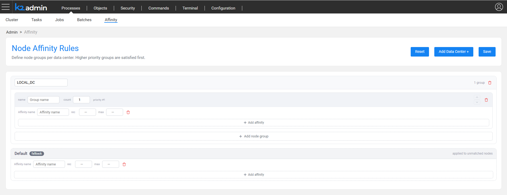

# Affinity Management

## Overview

Affinity Management enables a centralized definition and enforcement of node affinities across a Fabric cluster. Instead of editing the *node.id* file on each node separately, you can define the affinity rules once - per DC or for the entire cluster - and let Fabric distribute and maintain them automatically via a dedicated Affinity Management Job.

For an introduction to the affinity concept and its usage by jobs and batch processes, see the [Job & Batch Processes Affinity](/articles/20_jobs_and_batch_services/10_jobs_and_batches_affinity.md) article.

## Configuration Approaches

Affinity can be configured across a cluster using one of the following approaches:

* **Fully Automatic** - the affinity settings are defined for the whole cluster using the Admin UI, which generates the rules and applies them via the Affinity Management Job.
* **Global Manual** - the cluster affinity rules are set directly using Fabric commands, bypassing the Admin UI. The Affinity Management Job then applies the settings on the cluster nodes.
* **Local Manual** - the global affinity rules are not set at all. Instead, the **SET NODE_AFFINITY** command is executed on each node individually.

## Affinity Types

Affinity Management supports the existing affinity format - ```<name>:<recommended>:<max>``` - as well as the following special affinities:

* **Node ID** - the node's identifier.
* **DC** - the node's data center name.
* **Node group (color)** - a named group of nodes. A node can belong to only one group. Groups have a constant size (rather than a range); the size can change between deploys, except for the default group.
* **IGNORE_AFFINITY_RULES** - a special mark instructing the affinity manager to completely skip this node. Manual **SET NODE_AFFINITY** commands can then be applied on such a node.

### node.id Setting Examples

The below notations are supported in the *node.id* file:

* ```a1:1:2``` - full notation: affinity *a1* with a recommended value of 1 and a maximum of 2.
* ```a2:3``` - short notation, equivalent to ```a2:3:3```.
* ```a3``` - unlimited affinity.
* ```blue``` - a node group (color) name, e.g. group *blue*. A group name is also a valid affinity for jobs. However, recommended or max values cannot be set on a group.
* ```IGNORE_AFFINITY_RULES``` - the node is excluded from the affinity manager's scope.

### Node Groups

There are two types of node groups:

* **Named** - defined per DC. Although the same group name can be used in several DCs, it is not recommended.
* **Default** - a single default group, which is the same for all DCs.

## Global Affinity Rules

The global affinity definition is a JSON object that can be set either manually - using a Fabric command - or via the dedicated Admin UI section. If the JSON object is not set, no affinity management takes place.

The JSON structure is as follows:

* **Key** - a DC name. The rules can also include *future* DC names that are intended to be added later.
* **Value** - a list of node groups (colors). The order of the groups defines their priority - groups listed first are populated with nodes first. Each group includes:
    * **count** - the number of nodes in the group.
    * **affinities** - a list of affinity entries in the ```<affinity> [<recommended> [<max>]]``` format, as defined in the *node.id* file.
* **DEFAULT** - a single default section for the entire cluster, containing only an affinity list.

For example:

```
set_global affinity_rules='{"DC1":{"blue_new":{"count":1,"affinities":[{"affinity":"aff_b_22","recommended":2,"max":3},{"affinity":"Blue_new","recommended":5}]},"green2_11":{"count":1,"affinities":[{"affinity":"gr_11"}]}},"default_group":{"affinities":[{"affinity":"default_1","recommended":1,"max":4}]}}';
```

## Affinity Management Job

The Affinity Management Job applies the global affinity rules on the nodes. One job runs per DC, performing the following steps:

1. Fetch the existing affinity list of each node.
2. Fetch the configured global affinity settings.
3. Take the job's own DC section if it exists; otherwise, use the default section.
4. Skip the nodes marked with ```IGNORE_AFFINITY_RULES```.
5. Run on the nodes per group. For each group in the section (the default section has only one group):
   * Check whether enough nodes exist (not relevant for the default group).
   * Extra nodes are set back to default.
   * When a node is missing in a group, a default node is assigned to this group.
   * When a node belongs to a group that is not defined, it is set back to default.
   * Verify that each node has all the prescribed affinities, and set or update the missing ones.
   * Remove any additional affinity that was defined on the node but is not prescribed by the rules.

On startup, a node uses its existing *node.id* file. The file is updated once the Affinity Management Job runs.

## Admin UI

The Admin UI enables defining the affinity settings across the entire cluster. Note that:

* A confirmation message is displayed when rules are defined for the first time.
* The system can be deactivated via the UI (upon confirmation). Deactivation sets an empty string as a rule.
* Resetting the rules is done by providing the ```@Reset@``` string as an empty rule (see the **set_global reset_affinity_rules** command below).
* A rule can include *future* DC names that are intended to be added later.



## Fabric Commands

The following Fabric commands were added or updated to support Affinity Management.

### Set Global Affinity

Sets the global affinity definition. The command validates the provided rules, sets the definition if valid, and starts one Affinity Management Job per each Fabric DC:

```
set_global affinity_rules='{"DC1":{"blue_new":{"count":1,"affinities":[{"affinity":"aff_b_22","recommended":2,"max":3},{"affinity":"Blue_new","recommended":5}]},"green2_11":{"count":1,"affinities":[{"affinity":"gr_11"}]}},"default_group":{"affinities":[{"affinity":"default_1","recommended":1,"max":4}]}}';
```

When the command is executed with no rules, all jobs are deactivated and an empty rule is written to the global definition. All existing affinity settings are left as is.

To reset the affinity rules, run:

```
set_global reset_affinity_rules;
```

This command writes a special global value (```@Reset@```) as a rule, deletes all affinities from all live nodes and exits.

### Fetch Global Affinity

Presents the currently defined global affinity rules:

```
list affinity_rules;
```

### Set Node Affinity

Sets, updates or deletes affinity rules on the current node (the node defined by the command's connection):

```
SET NODE_AFFINITY "aff1:1:4"    -- Set
SET NODE_AFFINITY "aff1:2:4"    -- Update
SET NODE_AFFINITY "aff1:0:4"    -- Delete
```

### Fetch Current Cluster Status

Describes all the cluster nodes with their detailed affinity list, including the recommended and max values:

```
clusterstatus NODE_AFFINITY_STATUS;
```

### Run Affinity Management Job

Applies the global affinity rules on the current DC:

```
startjob NODE_AFFINITY_COORDINATOR_JOB NAME='affinity3';
```

If no rules are defined, the job does nothing and exits.

Note that usually the job starts automatically upon setting the cluster affinity rules, so there is no need to run it manually.

## Upgrade Flow

Following an upgrade, the new *node.id* file comes empty, although it can include default settings. 

Add the existing job types - such as *iidFinder* - and the existing cluster configuration using the Admin UI or in the other provided ways.

## Limitations

* Jobs for a DC start only when the **set** command runs. Therefore, if a DC was added or removed without running the **set** command - either explicitly or implicitly by changing the cluster settings - the DC jobs are not updated.
* When the count of a prioritized group is increased, nodes that are already assigned to other groups are not reassigned. The group is populated only when nodes are released from other groups or when new nodes are added to the DC.


[](/articles/20_jobs_and_batch_services/18_batch_monitor.md)
