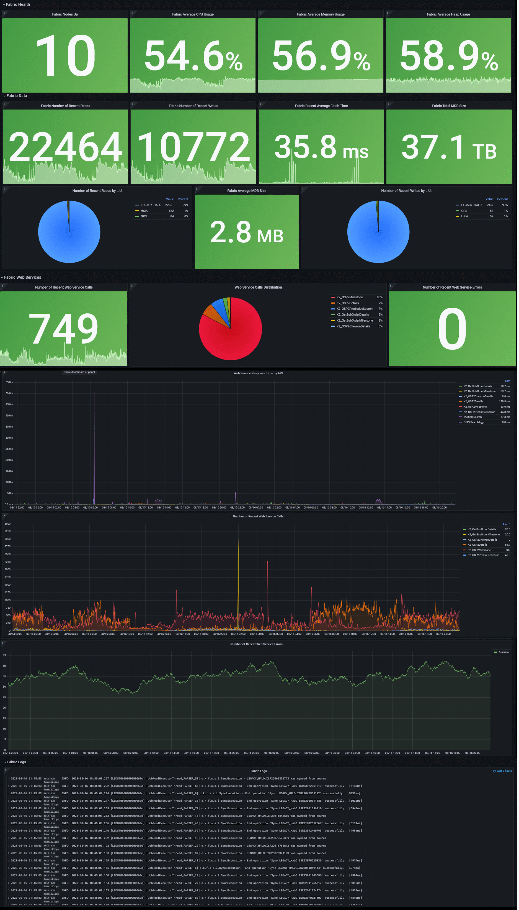

# Monitoring Dashboard Example

Below is a basic example of Grafana dashboard, which can be used as a reference. In addition to changes of these metrics, it is highly recommended to add suitable metrics that can assist your project and business.

The example refers to a case where Fabric/Cassandra/Kafka run on bare metal servers or virtual machines. Cloud/Kubernetes deployment is usually different in the metrics sourcing.

Learn [here](/articles/21_Fabric_troubleshooting/05_monitoring_dashboard_example_setup.md) how the dashboard example is set up.

[Here](/articles/21_Fabric_troubleshooting/resources/grafana_fabric_all_base_reference.json) you can find the dashboard's JSON file, that can be imported into Grafana. Each panel (the basic visualization building block in Grafana) contains, in addition to its data source and query, also its description (which is also shown at Grafana panels' tooltips). 

The dashboard is divided into several parts, with several panels, that show data of the last 5 minutes (which you can edit):

* **Fabric Health**: Nodes Up, Average CPU Usage, Average Memory Usage, Average Heap Usage
* **Fabric Performance**: Reads Count, Writes Count, Average Read Time, Total mDB Size, Average mDB Size, Writes Count by LU, Total API Calls Count, API Calls Distribution, Failed API Calls Count, API Calls, API Calls Avg. Response Time, API Calls Failures
* **Fabric Logs**
* **Cassandra Health** (in this example the system DB is Cassandra): Nodes Up, Average CPU Usage, Average Memory Usage, Average Heap Usage
* **Cassandra Performance**: Disk usage, Pending Top 5 Compactions
* **Cassandra Logs**
* **Kafka Health**: Nodes Up, Average CPU Usage, Average Memory Usage, Average Heap Usage
* **Kafka Performance**: Disk usage, Messages per Topic per Second (to avoid clutter, only topics that receive messages are shown)
* **Kafka Logs**

Below is an illustration of the Fabric parts (names may vary a little than in the export file):

## Variables

At the top of the dashboard resides a variables' panel, which is useful when you wish to change values dynamically. Some are mandatory and prepopulated with some default values and some are optional, and can be used for filtering. For example, in the Environment field  you can mention which environment you wish to track (e.g., pre-production, production, other) and switch between them, on the same dashboard. This is available only if your collected metrics data contains such information, that can be used for filtering metrics. 

You can edit the dashboard content to hide variables (set them as constant/environment variable). This can be done via Grafana UI (Settings > Variables) or in JSON ('templating' section).

