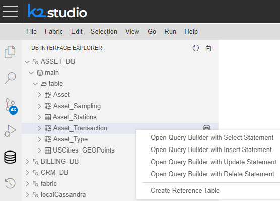
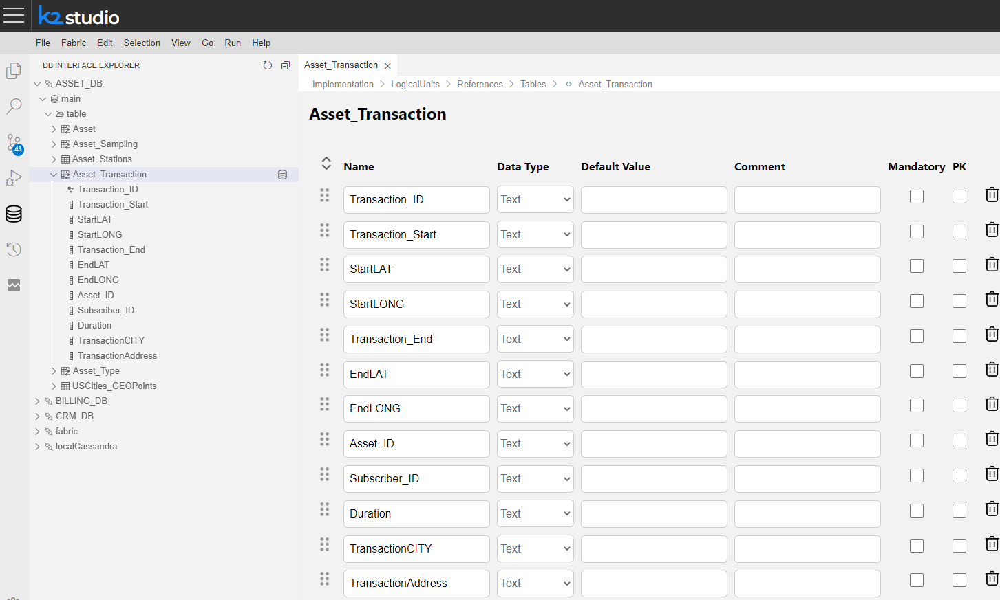
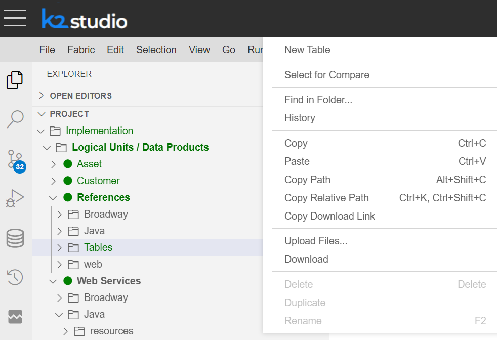
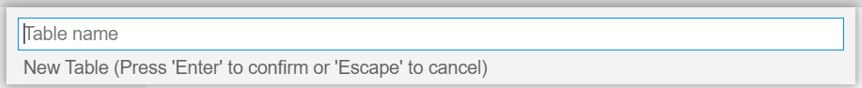
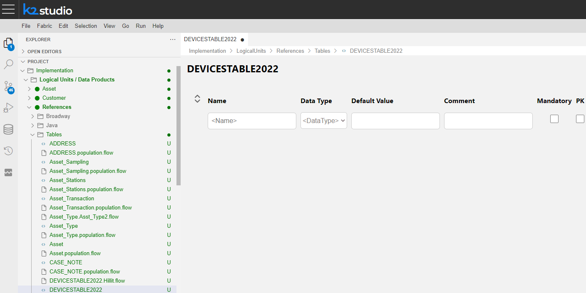

# How to Create a New Reference Table in Fabric Studio

A  Reference table holds information that is common to either all LU instances or to multiple LUs. For optimization reasons, this information is stored in an external table and not in each LUI MicroDB.


## How to Create a New Reference Table in Fabric from an External Source

<studio>

1.  Go to **Project Tree** > **References** , right-click, then select **Create References Based On DB Tables**. This will display the DB Browser menu, Context menu and References popup window. 

2.  Click **DB Connection** (top of the window) and select a data source interface. 

3.  Click **main** to display the Tables directory in the source DB.

4.  Select a **table**. To select multiple tables, press the Ctrl key.

_tables/images/01_create_new_common_tables.PNG)


5. Optional: 

Add a prefix to the Reference table's name in the **Name Prefix** field (window's footer). 
- If there are objects in the project with the same name, add a prefix to differentiate between Reference tables and LU tables with similar names.
- We recommend using a prefix that indicates the project name as a Reference table. 

To populate the Reference Table using a Broadway flow, tick the **Table population based Broadway flow** box.

_tables/images/02a_prefix_and_bdwyFlow_Ref_Table.PNG)

6. Click **Create Tables** to add the new Reference table under References in the Project Tree. 
    If the table does not appear immediately, click _tables/images/03_create_new_common_tables_refreshbutton.PNG) Refresh on the top of the Project Tree.

_tables/images/02_create_new_common_tables_schema.PNG)

</studio>  

<web>

1. Switch to DB Interface Explorer View by clicking on its icon ( ), located on the Activity Bar.

2. Choose the DB Interface and the required table

3. Right-click on the table. A popup window appears. Choose the *Create Reference Table* option as seen below

   

4. An automatically-generated new reference table has been created; as seen below, it is comprised of external data source table.

     > Note: Once the reference table is auto generated, a corresponding population flow is auto generated too. 

      

   

## Manual Creation of a New Reference Table

A new reference table can be created also manually.

1. Go to Project Tree > Implementation > Logical Units / Data Products

   - Choose Logical Units / Data Products by clicking anywhere along the line
   - Choose/click on the *References* logical unit 
   - Choose/highlight the *Tables* folder > right-click on it
   - Choose the *New Table* option from the opened context menu 

     

   - Name the new Table. Press **Enter** to confirm or **Escape** to cancel.

     

     

2. Follow the [instructions](/articles/06_LU_tables/02_create_an_LU_table.md#create-a-new-lu-table-manually) for creating a new table.



3. Save the file

4. Create a corresponding table population. 


</web>


## Editing and Viewing Reference Tables

Reference tables can be edited by either changing the default data mapping, adding transformations or adding or removing columns like in [LU tables](/articles/07_table_population/01_table_population_overview.md). 

When the Broadway flow population option is selected as described above, the table population process can be edited using the Broadway flow described [here](/articles/07_table_population/14_table_population_based_Broadway.md#example-of-creating-a-population-based-broadway-flow).


### How to View Reference Table Data 

To access the Reference Viewer do the following:

<studio>

1.  Go to **Project Tree** > **References**, right-click **References Viewer**, and then select the **table**. The Data Viewer window is displayed according to its hierarchy in the Instances Tree pane.

2.  Click the **data file** to display the components hierarchy in the Instance DB Tree pane.

_tables/images/05_create_new_common_tables_dataviewer.PNG)

2.  Click the **table name** to display the table's data in the main Data Viewer window. 

_tables/images/04_create_new_common_tables_dataviewer.PNG)

</studio>

<web>

To view Reference tables content:

1. Switch to DB Interface Explorer View by clicking on its icon ( ), located on the Activity Bar.
2. Click to open the Query Builder on Fabric 
3. Choose "common" 
4. Choose the required reference table or some of its columns and right-click to add a select statement. Then click on the Execute button to view its content in the results panel.

</web>

### Reference Tables Properties

Properties can be defined in the **Table Properties** panel in the right pane of the selected Table tab. 

<studio>

#### Main Properties

- Name, can be defined or modified.
- Schema, the name of the common DB in which this table will be stored. If left empty, the table will be added to the generic [commonDB schema](/articles/22_reference%28commonDB%29_tables/04_fabric_commonDB_sync.md#overview). In the illustration below the reference table *ref_geoCodeUSA* is attached to the *extraRefDB* schema. 
- Full Text Search 
- Column collation type:
  - BINARY, compares string data regardless of text encoding.
  - NOCASE, folds upper case characters to their lower case equivalents.
  - RTRIM, ignores trailing space characters.

_tables/images/06_create_new_common_tables_properties.PNG)


#### Sync Method

By default, reference tables are synched in the background of each table according to the defined Sync policy. The following Sync options can be selected in the Table Properties panel:

- None, default value, synchronization is according to the Sync policy defined.

- Time Interval, set in ```days.hrs:min:sec``` format.

- Decision function, syncs the table according to the [Decision function](/articles/14_sync_LU_instance/05_sync_decision_functions.md) defined under the **References**  > **Java** folder. 


#### Miscellaneous

The following functions or other tables can be attached to the Reference table:

- [Enrichment Functions](/articles/10_enrichment_function/01_enrichment_function_overview.md) - performs data manipulations on the table's content.
- Other Reference Tables, on which the current Reference table depends (e.g. it needs data from these tables).
- Index Post Sync - determines if an index should be created on a Reference table after data is synced. This capability is relevant for huge reference databases (more than 200M records) and can accelerate the overall data sync time. Added in release 6.5.1.  

</studio>

<web>

#### Query Statements Settings

- Schema, the name of the common DB in which this table will be stored. If left empty, the table will be added to the generic [commonDB schema](/articles/22_reference%28commonDB%29_tables/04_fabric_commonDB_sync.md#overview). In the illustration below the reference table *ref_geoCodeUSA* is attached to the *extraRefDB* schema. 
- Column collation type:
  - BINARY, compares string data regardless of text encoding.
  - NOCASE, folds upper case characters to their lower case equivalents.
  - RTRIM, ignores trailing space characters.
- Full Text Search: When set to True, enables the use of the MATCH SQLite command as part of the WHERE clause of a Select statement that reads data from a Fabric table. Default = False.


#### Sync 

* Sync Wait Timeout: The timeout in seconds for syncing the. This is similar to [schema sync wait timeout](/articles/14_sync_LU_instance/08_sync_timeout.md)

* Sync Method: By default, reference tables are synched in the background of each table according to the defined Sync policy. The following Sync options can be selected in the Table Properties panel:

  - None, default value, synchronization is according to the Sync policy defined.


  - Time Interval, set in ```days.hrs:min:sec``` format.


  - Decision function, syncs the table according to the [Decision function](/articles/14_sync_LU_instance/05_sync_decision_functions.md) defined under the **References**  > **Java** folder. 

* Truncate Before Sync: When Truncate Before Sync = True (checkbox is checked), the entire LU table is truncated before the populations are executed 


#### Miscellaneous

- Required Reference Tables, on which the current Reference table depends (e.g. it needs data from these tables).
- Index Post Sync - determines if an index should be created on a Reference table after data is synced. This capability is relevant for huge reference databases (more than 200M records) and can accelerate the overall data sync time.  

</web>

## Attach the Reference Table to an LU Schema

Before accessing the Reference Table from a specific LU, or before it can be used as a [lookup object](/articles/03_logical_units/15_LU_schema_edit_reference_tab.md#how-do-i-edit-a-reference-tab), it must be attached to the LU.

### Configure LU to Use a Reference Table

1. Open the **LU Schema Window**

2. In the right panel, select the [References](/articles/03_logical_units/15_LU_schema_edit_reference_tab.md) tab.

3. Check the relevant **Reference table(s)** option.

   <studio>

_tables/images/07_create_new_common_tables_LU_Ref.PNG)

</studio>

4. Click **Save** to save the association created between the LU and the Reference Table(s). 

Note: Reference tables can also be accessed via [Lookup tables](/articles/07_table_population/11_lookup_tables.md), [Web Services](/articles/15_web_services_and_graphit/01_web_services_overview.md), [functions](/articles/10_enrichment_function/01_enrichment_function_overview.md), [jobs](/articles/20_jobs_and_batch_services/01_fabric_jobs_overview.md) and [Broadway Actors](/articles/19_Broadway/04_built_in_actor_types.md#db).


## Deploy the Reference Tables

Reference Tables must be deployed before being used. As a result of the deployment, a synchronization [job](/articles/20_jobs_and_batch_services/01_fabric_jobs_overview.md) process is triggered in the background to ensure that all commonDB copies are kept in-sync across the Fabric Cluster.

To deploy the Reference Tables, go to the **Project Tree**, right-click **References**, select **Deploy to Server** and then the **Server** to deploy to the Reference table.

Note:

If the reference table has been attached to an LU Schema as described [above](/articles/22_reference(commonDB)_tables/02_reference_table_fabric_studio.md#configure-lu-to-use-a-reference-table), the LU must also be (re-)deployed.

  

[](/articles/22_reference%28commonDB%29_tables/01_fabric_commonDB_overview.md)

[](/articles/22_reference%28commonDB%29_tables/03_fabric_commonDB_runtime.md)

