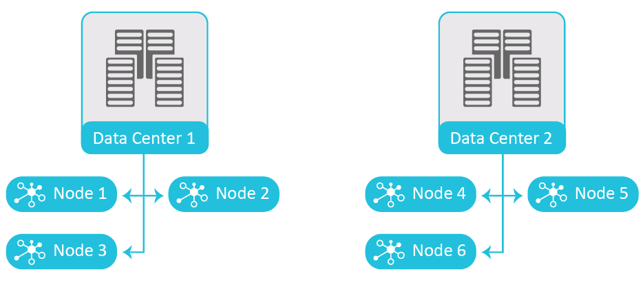

# Fabric Transactions

### Overview

Fabric can update a specific [LU table](/articles/06_LU_tables/01_LU_tables_overview.md) for a given LUI ([Instance ID](/articles/01_fabric_overview/02_fabric_glossary.md#instance-id)) in the Fabric database or an entry in the [Reference table](/articles/22_commonDB/01_fabric_commonDB_overview.md) instead of synchronizing the LUI or the Reference table from the source. 

The update is performed as follows:

* Begin the transaction.
* Run the required INSERT, UPDATE or DELETE command.
* End the transaction by performing a commit or a rollback.

Several INSERT, UPDATE or DELETE commands can be executed on the instance ID in the same transaction.

Note that after the update is completed, the data is only available on the current node. It becomes available to other nodes of the [Fabric Cluster](articles/02_fabric_architecture/01_fabric_architecture_overview.md#61-fabric-cluster) after the distribution process is completed. 

### Update LU Instance

The transaction is performed on an LUI level whereby the **get LUI** must be performed before running the update commands. The **get LUI** can be performed before or after starting the transaction. Note that you cannot get a different LUI until the changes on the current one are committed or rolled back.

For example, when the LU's [Root table](/articles/01_fabric_overview/02_fabric_glossary.md#root-table) is CUSTOMER, you can get CUSTOMER 1 and ADDRESS 100 in one transaction, but are not permitted to get CUSTOMER 1 and CUSTOMER 2 in one transaction.

The LU tables that are populated by the update process must be part of the [LU schema](/articles/03_logical_units/03_LU_schema_window.md) and can be defined either with or without a population. 

Note that it is recommended not to define a population for these tables in order to prevent data conflicts, however the creation of a population for LU tables that will be populated by the update process in not blocked in Fabric. It is the implementation's responsibility to verify that the data, populated during the LUI update, does not conflict or override the changes of the LU table populated during the Sync process.

There is a write lock per LUI during the process. This means that you can begin several transactions on an LUI only if the transactions are open in different nodes. It is not allowed to begin several transactions on the same LUI on the same node. 

### Parallel Transactions

Fabric can be configured as a [cluster](/articles/02_fabric_architecture/01_fabric_architecture_overview.md#61-fabric-cluster) with multiple nodes spread over multiple datacenters and can support parallel transactions on the same LUI. 

The OPTIMISTIC_LOCKING parameter in the **config.ini** can be set per node to support a lightweight transaction as follows:

- **NONE** (default). The latest transaction overrides the LUI (Instance ID).
- **QUORUM**. The first transaction locks the LUI. The latest transaction fails until the first transaction is committed (the commit requires a quorum).
- **LOCAL QUORUM**. The first transaction locks the LUI. The latest transaction fails until the first transaction is committed (the commit requires a local quorum on the DC).

**Example**

Transaction 1 runs on Node 1 (DC1) and Transaction 2 runs on Node 4 (DC2).

* If OPTIMISTIC_LOCKING=‘NONE’, Transaction 2 (the latest one) overrides Transaction 1.

* If OPTIMISTIC_LOCKING=‘QUORUM’, Transaction 1 locks the LUI until the transaction is committed and updates at least 2 nodes of each DC.

* If OPTIMISTIC_LOCKING=‘LOCAL QUORUM', Transaction 1 locks the LUI until the transaction is committed and updates at least 2 nodes of DC1.

### Asynchronous Mode of Update LUI

Fabric supports an asynchronous mode of INSERT, UPDATE or DELETE transactions simulating the **iidFinder** mechanism. 

These transactions can be populated in the iidFinder delta table where the delta table is created under the [Cassandra **k2staging** keyspace](/articles/02_fabric_architecture/06_cassandra_keyspaces_for_fabric.md). The Sync process then triggers the iidFinder to get the transactions from the delta table and updates the LUI.

The asynchronous mode is set using the following command:

~~~
set async_trx=true;
~~~

**Example**

~~~
> set async_trx=true;
> begin;
> get Customer.22;
> insert/update/delete command...
> commit;
~~~

Notes:

* The transaction is added to the delta table as is without any validation.

* The **set async_trx** command must be executed outside the transaction and prior to it.

* The get of the LUI must run inside the transaction.

### Update Reference Tables

Similar to LU tables, a Reference table can be defined with or without a population, and be populated by an update transaction.

The transaction can be done in a synchronous or an asynchronous mode using the following command:

~~~
set common_local_trx=true;
~~~

- When **common_local_trx** is set to **true**, the updated data is available in the session even before the commit and publish to Kafka.

- When **common_local_trx** is set to **false**, the updated data cannot be viewed until a commit is performed and Fabric updates the Common DB. 

The transaction is sent to Kafka and is saved into Kafka or Cassandra, depending on its size. The TRANSACTION_BULK_SIZE parameter in the **config.ini** files defines the maximum number of commands in each bulk.

For example, run 2500 insert commands whereby the TRANSACTION_BULK_SIZE = 1000. 

* Each bulk of 1000 commands is sent to Kafka, the commands are kept in Cassandra, and Kafka gets the transaction ID. 
* The 2500 inserts are divided into 3 transactions (1000 + 1000 + 500).
* Then, run another 900 inserts. The 900 inserts are sent and stored in Kafka.

Parallel transactions are supported on Reference tables as follows:

* The first commit updates the table. The commit is initiated either by:
  * Short transaction - the user runs the commit command.
  * Large transaction - the commit is initiated internally for each bulk size, populated in Cassandra.

The REF_SYNC_WAIT and REF_STATUS commands support transactions on Reference tables. 

When running a DELETE command on a Reference table within the transaction, Fabric creates a snapshot on the common table. Note that you can create a snapshot using the population and REF_SYNC when the population includes a truncate of the table. The sync is a separate transaction.

[Click for more information about the synchronization commands on Reference tables](/articles/22_reference(commonDB)_tables/03_fabric_commonDB_runtime.md#synchronization-commands).

