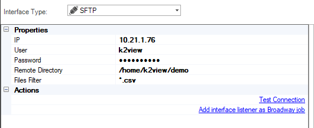

# SFTP Interface And Interface Listeners

The SFTP interface type is used to define the connections between a secured FTP server (a remote server with an SSH connection) and a data stream.

When creating an [Interface Listener for a Broadway flow](/articles/19_Broadway/09_broadway_integration_with_Fabric.md#interface-listener-for-broadway-flows), an SFTP interface is needed to detect new files added to the remote file system.

To create a new SFTP interface, do the following:

1. Go to **Project Tree** > **Shared Objects**, right click **Interfaces**, select **New Interface** and then select **SFTP** from the **Interface Type** dropdown menu to open the **New Interface** window.

   

2. Populate the connection's settings and click **Save**.

### Connection Settings

<table>
<tbody>
<tr>
<td width="300pxl"><strong>Parameter</strong></td>
<td width="600pxl"><strong>Description</strong></td>
</tr>
<tr>
<td><strong>IP</strong></td>
<td>Hostname or IP address of the FTP server.</td>
</tr>
<tr>
<td><strong>Port</strong></td>
<td>Port. Added on release 6.5.3</td>
</tr>
<tr>
<td><strong>User</strong>&nbsp;</td>
<td>Username.</td>
</tr>
<tr>
<td><strong>Password&nbsp;</strong></td>
<td>Password.&nbsp;</td>
</tr>
<tr>
<td><strong>Remote Directory</strong></td>
<td>Directory where the files are stored.</td>
</tr>
<tr>
<td><strong>Files Filter</strong></td>
<td>Regular expression.</td>
</tr>
<tr>
<td><strong>Actions</strong></td>
<td>

Test Connection. Click to test the connection.

Add an Interface Listener as a Broadway job. Click to create an Interface Listener job under the specified Logical Unit.

</td>
</tr>
</tbody>
</table>

### Example of Using an SFTP Interface

To create an [Interface Listener](/articles/19_Broadway/09_broadway_integration_with_Fabric.md#interface-listener-for-broadway-flows) Job that runs on an SFTP interface, do the following: 

1. Create an interface using an **SFTP** interface type.

2. Click the **Add interface listener as Broadway job** link in the Interface window and select the [Logical Unit](/articles/03_logical_units/01_LU_overview.md) from the list to open the Jobs window. 

3. Create a Broadway flow either under Shared Objects or under the same Logical Unit. The flow reads data from a file using the predefined interface and populates it into the DB. 

   

   * Note that the **interface** and the **path** input arguments of the **FileRead** Actor are defined as [External link type](/articles/19_Broadway/03_broadway_actor_window.md#actors-inputs-and-outputs). Their values are passed from the defined interface by the Listener.

4. In the Jobs window, select the **Broadway flow** and **Execution mode** and then save the job.

5. [Deploy the LU](/articles/16_deploy_fabric/02_deploy_from_Fabric_Studio.md) to activate the Listener.

### Using the InterfaceListener Actor 

To create an interface listener job from a broadway flow, simply chose the **interfaceListener** actor from the **Add Actors To Stage menu** in Broadway.

The following parameters are to be filled in the properties tab:

- flowName: name of the flow to be triggered by this actor.
- interfaceName: this is the interface that is being listened and used to trigger the flow defined above, once a new file is detected on the file system to which the interface points to.

Note that both name and UID can either be chosen by the user, attributed automatically by Fabric, or parsed from a previous actor.

- Affinity: this sets which node/DC name IP address is to be used to run the Broadway job.

- Params: This refers to the arguments that can be parsed to the Broadway flow. 
For example, multiple parameters can be parsed as a key/value object from an external link or from a **Constant** or **Javascript** actor.

 
