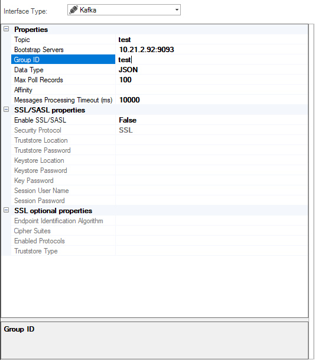
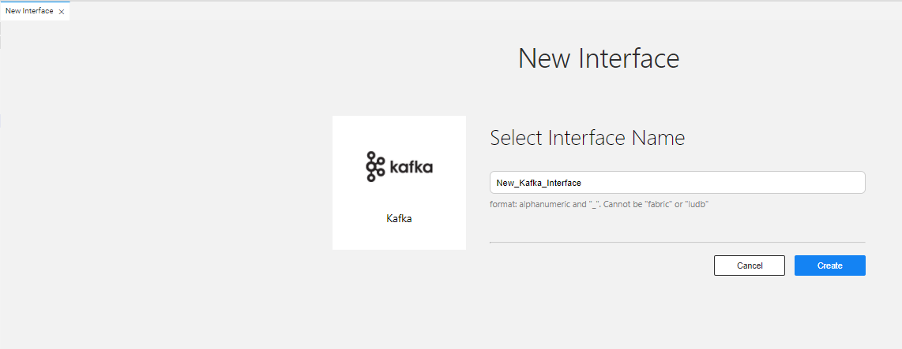
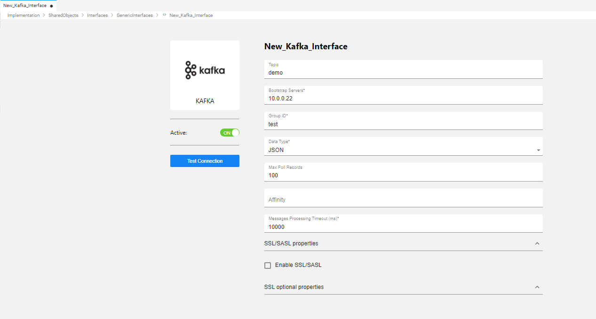
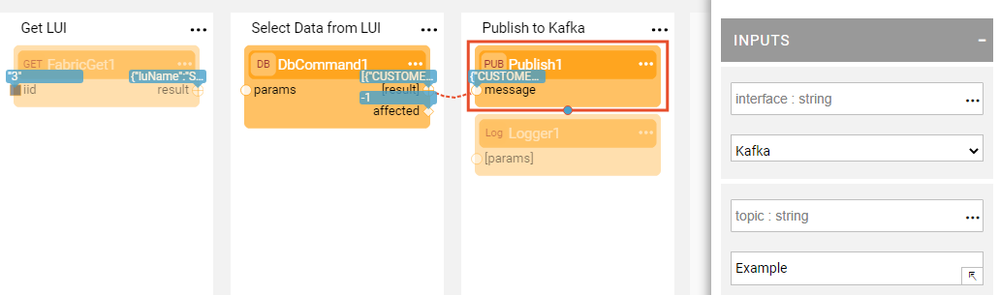

# Kafka Interface

A Kafka interface type defines the connections to Apache Kafka and can be used by the [Broadway Pub / Sub Actors](/articles/19_Broadway/actors/04_queue_actors.md), iidFinder or by [User Jobs](/articles/20_jobs_and_batch_services/01_fabric_jobs_overview.md).

To create a new Kafka interface, do the following:

<studio>

1. Go to **Project Tree** > **Shared Objects**, right click **Interfaces** and select **New Interface**. Then select **Kafka** from the **Interface Type** dropdown menu to open the **New Interface** window.

   

2. Populate the relevant properties and click **Save**.
  

</studio>

<web>

1. Go to **Project Tree** > **Shared Objects**, right click **Interfaces** and select **New Interface**. Then select **Kafka** from the **Event Streaming and Queue** section to open the **New Interface** window.

2. Enter a suitable name for your new SFTP Interface, then click **Create**:
  
   

3. Populate the relevant properties and click **Save**.

   

</web>

### Connection Settings

<table>
<tbody>
<tr>
<td width="300pxl"><strong>Parameter</strong></td>
<td width="600pxl"><strong>Description</strong></td>
</tr>
<tr>
<td><strong>Topic</strong></td>
<td>

Apache Kafka topic name.

Can be overriden by the Broadway Actor's setting.

</td>
</tr>
<tr>
<td><strong>Bootstrap Servers</strong></td>
<td>Server IP.</td>
</tr>
<tr>
<td><strong>Group ID</strong></td>
<td>

Apache Kafka group ID.

Can be overriden by the Broadway Actor's setting.&nbsp;

</td>
</tr>
<tr>
<td><strong>Data Type</strong>&nbsp;</td>
<td>

Supported data types: String, byte[], JSON, long.

The message type to be processed by Broadway Actors must be aligned with the Data type definition.

</td>
</tr>
<tr>
<td><strong>Max Poll Records</strong></td>
<td>
Maximum poll records.

Can be overriden by the Broadway Actor's setting.&nbsp;

</td>
</tr>
<tr>
<td><strong>Affinity</strong></td>
<td>(Optional) Populate this parameter with the IP address of a Fabric node, DC name, or logical identifier for Fabric nodes. Fabric allocates an execution server based on the populated affinity. If the affinity is not populated, Fabric allocates an available server for the execution.

Example of an affinity: &rsquo;10.21.1.169&rsquo;, &lsquo;DC1&rsquo;.

Can be overriden by the User Job's settings.

</td>
</tr>
<tr>
<td><strong>Message Processing Timeout (ms)</strong></td>
<td>(Optional) The timeout to wait for a new message, default is 10,000 ms.

Can be overriden by the Broadway Actor's setting.

</td>
</tr>
<tr>
<td><strong>SSL properties</strong></td>
<td>Mandatory properties if Kafka is defined with SSL (available starting from V6.5.1).</td>
</tr>
<tr>
<td><strong>SSL optional properties</strong></td>
<td>Optional properties if Kafka is defined with SSL.</td>
</tr>
<tr>
<td><strong>SASL properties</strong></td>
<td>Mandatory properties if Kafka is defined with SASL authentication (available starting from V6.5.4).

The following SASL flavors are supported: SASL_PLAIN, SASL_SCRAM, SASL_LDAP, SASL_GSSAPI.

 When SASL_SCRAM is used, you must fill in the Session Hash Policy in addition to the Session User Name & Password. 

</td>
</tr>    
</tbody>
</table>

### Example of Publish to Kafka Broadway Flow

The above Broadway flow uses a **Publish** Actor to publish the data to the predefined Kafka interface. The data is published to the **Example** topic which overrides the topic in the Interface definition.

 
