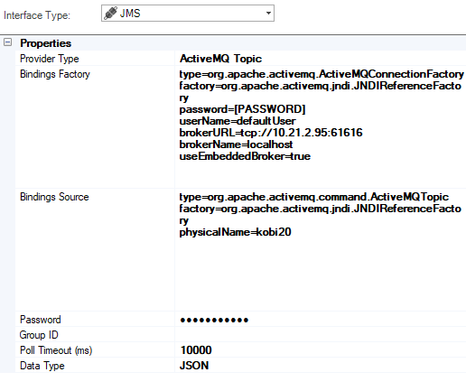
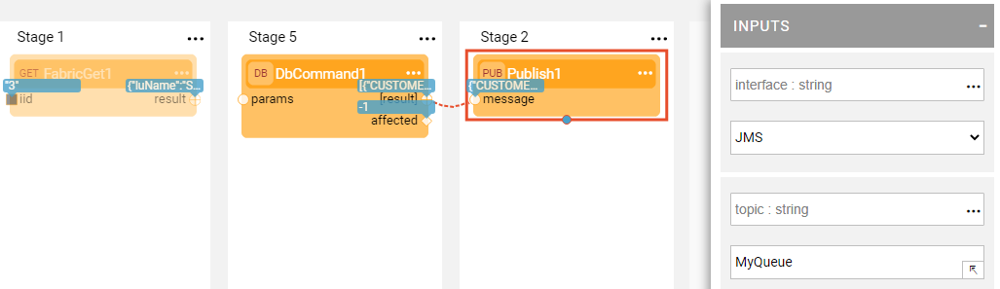

# JMS Interface

JMS interface type defines the ability to connect to JMS Queue or Topic by any JMS provider (for example, RabbitMQ or Active MQ) which is used by the [Broadway Pub / Sub Actors](/articles/19_Broadway/actors/05_db_actors.md).

To create a new JMS interface:

1. Go to **Project Tree** > **Shared Objects**, right click **Interfaces** and select **New Interface** and then select the **JMS** Interface Type to open the **New Interface** window.

   

2. Populate the connection settings and **Save**.

### Connection Settings

The connection settings are:

<table>
<tbody>
<tr>
<td width="300pxl">&nbsp;<strong>Parameter</strong></td>
<td width="600pxl">&nbsp;<strong>Description</strong></td>
</tr>
<tr>
<td>&nbsp;<strong>Provider Type</strong></td>
<td>

&nbsp;Message provider types, supporting:

<ul>
<li>ActiveMQ, RabbitMq, MQ queue or topic</li>
<li>Custom provider queue or topic</li>
</ul>
</td>
</tr>
<tr>
<td>&nbsp;<strong>Bindings Factory&nbsp;</strong></td>
<td>&nbsp;Bindings Factory.</td>
</tr>
<tr>
<td>&nbsp;<strong>Bindings Source</strong></td>
<td>&nbsp;Bindings Source.</td>
</tr>
<tr>
<td>&nbsp;<strong>Password</strong></td>
<td>&nbsp;Password.</td>
</tr>
<tr>
<td>&nbsp;<strong>Group ID</strong></td>
<td>

&nbsp;JMS queue / topic group ID.

&nbsp;Can be overriden by the Broadway Actor's setting.&nbsp;

</td>
</tr>
<tr>
<td>&nbsp;<strong>Poll Timeout (ms)</strong></td>
<td>&nbsp;The time to wait for a new message.</td>
</tr>
<tr>
<td><strong>&nbsp;Data Type</strong></td>
<td>

&nbsp;Supported data types: String, byte[], JSON, long.

&nbsp;The message type to be processed by the Broadway Actors must be aligned with the Data type definition.

</td>
</tr>
</tbody>
</table>

### Example of Publish to JMS Broadway Flow

The above Broadway flow is using a **Publish** Actor in order to publish the data to predefined JMS interface. In case of using JMS Queue provider,  **topic** input argument stands for the queue name.

 

