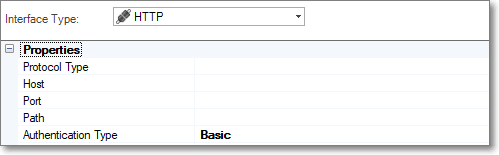
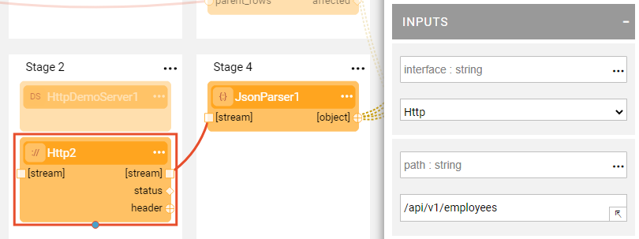

# HTTP Interface

The HTTP interface type defines the connections to an HTTP/s host and can be used by Broadway Actors.

To create a new HTTP interface, do the following:

1. Go to **Project Tree** > **Shared Objects**, right click **Interfaces**, select **New Interface** and then select **HTTP** from the **Interface Type** dropdown menu to open the **New Interface** window.

   

2. Populate the connection's settings and click **Save**.

### Connection Settings

<table>
<tbody>
<tr>
<td width="300pxl">&nbsp;<strong>Parameter</strong></td>
<td width="600pxl">&nbsp;<strong>Description</strong></td>
</tr>
<tr>
<td>&nbsp;<strong>Protocol Type</strong></td>
<td>&nbsp;Select between HTTP and HTTPs</td>
</tr>
<tr>
<td>&nbsp;<strong>Host</strong></td>
<td>&nbsp;Hostname or IP address of the HTTP server</td>
</tr>
<tr>
<td>&nbsp;<strong>Port</strong></td>
<td>&nbsp;Port of the HTTP server</td>
</tr>
<tr>
<td>&nbsp;<strong>Path</strong></td>
<td>&nbsp;(Optional) A specific path on the Host endpoint</td>
</tr>
<tr>
<td>&nbsp;<strong>Authentication Type</strong></td>
<td>Access authentication type. Default value = Basic. When Basic is selected, the properties shown in this window are the same as shown in the figure above. If a different access authentication type is selected (Basic, Bearer, etc) different properties are shown. These differences are detailed in the section below. </td>
</tr>
<tr>
<td>&nbsp;<strong>Test Connection Valid Status</strong></td>
<td>List of http response codes that can successfully pass the test connection activity. e.g. 401,404.   Added for Release 6.5.3 </td>
</tr>
</tbody>
</table>

### Authentication Settings

The Fabric HTTP Interface supports various standard authentication and authorization types (aka schemas) that can be used to access external protected resources. 

Each Authentication Type (except for the **None** type) requires specific security credentials (provided by the resource provider) that are populated by the implementer into the HTTP Interface Properties and used by Fabric to authenticate remote vendor servers.  

Fabric supports the following: 

* ***Basic* HTTP Authentication**, built into the HTTP protocol. Fabric (the client) sends HTTP requests with the `Authorization` header that contains the word `Basic` followed by  \<user:password\> in base64-encoded form. This interface requires the following properties:

  * User
  * Password

  Note that since this mechanism does not provide confidentiality it is usually used over HTTPS and not HTTP.

* ***Bearer* Authentication** (aka token authentication), an HTTP Authentication Type / schema that uses cryptic string security tokens called Bearer Tokens. Fabric (the client) sends this token in the `Authorization` header when sending requests to a resource. This interface requires the following properties:

  * token

* **OAuth 2.0 Password Credentials**, an OAuth protocol's grant type flow. Fabric (the client) first interacts  with an authorization server, provides a user and password and gets an access token which is then used for the resource server's calls. This interface requires the following properties:

  * User 

  * Password

  * Access Token URL, address of the authorization server providing the access token.

  * Client ID, provided by the external resource / authorized vendor. 
 
  * Client Secret, provided by the external resource / authorized vendor. Note that although the Client Server is encrypted and saved it is displayed in clear text in the Fabric Studio.

  * Scope (optional), validates that the required actions are permitted by the authenticating server which returns the access token's scope  to the client. 
  The value of the scope parameter is expressed as a list of space-delimited, case-sensitive strings.

  * Token Timeout, request timeout to the authorization server.

* **OAuth 2.0 Password Credentials - Basic Auth Headers**, an OAuth protocol grant type flow. It is similar to "OAuth 2.0 Password Credentials" but in this type Fabric provides the User and Password to the authorization server in the request header, rather than in the request body. This type is more recommended and considered as the best practice.

* **OAuth 2.0 Client Credentials**, an OAuth protocol grant type flow. Fabric provides the client-ID and Client-Secret to the authorization server which returns the access token used by Fabric for the resource's server calls. In Fabric this interface requires the following properties:

  * Client ID, provided by the external resource / authorized vendor.

  * Client Secret, provided by the external resource / authorized vendor. Note that although the secret key is encrypted and saved, it is displayed in clear text in the Fabric Studio.

  * Scope (optional), specifies the scope of the access request.  In turn, the authorization server uses the scope response parameter to inform the client of the scope of the access token issued. The value of the scope is expressed as a list of space-delimited, case-sensitive strings.

  * Token Timeout, request timeout to the authorization server.

* **OAuth 2.0 Client Credentials - Basic Auth Headers**, an OAuth protocol grant type flow. It is similar to "OAuth 2.0 Client Credentials" but in this type Fabric provides the client-ID and Client-Secret to the authorization server in the request header, rather than in the request body. This type is more recommended.

If the service provider does not require authentication, select **None** in the Authentication Type.

### Example of Using an HTTP/HTTPS Interface in a Broadway Flow

The above Broadway flow uses an **Http** Actor to connect to the HTTP server that populates the predefined HTTP interface into the **interface** input argument. The **path** input argument must be populated by the path relative to the interface. 
Note that HTTPS requests are included in this HTTP Actor, whose security settings are defined in the interface.  

 
