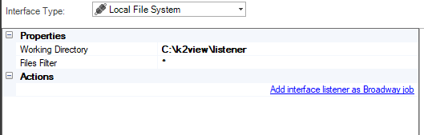
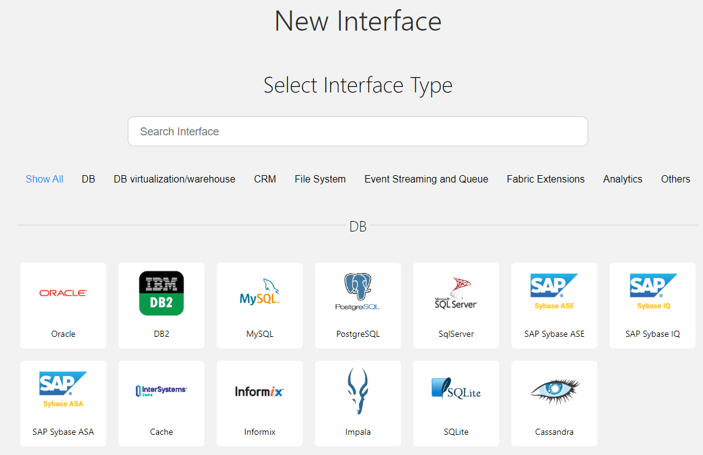
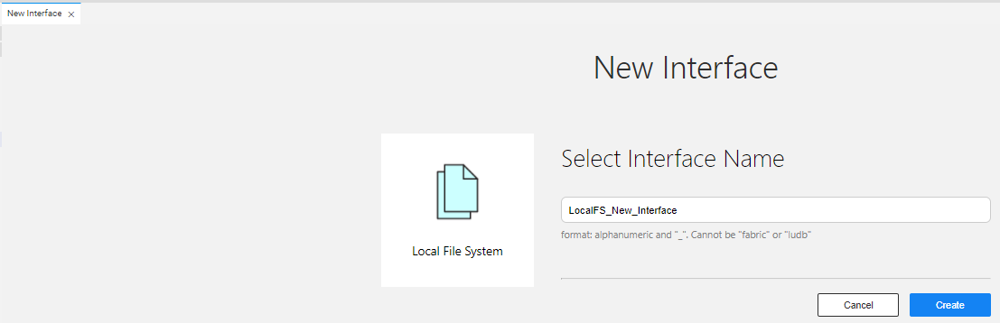
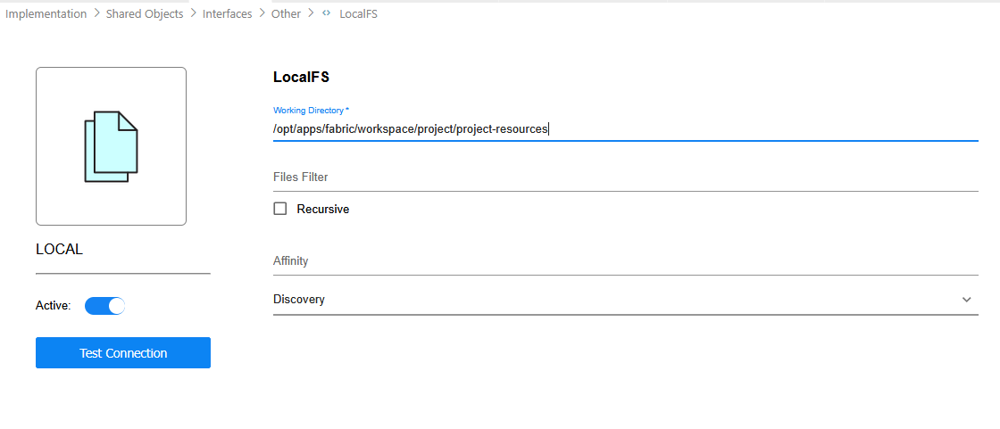
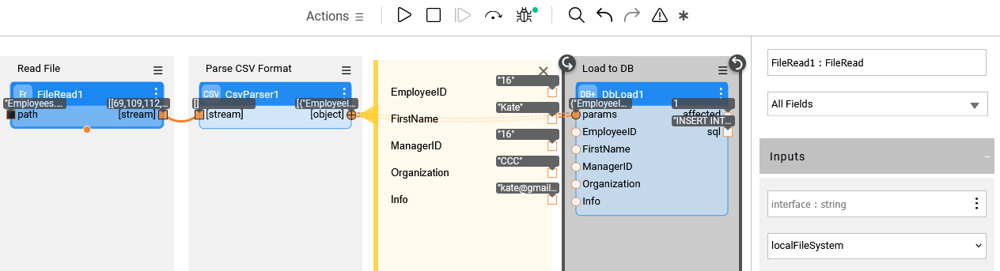
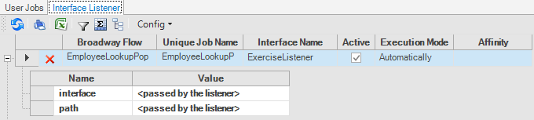

# Local File System Interface

The Local File System interface type enables processing files from a local directory in a specific Fabric server.

A Local File System interface can be used when creating an [Interface Listener for a Broadway flow](/articles/19_Broadway/09_broadway_integration_with_Fabric.md#interface-listener-for-broadway-flows). The directory can be either Windows or Linux. 

To create a new interface, do the following:

<studio>

1. Go to **Project Tree** > **Shared Objects**, right click **Interfaces**, select **New Interface** and then select **Local File System** from the **Interface Type** dropdown menu to open the **New Interface** window.

   

2. Populate the connection's settings and click **Save**.

</studio>   

<web>

1. Go to **Project Tree** > **Implementation** > **Shared Objects**, right click **Interfaces**, select **New Interface**.

2. From the window that appears, select the interface type. Scroll down to see more interface types. You can reduce the number of interface types shown by clicking on a menu item from the *Show All ... Others* list. 

   

3. Enter a suitable name for your new interface, then click **Create**:
   . 

4. Populate the connection's settings and click **Test Connection**.

   

5. Once the connection test succeeds, the interface is ready. If the connection test did not succeed, check your settings and try again. 

6. If the interface is supposed to be used for File Cataloging, expand the **Discovery** section and populate the names of 3 Broadway flows. This option is available starting from Fabric V8.3. [Click here for more information about the File Cataloging solution.](/articles/39_fabric_catalog/05_cataloging_of_files.md)

</web>   

### Connection Settings

<table>
<tbody>
<tr>
<td width="200pxl"><strong>Parameter</strong></td>
<td width="700pxl"><strong>Description</strong></td>
</tr>
<tr>
<td><strong>Working Directory</strong></td>
<td>Directory where the files are stored - Windows or Linux.</td>
</tr>
<tr>
<td><strong>Files filter</strong></td>
<td>Filters files using <em>files wildcard pattern</em>, e.g. "*.CSV"</td>
</tr>
<tr>
<td><strong>Recursive</strong></td>
<td>Indicator, to enable presenting all files included in all embedded folders.</td>
</tr>
<tr>
<td><strong>Affinity</strong></td>
<td>Affinity (Optional) populate this parameter with the IP address of a Fabric node, DC name, or logical identifier for Fabric nodes.</td>
</tr>
<tr>
<td><strong>Discovery</strong></td>
<td>Broadway flows, invoked upon running Discovery for analyzing and cataloging the content of this interface. These flows define mapping and transformation rules to convert the files into the Catalog&rsquo;s standard hierarchy:
<ul>
<li>Get Metadata - Retrieves metadata information about files and objects</li>
<li>Get Files List - Generates a list of all files in the specified bucket/path</li>
<li>Get File Data - Extracts actual file content and data for processing</li>
</ul>

</td>
</tr>
</tbody>
</table>

### Example of Using a Local File System Interface

To create an [Interface Listener](/articles/19_Broadway/09_broadway_integration_with_Fabric.md#interface-listener-for-broadway-flows) Job in a Local File System interface, do the following: 

1. Create an interface using a **Local File System** interface type.

2. Click the **Add interface listener as Broadway job** link in the Interface window and select the [Logical Unit](/articles/03_logical_units/01_LU_overview.md) from the list to open the Jobs window. 

3. Create a Broadway flow either under Shared Objects or under the same Logical Unit. The flow reads data from a file using the predefined interface and populates it into the DB. 

   

   * Note that the **interface** and the **path** input arguments of the **FileRead** Actor are defined as an [External link type](/articles/19_Broadway/03_broadway_actor_window.md#actors-inputs-and-outputs). Their values are passed from the defined interface by the Listener.

<studio>

4. In the Jobs window, select the **Broadway flow** and **Execution mode** and then save the job.

   

5. [Deploy the LU](/articles/16_deploy_fabric/02_deploy_from_Fabric_Studio.md) to activate the Listener.

</studio>

 
