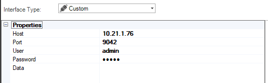
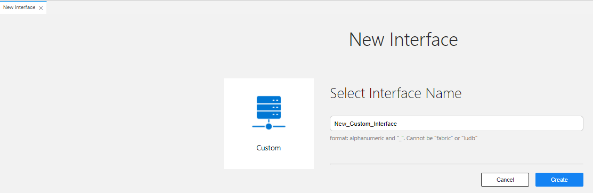
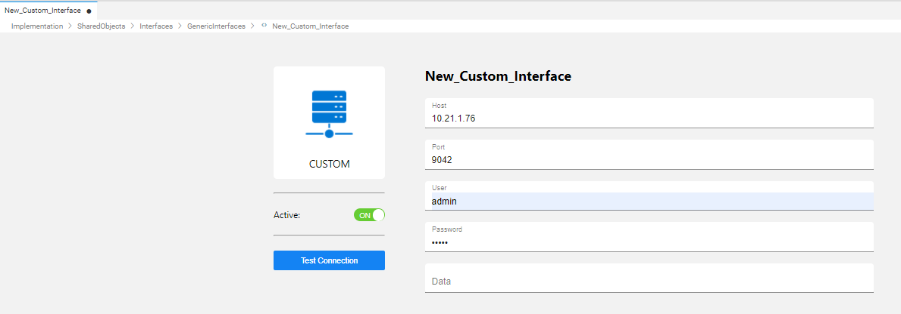

# Custom Interface

The Custom interface type is used to interact with interfaces that are not defined as dedicated interface types in Fabric, such as SSH or any interface that requires a user, password, port and host.  

A Custom interface type can be used to store encrypted passwords. For example, to connect to a website using a user and a password, use the getCustomProperties API in the user code to get the password's original value.

Starting from V6.5.1, you can access the custom interface attributes (such as user or password) from a Broadway flow when writing your own custom Actor. In the Actor's Java class, you can access the IoSession by writing the following:

~~~java
Map m = (Map) context.ioProvider().createSession("my-custom-interface").object(null);

m.get("username");
~~~

To create a new interface, do the following:

<studio>

1. Go to **Project Tree** > **Shared Objects**, right click **Interfaces**, select **New Interface** and then select **Custom** from the **Interface Type** dropdown menu to open the **New Interface** window.

   

2. Populate the connection's settings and click **Save**.

</studio>
	
<web>

1. Go to **Project Tree** > **Shared Objects**, right click **Interfaces**, select **New Interface** and then select **Custom** from the **Others** section to open the **New Interface** window.

2. Enter a suitable name for your new Custom Interface, then click **Create**:
   

2. Populate the connection's settings and click **Save**.
   

</web>
	
	
### Connection Settings

<table>
<tbody>
<tr>
<td width="200pxl">&nbsp;<strong>Parameter</strong></td>
<td width="700pxl">&nbsp;<strong>Description</strong></td>
</tr>
<tr>
<td>&nbsp;<strong>Host</strong></td>
<td>&nbsp;Hostname or IP address of the server.</td>
</tr>
<tr>
<td>&nbsp;<strong>Port</strong></td>
<td>&nbsp;Port ID.</td>
</tr>
<tr>
<td><strong>&nbsp;User</strong></td>
<td>&nbsp;Username.</td>
</tr>
<tr>
<td><strong>&nbsp;Password</strong></td>
<td>&nbsp;Password.</td>
</tr>
<tr>
<td><strong>&nbsp;Data</strong></td>
<td>&nbsp;Any additional parameters defined for the customer interface.</td>
</tr>
</tbody>
</table>

### Example of Using a Custom Interface to Connect to a Session

1. Define a **Custom** interface.

2. In the Fabric user code, get the connection's details using the **getCustomProperties()** API as follows:

~~~java
String remoteFile = "/home/k2view/Test-Automaton-Report.html";
Map<String, String> props = getCustomProperties("CustomInterface");
String user = props.get("User");
String password = props.get("Password");
String host = props.get("Host");
int port = Integer.parseInt(props.get("Port"));
JSch jsch = new JSch();
Session session = jsch.getSession(user, host, port);
session.setPassword(password);
session.connect();
log.info("Connection established.");
ChannelSftp sftpChannel = (ChannelSftp) session.openChannel("sftp");
sftpChannel.connect();
log.info("SFTP Channel created.");
InputStream inputStream = sftpChannel.get(remoteFile);
~~~

### Example of Using a Custom Interface to Encode a Password

1. Define a **Custom** interface type.
2. In the Fabric user code, get the connection's details using the **getCustomProperties()** API as follows:

~~~java
Map <String,String> mapInterface = getCustomProperties("myCustInterface");
final String USERNAME = mapInterface.get("User");
final String PASSWORD = mapInterface.get("Password");
		
String encodedUPass = Base64.getEncoder().encodeToString((USERNAME+":"+PASSWORD).getBytes(StandardCharsets.UTF_8.name()));
~~~

 
