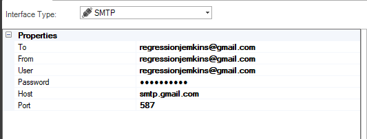
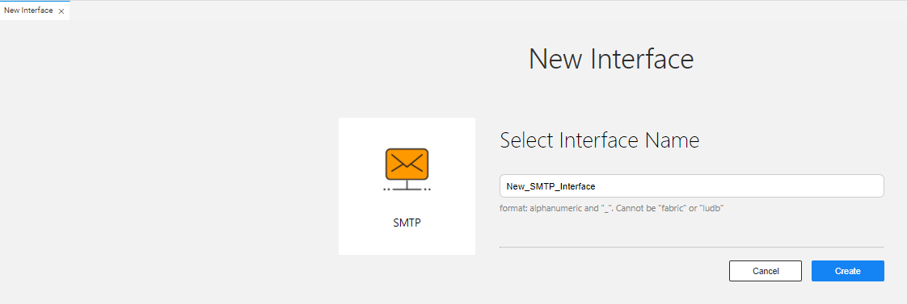
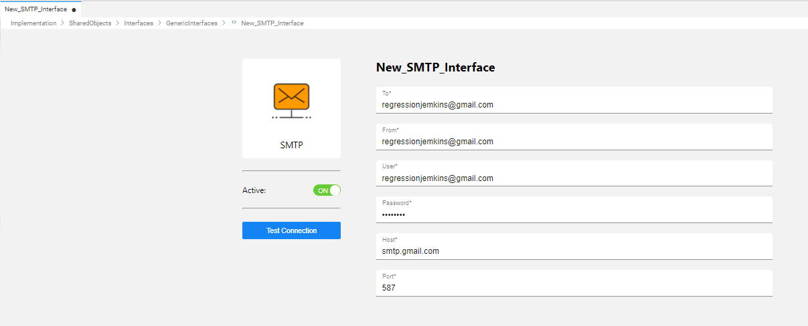
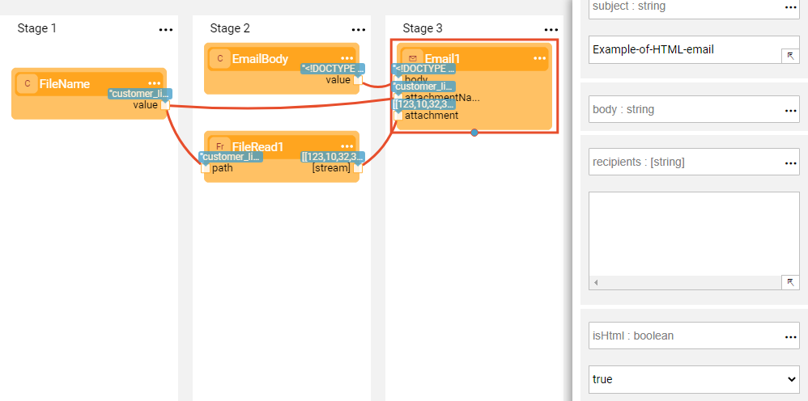

# SMTP Interface

The SMTP interface type defines the connections to the SMTP (Simple Mail Transfer Protocol) server used to send and receive emails. 

To create a new SMTP interface, do the following:

<studio>
1. Go to **Project Tree** > **Shared Objects**, right click **Interfaces**, select **New Interface** and then select **SMTP** from the **Interface Type** dropdown menu to open the **New Interface** window.

   

2. Populate the connection's settings and **Save**.

</studio>

<web>
1. Go to **Project Tree** > **Shared Objects**, right click **Interfaces**, select **New Interface** and then select **SMTP** from the **Others** section to open the **New Interface** window.

2. Enter a suitable name for your new SMTP Interface, then click **Create**:
   

2. Populate the connection's settings and **Save**.
   

</web>

### Connection Settings

<table>
<tbody>
<tr>
<td width="300pxl"><strong>Parameter</strong></td>
<td width="600pxl"><strong>Description</strong></td>
</tr>
<tr>
<td><strong>To</strong></td>
<td>Recipient's email address</td>
</tr>
<tr>
<td><strong>From</strong></td>
<td>Sender's email address</td>
</tr>
<tr>
<td><strong>User</strong></td>
<td>Sender's user</td>
</tr>
<tr>
<td><strong>Password&nbsp;</strong></td>
<td>Sender's password</td>
</tr>
<tr>
<td><strong>Host</strong></td>
<td>Email server host</td>
</tr>
<tr>
<td><strong>Port</strong></td>
<td>Email server port</td>
</tr>
</tbody>
</table>

### Example of Using an SMTP Interface in a Broadway Flow

The above Broadway flow uses an **Email** Actor to send an email via a predefined SMTP interface. If a **recipients** input argument is provided, it overrides the interface's setting. To send an email in HTML format, set **isHtml** to true. 

 
