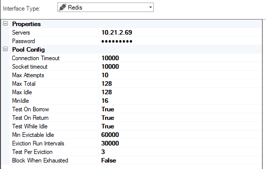
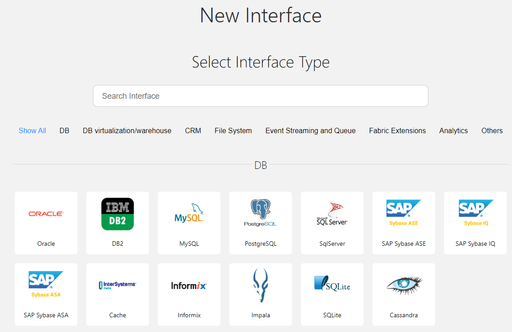
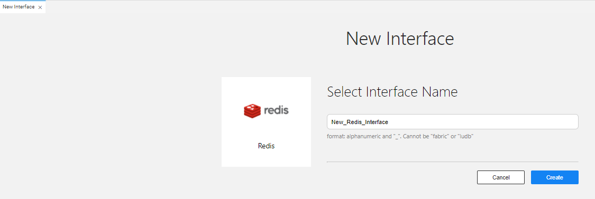
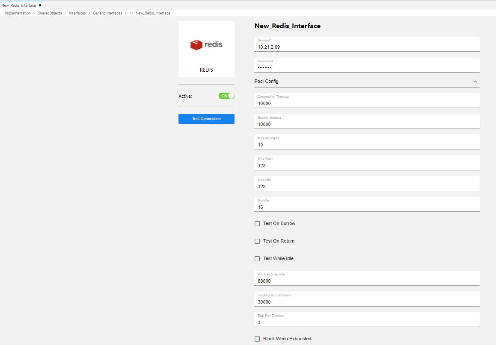
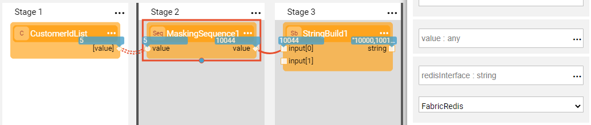

# Redis Interface
The Redis interface type defines the connections to the Redis in-memory storage used as key-value data storage to enable quick access to data sets.

A Redis interface connection is used by K2View TDM or by Broadway Actors to handle sequences or to mask sensitive data which is required for data uniqueness and consistency across multiple nodes or a Fabric cluster.  

<!--[Click for more information about TDM7 implementation]().  TBD !!!-->

To create a new Redis interface, do the following:

<studio>

1. Go to **Project Tree** > **Shared Objects**, right click **Interfaces** and select **New Interface** and then select **Redis** from the  **Interface Type** dropdown menu to open the **New Interface** window.

   

2. Populate the connection settings and click **Save**.

</studio>   

<web>

1. Go to **Project Tree** > **Implementation** > **Shared Objects**, right click **Interfaces**, select **New Interface**.
   
2. From the window that appears, select **Redis**. Alternatively, you can scroll down to find this interface type. You can reduce the number of interface types shown by clicking on a menu item from the *Show All ... Others* list. 
   
   
   
3. Enter a suitable name for your new Redis Interface, then click **Create**:
   
   

4. Populate the connection settings and click **Save**. 
   
   

</web>   
   
### Connection Settings

<table>
<tbody>
<tr>
<td width="300pxl"><strong>Parameter</strong></td>
<td width="600pxl"><strong>Description</strong></td>
</tr>
<tr>
<td><strong>Servers</strong></td>
<td>Comma delimited servers list</td>
</tr>
<tr>
<td><strong>Password&nbsp;</strong></td>
<td>Password&nbsp;</td>
</tr>
<tr>
<td><strong>Connection Timeout</strong></td>
<td>Amount of time to allow new connections to be established (in milliseconds)</td>
</tr>
<tr>
<td><strong>Socket Timeout</strong></td>
<td>Amount of time to wait for a response from Redis (in milliseconds)</td>
</tr>
<tr>
<td><strong>Max Attempts</strong></td>
<td>&nbsp;</td>
</tr>
<tr>
<td><strong>Max Total</strong></td>
<td>Max number of connections that can be created at a given time</td>
</tr>
<tr>
<td><strong>Max Idle</strong></td>
<td>Max number of connections that can be idle in the pool without being immediately evicted</td>
</tr>
<tr>
<td><strong>Min Idle</strong></td>
<td>Number of connections that are ready for immediate use that remain in the pool even when the load has been reduced</td>
</tr>
<tr>
<td><strong>Test On Borrow</strong></td>
<td>Controls whether or not the connection is tested before it is returned from the pool</td>
</tr>
<tr>
<td><strong>Test on Return</strong></td>
<td>&nbsp;</td>
</tr>
<tr>
<td><strong>Test While Idle</strong></td>
<td>&nbsp;</td>
</tr>
<tr>
<td><strong>Min Evictable Idle</strong></td>
<td>Minimum amount of time a connection is idle in the pool before it is evicted due to being idle</td>
</tr>
<tr>
<td><strong>Eviction Run Intervals</strong></td>
<td>&nbsp;</td>
</tr>
<tr>
<td><strong>Test Per Eviction</strong></td>
<td>&nbsp;</td>
</tr>
<tr>
<td><strong>Block When Exhausted</strong></td>
<td>&nbsp;</td>
</tr>
</tbody>
</table>

### Example of Using a Redis Interface in a Broadway Flow

The above Broadway flow uses a **MaskingSequence** Actor to mask an input list of customer IDs. The Actor connects to a predefined Redis interface populated in the Actor's **sequenceInterface** input argument.

