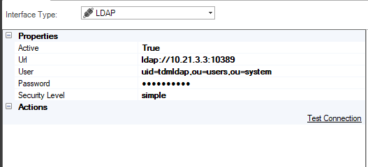
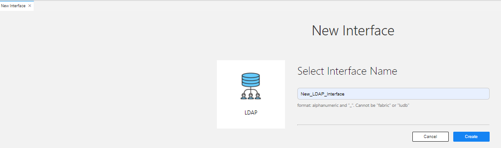
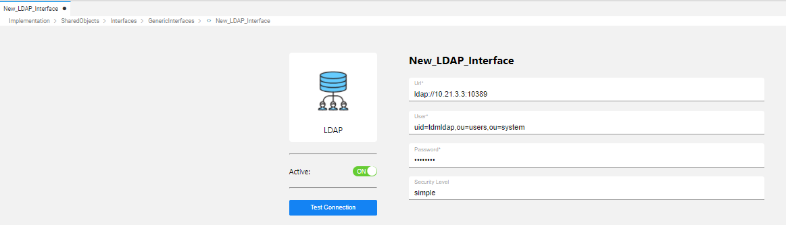

# LDAP Interface

The LDAP interface type defines the communication details with LDAP service provider.

To create a new LDAP interface, do the following:

<studio>

1. Go to **Project Tree** > **Shared Objects**, right click **Interfaces**, select **New Interface** and then select **LDAP** from the **Interface Type** dropdown menu to open the **New Interface** window.

   

2. Populate the connection's settings and click **Save**.

</studio> 

<web>

1. Go to **Project Tree** > **Implementation** > **Shared Objects**, right click **Interfaces**, select **New Interface**.
   
2. From the window that appears, select **LDAP**. Alternatively, you can scroll down to find this interface type. You can reduce the number of interface types shown by clicking on a menu item from the *Show All ... Others* list. 
   
   

3. Enter a suitable name for your new LDAP Interface, then click **Create**:   
   
   

4. Populate the connection's settings and click **Save**.
   
   

</web>

### Connection Settings

<table>
<tbody>
<tr>
<td width="300pxl"><strong>Parameter</strong></td>
<td width="600pxl"><strong>Description</strong></td>
</tr>
<tr>
<td><strong>Active</strong></td>
<td>Indication whether the connection is active. When set to False, the interface is ignored by the server side.</td>
</tr>
<tr>
<td><strong>URL</strong></td>
<td>LDAP server URL.</td>
</tr>
<tr>
<td><strong>User</strong>&nbsp;</td>
<td>Username.</td>
</tr>
<tr>
<td><strong>Password</strong></td>
<td>Password.</td>
</tr>
</tr>
<tr>
<td><strong>Security Level</strong></td>
<td>Constant that holds the JNDI environment property for specifying the security level to use - <i>java.naming.security.authentication</i>. The following values are defined: 
    <li><strong>none</strong> - use no authentication (anonymous bind).</li> 
    <li><strong>simple</strong> - use simple authentication (a cleartext password). </li>
    <li>a provider-specific space-separated list of one or more SASL mechanism names.</li>         
    If the value is not specified, the behaviour is determined by the service provider's default.
</td>
</tr>
</tbody>
</table>

