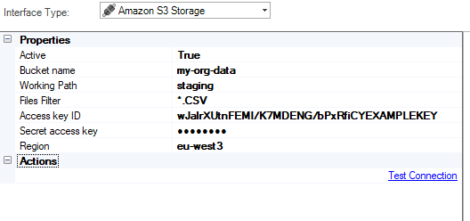
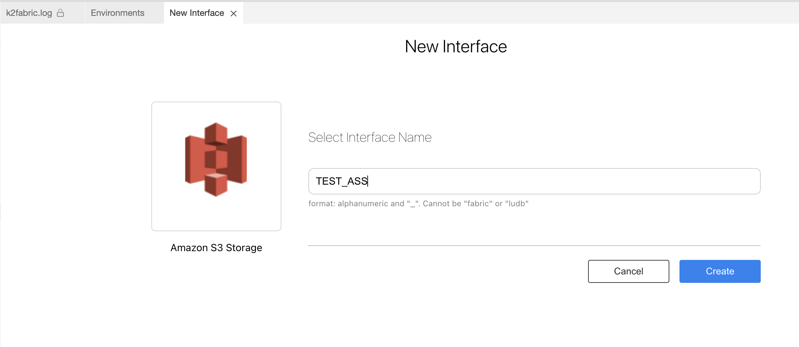
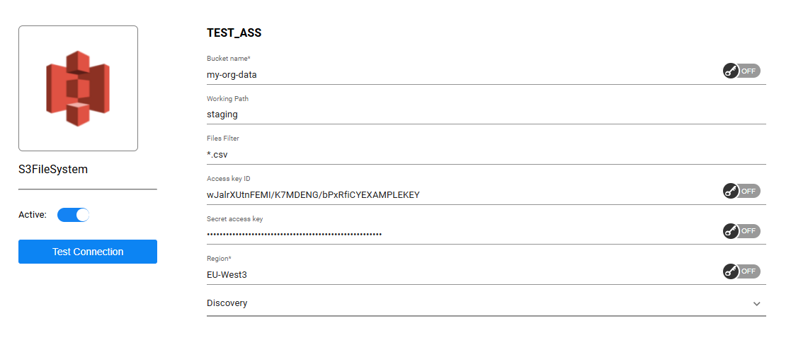
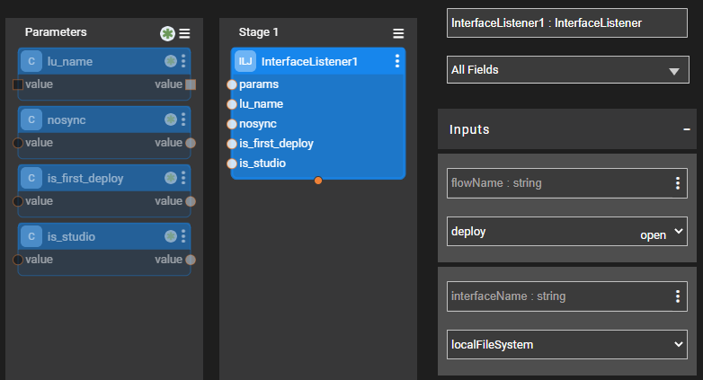

# Amazon S3 Storage Interface 

The Amazon S3 Storage interface type is used to define the connections between S3 bucket and a data stream.

When creating an [Interface Listener for a Broadway flow](/articles/19_Broadway/09_broadway_integration_with_Fabric.md#interface-listener-for-broadway-flows), an Amazon S3 Storage interface is needed to detect new files added to the S3 storage.

To create a new Amazon S3 Storage interface, do the following:

<studio>

1. Go to **Project Tree** > **Shared Objects**, right click **Interfaces**, select **New Interface** and then select **Amazon S3 Storage** from the **File System** section to open the **New Interface** window.

   
   
2. Populate the connection's settings and click **Save**.
</studio>

<web>
1. Go to **Project Tree** > **Shared Objects**, right click **Interfaces**, select **New Interface** and then select **Amazon S3 Storage** from the **Interface Type** dropdown menu to open the **New Interface** window.

2. Enter a suitable name for your new Amazon S3 Storage Interface, then click **Create**
  
   

3. Populate the connection's settings and click **Save**.

   

</web>

### Connection Settings

<table>
<tbody>
<tr>
<td width="300pxl"><strong>Parameter</strong></td>
<td width="600pxl"><strong>Description</strong></td>
</tr>
<tr>
<td><strong>Bucket name</strong></td>
<td>The name of the S3 bucket where your files are stored. This is a required field. Must be globally unique, 3-63 characters, lowercase letters, numbers, periods, and hyphens only.</td>
</tr>
<tr>
<td><strong>Working Path</strong></td>
<td>The specific folder path within the bucket where the connector will look for files.</td>
</tr>
<tr>
<td><strong>Files Filter</strong></td>
<td>Filters files using regular expressions.</td>
</tr>
<tr>
<td><strong>Access key ID</strong></td>
<td>The AWS access key ID for authentication. This is a 20-character alphanumeric identifier that works with the secret access key to authenticate API requests to AWS services.</td>
</tr>
<tr>
<td><strong>Secret access key</strong></td>
<td>The AWS secret access key paired with the access key ID. This is a 40-character base64-encoded string that must be kept secure and should not be shared or exposed in code.</td>
</tr>
<tr>
<td><strong>Region</strong></td>
<td>The AWS region where your S3 bucket is located (e.g., us-east-1, eu-west-1, ap-southeast-2). This is a required field and must match the actual region of your bucket.</td>
</tr>
<tr>
<td><strong>Discovery</strong></td>
<td>Platform discovery catalog options for analyzing and cataloging S3 bucket contents. Available options:
<ul>
<li>Get Metadata - Retrieves metadata information about files and objects</li>
<li>Get Files List - Generates a list of all files in the specified bucket/path</li>
<li>Get File Data - Extracts actual file content and data for processing</li>
</ul></td>
</tr>
<studio>

Add an Interface Listener as a Broadway job. Click to create an Interface Listener job under the specified Logical Unit.

</studio>
</td>
</tr>
</tbody>
</table>

<studio>

### Example of Using an Amazon S3 Storage Interface

To create an [Interface Listener](/articles/19_Broadway/09_broadway_integration_with_Fabric.md#interface-listener-for-broadway-flows) that runs on an S3 interface, do the following: 

1. Create an interface using an **Amazon S3 Storage** interface type.

2. Create a Broadway flow either under Shared Objects or under the same Logical Unit. The flow reads data from a file using the predefined interface and populates it into the DB. 

* Note that the **interface** and the **path** input arguments of the **FileRead** Actor are defined as [External link type](/articles/19_Broadway/03_broadway_actor_window.md#actors-inputs-and-outputs). Their values are passed from the defined interface by the Listener.

3. Add an InterfaceListener Actor to the "deploy.flow" flow, located at the Broadway folder. Use the Broadway flow, which you created in the previous step, as the `flowName` property in this actor.

4. [Deploy the LU](/articles/16_deploy_fabric/02_deploy_from_Fabric_Studio.md) to activate the Listener.

</studio>

### Using the InterfaceListener Actor 

The **InterfaceListener** Actor enables the flow in which it is instantiated to listen to Amazon S3 Storage interface and trigger another Broadway flow upon arrival of a new file on the interface.

To create an Interface Listener job from a Broadway flow, add the **InterfaceListener** Actor to the flow.

Fill in the following parameters in the Actor's Properties tab:

- **flowName**, the flow to be triggered by the Interface Listener.
- **interfaceName**, the interface that is being listened and used to trigger the flow defined above, once a new file is detected on the file system to which the interface points.

- **affinity**, sets which node/DC name IP address is to be used to run the Interface Listener job.

- **params**, refer to the arguments that can be passed to the flow. For example, multiple parameters can be parsed as a key/value object from an external link or from a **Const** or **JavaScript** Actor.

