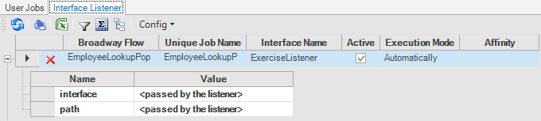
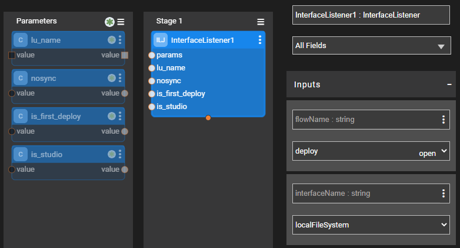

# Azure Blob Storage Interface 

Azure Blob Storage interface type is used to define the connections between a blob storage and a data stream.

When creating an [Interface Listener for a Broadway flow](/articles/19_Broadway/09_broadway_integration_with_Fabric.md#interface-listener-for-broadway-flows), an Azure Blob Storage interface is needed to detect new files added to the storage.

To create a new Azure Blob Storage interface, do the following:

<studio>

1. Go to **Project Tree** > **Shared Objects**, right click **Interfaces**, select **New Interface** and then select **Azure Blob Storage** from the **File System** section to open the **New Interface** window.

   
   
2. Populate the connection's settings and click **Save**.
</studio>

<web>
1. Go to **Project Tree** > **Shared Objects**, right click **Interfaces**, select **New Interface** and then select **Azure Blob Storage** from the **Interface Type** dropdown menu to open the **New Interface** window.

2. Enter a suitable name for your new Asuze Blob Storage Interface, then click **Create**
  
   

3. Populate the connection's settings and click **Save**.

   

</web>

### Connection Settings

<table>
<tbody>
<tr>
<td width="300pxl"><strong>Parameter</strong></td>
<td width="600pxl"><strong>Description</strong></td>
</tr>
<tr>
<td><strong>Container name</strong></td>
<td>The name of the container.</td>
</tr>
<tr>
<td><strong>Account name</strong></td>
<td>The name of the Azure Blob Storage account.</td>
</tr>
<tr>
<td><strong>Account key</strong>&nbsp;</td>
<td>The secret key of the account.</td>
</tr>
<tr>
<td><strong>Endpoint templates</strong></td>
<td>Endpoint templates.</td>
</tr>
  <tr>
<td><strong>Credentials type</strong></td>
<td>Credentials type, can be SHARED_KEY (default) or SAS.</td>
</tr>

Test Connection. Click to test the connection.

<studio>

Add an Interface Listener as a Broadway job. Click to create an Interface Listener job under the specified Logical Unit.

</studio>
</td>
</tr>
</tbody>
</table>

<studio>

### Example of Using an Azure Blob Storage Interface

To create an [Interface Listener](/articles/19_Broadway/09_broadway_integration_with_Fabric.md#interface-listener-for-broadway-flows) Job that runs on an Azure Blob Storage interface, do the following: 

1. Create an interface using an **Azure Blob Storage** interface type.

2. Click the **Add interface listener as Broadway job** link in the Interface window and select the [Logical Unit](/articles/03_logical_units/01_LU_overview.md) from the list to open the Jobs window. 

3. Create a Broadway flow either under Shared Objects or under the same Logical Unit. The flow reads data from a file using the predefined interface and populates it into the DB. 

* Note that the **interface** and the **path** input arguments of the **FileRead** Actor are defined as [External link type](/articles/19_Broadway/03_broadway_actor_window.md#actors-inputs-and-outputs). Their values are passed from the defined interface by the Listener.
* In the Jobs window, select the **Broadway flow** and **Execution mode** and then save the job.

5. [Deploy the LU](/articles/16_deploy_fabric/02_deploy_from_Fabric_Studio.md) to activate the Listener.

</studio>

### Using the InterfaceListener Actor 

The **InterfaceListener** Actor enables the flow in which it is instantiated to listen to Azure Blob Storage interface and trigger another Broadway flow upon arrival of a new file on the interface.

To create an Interface Listener job from a Broadway flow, add the **InterfaceListener** Actor to the flow.

Fill in the following parameters in the Actor's Properties tab:

- **flowName**, the flow to be triggered by the Interface Listener.
- **interfaceName**, the interface that is being listened and used to trigger the flow defined above, once a new file is detected on the file system to which the interface points.

- **affinity**, sets which node/DC name IP address is to be used to run the Interface Listener job.

- **params**, refer to the arguments that can be passed to the flow. For example, multiple parameters can be parsed as a key/value object from an external link or from a **Const** or **JavaScript** Actor.

 
