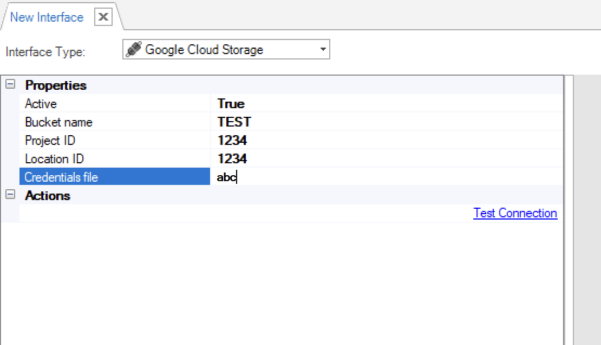
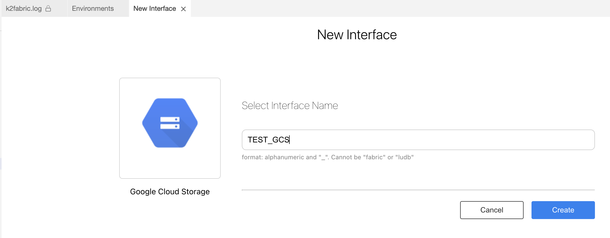
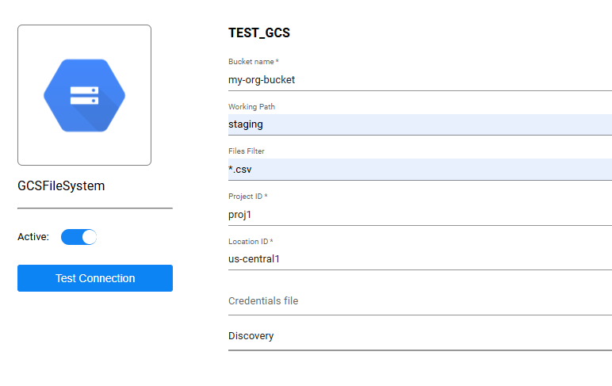

# Google Cloud Storage Interface 

Google Cloud Storage interface type is used to define the connections between a blob storage and a data stream.

When creating an [Interface Listener for a Broadway flow](/articles/19_Broadway/09_broadway_integration_with_Fabric.md#interface-listener-for-broadway-flows), an Google Cloud Storage interface is needed to detect new files added to the storage.

To create a new Google Cloud Storage interface, do the following:

<studio>

1. Go to **Project Tree** > **Shared Objects**, right click **Interfaces**, select **New Interface** and then select **Google Cloud Storage** from the **File System** section to open the **New Interface** window.

   

2. Populate the connection's settings and click **Save**.
  </studio>

<web>
1. Go to **Project Tree** > **Shared Objects**, right click **Interfaces**, select **New Interface** and then select **Google Cloud Storage** from the **Interface Type** dropdown menu to open the **New Interface** window.

2. Enter a suitable name for your new Google Cloud Storage Interface, then click **Create**

   

3. Populate the connection's settings and click **Save**.

   

4. If the interface is supposed to be used for File Cataloging, expand the **Discovery** section and populate the names of 3 Broadway flows. This option is available starting from Fabric V8.3. [Click here for more information about the File Cataloging solution.](/articles/39_fabric_catalog/05_cataloging_of_files.md)

</web>

### Connection Settings

<table>
<tbody>
<tr>
<td width="300pxl"><strong>Parameter</strong></td>
<td width="600pxl"><strong>Description</strong></td>
</tr>
<tr>
<td><strong>Bucket name</strong></td>
<td>The name of the Google Cloud Storage bucket where your files are stored. This is a required field. Must be globally unique, 3-63 characters, lowercase letters, numbers, periods, and hyphens only.</td>
</tr>
<tr>
<td><strong>Working Path</strong></td>
<td>The specific folder path within the bucket where the connector will look for files. </td>
</tr><tr>
<td><strong>Files Filter</strong></td>
<td>Filters files based on the below filter type.</td>
</tr>
<tr>
<td><strong>Files Filter Type</strong></td>
<td>

Two types are supported:

<ul>
<li><strong>Wildcard </strong>&ndash; to support filter using the <em>files wildcard pattern</em>.</li>
<li><strong>Regular expression </strong>&ndash; to support filter using <em>regex</em>.</li>
</ul>
</td>
</tr>
<tr>
<td><strong>Recursive</strong></td>
<td>Indicator, to enable presenting all files included in all embedded folders.</td>
</tr>

<tr>
<td><strong>Project ID</strong></td>
<td>The Google Cloud Platform project ID where your bucket is located. This is a required field with a globally unique identifier, typically 6-30 characters using lowercase letters, numbers, and hyphens.</td>
</tr>
<tr>
<td><strong>Location ID</strong></td>
<td>The Google Cloud region or multi-region where your bucket is located (e.g., us-central1, europe-west1, asia). This is a required field and must match the actual location of your bucket.</td>
</tr>
<tr>
<td><strong>Credentials file</strong></td>
<td>The location of the credentials file. This file includes the private key and service account details required to access the GCS bucket securely.</td>
</tr>
<tr>
<td><strong>Discovery</strong></td>
<td>Discoveryoptions for analyzing and cataloging GCS bucket contents. Available options include Get Metadata, Get Files List, and Get File Data for different levels of bucket analysis.</td>
</tr>

Test Connection. Click to test the connection.

<studio>

Add an Interface Listener as a Broadway job. Click to create an Interface Listener job under the specified Logical Unit.

</studio>
</td>
</tr>
</tbody>
</table>

<studio>

### Example of Using an Google Cloud Storage Interface

To create an [Interface Listener](/articles/19_Broadway/09_broadway_integration_with_Fabric.md#interface-listener-for-broadway-flows) Job that runs on an Google Cloud Storage interface, do the following: 

1. Create an interface using an **Google Cloud Storage** interface type.

2. Create a Broadway flow either under Shared Objects or under the same Logical Unit. The flow reads data from a file using the predefined interface and populates it into the DB. 

* Note that the **interface** and the **path** input arguments of the **FileRead** Actor are defined as [External link type](/articles/19_Broadway/03_broadway_actor_window.md#actors-inputs-and-outputs). Their values are passed from the defined interface by the Listener.

3. Add an InterfaceListener Actor to the "deploy.flow" flow, located at the Broadway folder. Use the Broadway flow, which you created in the previous step, as the `flowName` property in this actor.
4. [Deploy the LU](/articles/16_deploy_fabric/02_deploy_from_Fabric_Studio.md) to activate the Listener.

</studio>

### Using the InterfaceListener Actor 

The **InterfaceListener** Actor enables the flow in which it is instantiated to listen to Google Cloud Storage interface and trigger another Broadway flow upon arrival of a new file on the interface.

To create an Interface Listener job from a Broadway flow, add the **InterfaceListener** Actor to the flow.

Fill in the following parameters in the Actor's Properties tab:

- **flowName**, the flow to be triggered by the Interface Listener.
- **interfaceName**, the interface that is being listened and used to trigger the flow defined above, once a new file is detected on the file system to which the interface points.

- **affinity**, sets which node/DC name IP address is to be used to run the Interface Listener job.

- **params**, refer to the arguments that can be passed to the flow. For example, multiple parameters can be parsed as a key/value object from an external link or from a **Const** or **JavaScript** Actor.

