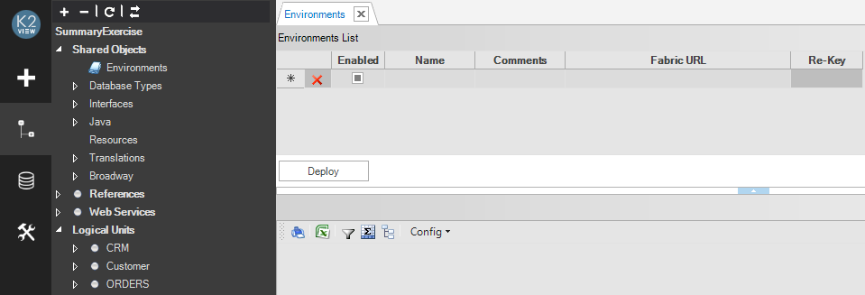
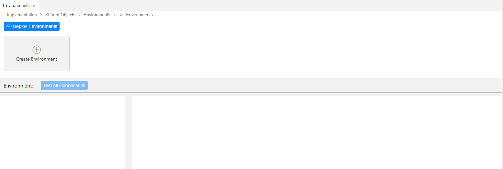
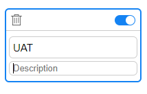
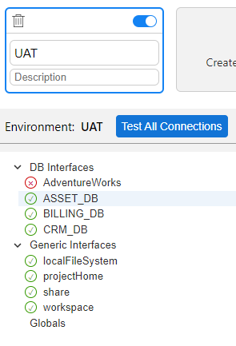
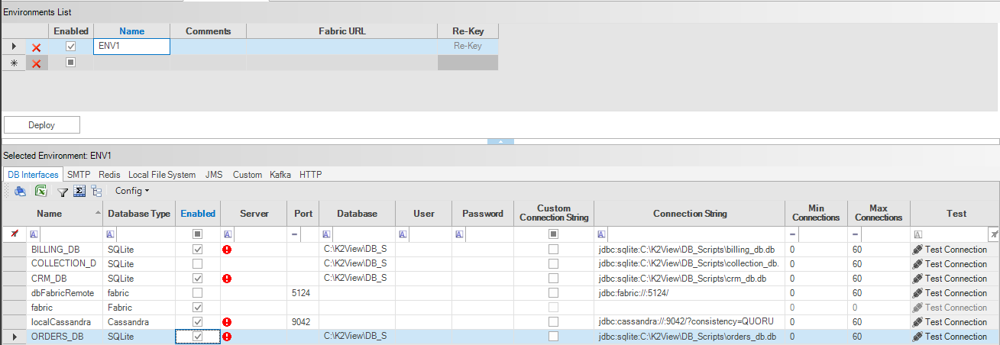
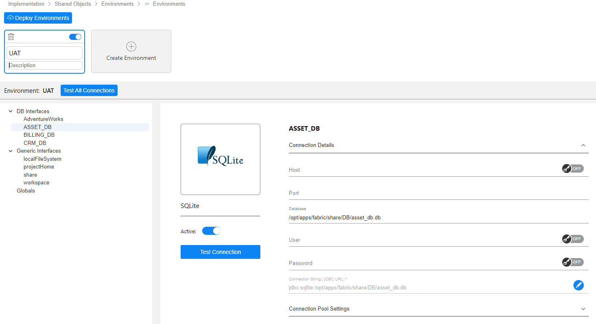
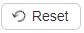
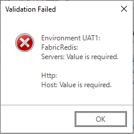

# Create and Edit Environment

The following steps are used for creating an environment in Fabric:

1. Creating the environment in the Fabric Studio using the Environments window.
2. Populating the connection details of the interfaces via the selected environment.
3. Overriding Globals at any Shared, Reference or LU level via the dedicated tab in the selected environment view.   
4. Deploying all environments to server.

### Step 1 - Creating the Environment

<studio>

1. Go to **Project Tree** > **Shared Objects** and double click **Environments** to open the Environments window.

   

2. In the **Environments List** grid, do the following:

   -  Enter a meaningful name for the environment in the **Name** field.

    - (Optional) In the **Comments** field, add a description of the environment.

    - (Optional) In the **Fabric URL** field, select the server from the predefined list in the **Server Configuration** tab in the [**User Preferences**](/articles/04_fabric_studio/04_user_preferences.md) window. 

       The selected Fabric node is used to encrypt the passwords of all interfaces related to the given environment and to run the test connection. If the node is not selected, Fabric uses the local test connection and previous encryption algorithm. 

   
   -  Click **Re-Key** to use the most updated encryption mechanism and the latest master key to encrypt the passwords of the interfaces.
   

Click [here](/articles/99_fabric_infras/devops/01_fabric_security_overview.md) for more information about Fabric security hardening.

</studio>

<web>

1. Go to **Project Tree** > **Shared Objects** > **Environments** > **Environments** to open the window.

   

2. Click **Create Environment** to start the environment creation. 

   

   * Enter a meaningful name for the environment in the **Name** field.
   * (Optional) In the **Description** field, add a description of the environment.

The following activities can be done on each environment:

* Click the **Test Connection**icon to test the connections of all interfaces under this environment. Once the test connection is completed, the results (success or failure icon) are displayed next to each interface name:

  

* Click the **Delete** icon to delete the environment.

* Click the **Active**icon to disable or enable the environment.

</web>

### Step 2 - Defining Interface Settings per Environment 

<studio>

Once **Name** in the **Environments List** grid is clicked, all DB and non-DB interfaces in the project are copied to the **Selected Environment** grid and displayed in the tabs. Each interface type is displayed in a separate tab. For example, if the project has DB, SMTP, Kafka and HTTP interfaces, each type is displayed in a separate tab.

By default, all interfaces are enabled. However each interface can be disabled if it is not applicable for the environment. 

1. Select the interface and enable or disable it for the environment by either:
   * Clicking the **Enabled** column checkbox.
   * Right clicking the row and clicking **Set Selected Rows as Enabled** or **Set Selected Rows as Disabled**. Hold the **Ctrl** key to select multiple rows. 
2. Populate the relevant fields of each active interface in the **Selected Environment** grid: Server, User, Password, etc. If the project has several interface types, go through the tabs and populate all mandatory fields.
   * Note that when the password is updated, the Fabric Studio re-encrypts it. 

   

</studio>

<web>

Once an environment is added (upper part of the window), all DB and non-DB interfaces in the project appear at the bottom left area of the window. You can go over them and populate their connection details, such as Host and Port. 

By default, all interfaces are enabled. However each interface can be disabled if it is not applicable for the environment. This can be done by clicking the Active toggle in the interface.

</web>

### Step 3 - Overriding Globals per Environment

In addition to the interfaces that are automatically copied to the created environment, Globals can also be overridden per environment via the Globals tab. 

The Globals tab grid has the following columns:

<studio>

<table>
 <tbody> 
     <tr>  
        <td ><strong>Logical Unit</strong></td>  
        <td >  
            
(Read only). Indicates whether this global variable is defined under either a specific Logical Unit or Shared Objects:
<ul>
            <li>LU, displays the LU name.</li>
            <li>References, indicated by "k2_ref".</li>
            <li>Shared Objects, this column is empty. </li>  </ul>  
            
When a Global with the same name is defined under both Shared Objects and LU, it is displayed twice, accordingly.
  </td> </tr>
     <tr>
         <td style="width:109px"><strong>Category</strong></td>  
         <td style="width:562px">(Read only). Displays the original category.  </td></tr>
     <tr>  
         <td style="width:109px"><strong>Name</strong></td>
         <td style="width:562px">(Read only). Displays the name of the variable.</td></tr>
     <tr>  
         <td style="width:109px"><strong>Value</strong></td>
         <td style="width:562px">  
             
Displays the value defined for this environment:
 
             <li>If this value is not updated, the Global inherits the original implementation value.</li> 
             <li>When the value is updated, it is displayed in a bold font.</li> 
    </ul></td></tr>
	<tr><td style="width:109px"><strong>Comment</strong></td>
        <td style="width:562px">Explaining why the value has been updated. </td></tr></tbody></table>

-  To edit the Global variable value, type in the new value. The new value becomes **bold** and remains like this also when this window is accessed next time, to indicate that it has been overridden.

-  To revert to the previous value, click the left gray area of the Global variable entry and then click **Reset To Original Values**. 

</studio>

<web>

<table>
 <tbody> 
     <tr>  
        <td ><strong>Logical Unit</strong></td>  
        <td >  
            
(Read only). Indicates whether this global variable is defined under either a specific Logical Unit or Shared Objects:
<ul>
            <li>LU, displays the LU name.</li>
            <li>References, indicated by "k2_ref".</li>
            <li>Shared Objects, this column is empty. </li>  </ul>  
            
When a Global with the same name is defined under both Shared Objects and LU, it is displayed twice, accordingly.
  </td> </tr>
     <tr>
         <td style="width:109px"><strong>Category</strong></td>  
         <td style="width:562px">(Read only). Displays the original category.  </td></tr>
     <tr>  
         <td style="width:109px"><strong>Name</strong></td>
         <td style="width:562px">(Read only). Displays the name of the variable.</td></tr>
     <tr>  
         <td style="width:109px"><strong>Value</strong></td>
         <td style="width:562px">  
             
Displays the value defined for this environment:
 
             <li>If this value is not updated, the Global inherits the original implementation value and the Edit icon is displayed next to the value.</li> 
             <li>When the value is updated, the Edit icon is replaced by the Reset icon (as explained below).</li> 
    </ul></td></tr>
	<tr><td style="width:109px"><strong>Comments</strong></td>
        <td style="width:562px">Free text. </td></tr></tbody></table>

* Sorting and filtering can be applied on any of the grid's columns.
* To edit the Global variable's value, click the Edit  icon and update the value. The Edit icon then becomes the Reset  icon, so that the user can revert back to the original value. 
* To revert several values simultaneously, the user can select the required rows and click the Reset  button.
* The icon remains as Reset  also when this window is accessed next time, to indicate that the value has been overridden.

</web>

Notes:

-  Only **non-final** Globals are displayed in the Globals environment's table. 
-  New global variables cannot be created per environment.
-  When an implementation has been updated - e.g., adding a new global variable in an LU - deploy the updated LU, close the Environments window and reopen it to see the changes in the Globals grid.

### Step 4 - Deploying the Environments

<studio>

Repeat steps 1-3 to create the environments and then do the following:

1. Save the environments definitions:

   -   The environment cannot be saved when  is displayed to indicate that a mandatory field is not populated.

   -   If the mandatory settings are missing, a validation error message opens:

      

2. Click **Deploy** to deploy an environment to the Fabric server. Unlike interfaces, environments are not deployed together with an LUT, Reference tables and Web Services and require an explicit deployment.

Note that environments can be deployed to the Fabric Server either from the [Fabric Studio](03_deploy_env_from_Fabric_Studio.md) or using a command line to perform an [offline deployment](04_offline_deployment.md) from an XML file.

</studio>

<web>

Once the environments' definition is completed, deploy them to the server by clicking the **Deploy Environments**  button. 

The environments' saving is performed automatically, prior to their deployment. If at least one of the environments has an empty name, the deployment would fail.

</web>
