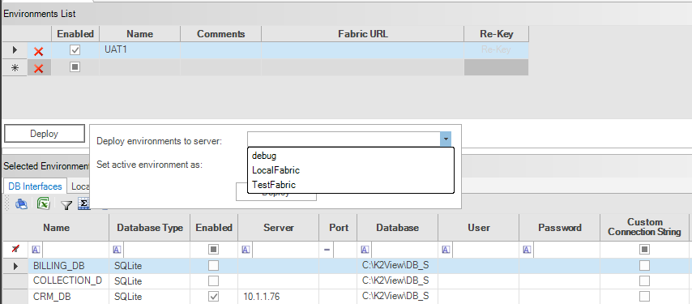
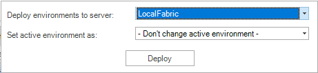
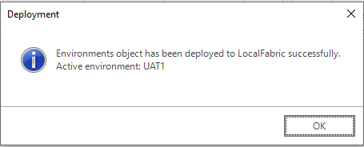

<studio>

# Deploying an Environment from the Fabric Studio

To deploy an environment to the server from the Fabric Studio, do the following:

1. Go to **Project Tree** > **Shared Objects** and double click **Environments** to open the Environments window.

   

2. Click **Deploy** to open the popup.

       

3. Select the server from the **Deploy environments to server** dropdown list and the environment from the **Set active environment** dropdown list. 

4. Click **Deploy**. If a deployment is successful, a confirmation notification is displayed.

   

Notes:

* All the environments are deployed to the server. A list of deployed environments can be displayed using the LIST command.
* Only one environment can be active at a specific time which can be either selected from the dropdown list or the default *_dev* environment. 
* Setting an active environment during the deployment is optional. If the active environment is not updated during deployment, the *_dev* environment remains active and can be later changed using the SET environment commands.

[Click for more information about SET and LIST commands for environments](/articles/25_environments/05_set_and_list_commands.md).

</studio>
