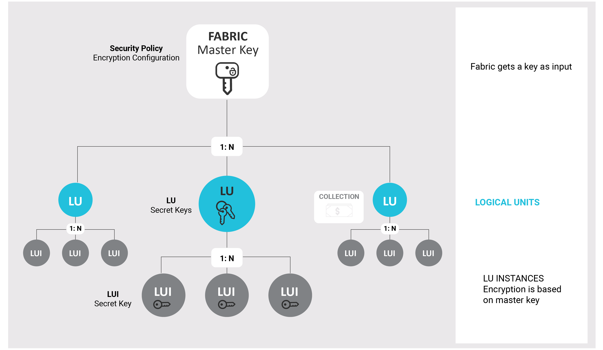

# **Fabric Data: Secured-By-Design** 


## Logical Unit Encryption 

### The Logical Unit 

Most database management systems store data in silos, organized according to the type of data stored. For example: customer data, financial data, address data or device data. When data is required, hundreds or thousands of tables may need to be queried using complex joins in order to deliver the information. This process is very cumbersome, complex and time consuming. Most importantly, data safety is challenged and security is increasingly compromised each time these tables are accessed. 

Fabric's unique data approach offers a new paradigm for data management, especially when it comes to protecting data integrity. This approach uses a *Logical Unit*. Fabric uses the Logical Unit to store and enable access to data using an entity-centric predefined structure that considerably reinforces its security and integrity as each entity is stored separately within a *Logical Unit Instance*. Each time data is accessed, a *Logical Unit Instance* is created or updated, based on a sync policy. 

### Logical Unit Instances Encryption

Fabric encrypts each Logical Unit Instance (LUI) using an AES256 algorithm along with an initialization vector (IV) and creates a unique encryption key for each LUI. The LUI data can only be read using the Fabric master key, which is also always encrypted. 

This additional atomic-level encryption delivers greater protection for sensitive data and entirely eliminates the chance of a large-scale data breach of your systems. Each entity is uniquely protected and its encryption secrets are not relevant to the other millions or more of entities stored in Fabric.   


## Fabric Hashing Mechanism

As part of managing data securely, Fabric hashes keys which point to the data. For this purpose, Fabric uses the SHA-512 or SHA-512/256 algorithms for hashing: when working [with FIPS mode](18_FIPS_implementation.md), Fabric uses SHA-512/256 algorithm for hashing. If the FIPS mode is not set, Fabric uses the SHA-512 algorithm for hashing. In addition, Fabric uses a [dedicated master key](#fabric-master-key) to hash the original value.

Examples for hashing:

- An **Instance Key** used to encrypt LU Instances is the hashed combination of the LU name it belongs to, its own LU Instance, and the master key.
- The **Fabric Masking** utility uses Fabric hashing capability when hashing the original value of any encrypted field of a given LUI. 

## Fabric Encryption: Project Perspective

The following illustration shows how Logical Unit Instances inherit their own private encryption keys based on the Fabric master key and the LU to which they belong.




## Fabric Master Key 

Fabric Master Key mechanism is based on two modules: key generator and key storage, where both are configurable.

### Master Key Generation

By default, Fabric uses its built-in master-key generator, which uses strong Java methods aimed for AES key generation algorithms. A 
Master key can be regenerated via the [Master Key Rotation](#master-key-rotation) mechanism.

As an alternative for using its built-in master key generator, Fabric enables integration with [KMS](#kms) (Key Management Services) to generate and encrypt its master key.   

### Master Key Storage

By default, Fabric uses its built-in master-key storage mechanism, which stores the master key securely. When used, it first encrypts the master key using a *protection key*. To do so, the JAVA_AES library randomly generates a new 256 bit key using an AES-256 algorithm. Fabric also uses an Initialization Vector algorithm to encrypt the master key. 

Once the master key is encrypted, it is broken into bytes. Each byte is stored in a separate record in a dedicated Cassandra table. Using the Cassandra distribution data logic, the parts of the key are stored across different nodes of the cluster. 

#### Securing the Protection Key

To secure the protection key itself, along with the ability to control and rotate it, it is recommended to configure Fabric to store it within KeyStore mechanism. 

To use it:

* Set the ```MASTERKEY_KEY_STORE_ENABLED``` parameter of the config.ini file to ```true```. 

* Generate a secret key and store it in the KeyStore using ```keytool -genseckey``` command as described [here](/articles/99_fabric_infras/devops/10_fabric_definde_master_key.md ) 

  > Note:  When Fabric is loaded for the first time, it checks whether such entry exists and if it does not - it generates it.

When used, Fabric accesses first the KeyStore, opens it using user and password credentials, gets the protection key stored in it, and uses it with an initialization vector (IV) to encrypt or decrypt the Fabric master key.

> Notes:
>
> * KeyStore usage can be turned on later, not from the beginning of the specific Fabric setup, where master key will be re-generated using the KeyStore's protection key. Once the KeyStore is added to Fabric, it cannot be removed.
> * Fabric supports protection key rotation, where previous protection keys can still be used to get entities already encrypted by old ones. For supporting it, the KeyStore contains the history of all encryptions. Each encryption of a master key creates a record in the KeyStore with the protection key and the key description of the encrypted master key. 
> * When ``MASTERKEY_KEY_STORE_ENABLED`` is set to ``false``, Fabric still uses a protection key, which it generates, to encrypt the master key. Yet, this protection key cannot be controlled.
>


### Master Key Commands

A key can be generated using the following command:

```activatekey name='<name>' [generatorType='<generatorType>'] [storeType='<storeType>'] [WITH ARGS='<args>']```

**Examples:**

1. Rotating the logical unit instance encryption master key:
   ```activatekey name='<masterkey_key_name>' [generatorType='Java_AES'] [storeType='Stripe_AES']```

2. Rotating the the master key for hashing:

   ```activatekey name='k2_hash_key' [generatorType='Java_AES'] [storeType='Stripe_AES']```

> Notes:
>
> * When Fabric is going live, it checks whether a master key already exists and if it does not - it creates it.
> * The *generator-type* and *store-type* parameters are optional. If not specified, Fabric uses its defaults -  "Java_AES" and "Stripe_AES" respectively.

### Master Key Rotation

The master key rotation supports the LUI encryption master key. Although the data is organized and encrypted on a per-instance basis, Fabric users can regenerate keys by setting a regularly scheduled daily or weekly job calling Fabric's [rekey](/articles/26_fabric_security/03_fabric_LUI_encryption.md#lurekey) function to re-issue the master key and therefore re-encrypt data from all instances.

Note that the job does not have to be time-based but must be triggered by any other condition such as the number of LUIs per node.

Master key rotation enables generating and activating a new master key. The new master key impacts Instance IDs saved in Cassandra from the moment they are generated onwards. The existing Instance IDs are not impacted by the new key until they are next synced and saved in Cassandra.

Upon retrieval of a specific Instance ID, Fabric collects the master key's information used for the encryption of the LU instance and performs on-the-fly de-encryption of the data.

### KMS

Fabric supports, since v6.5.9 release, integrations with KMS (Key Management Service) in order to generate and encrypt its master key.  

#### Background

KMS is a cloud service that provides a centralized key management with interfaces to generate, rotate and manage cryptographic keys. Key Management Service is provided by various Cloud providers, with various capabilities, where Fabric supports integration with AWS and GCP KMS. Among the advantages of using KMS is that it is backed by hardware security modules (HSM). 

>  Note: While KMS providers enable working with either symmetric and asymmetric encryption types, Fabric supports the symmetric type and thus the below explanations refer to this type only. 

KMS exposes two-tiered key hierarchy to clients: 
* **Master Key** (one or more, as needed) - at AWS it is known as CMK (Customer Master Key) and at GCP it is called KEK (Key Encryption Key). The master key, which is protected with HSM, lives in KMS and never leaves it. Clients cannot get it, but are rather aware of its identity and ask KMS to use it. 
* **Data Key** - used by applications to encrypt the data. The KMS does not store data keys but rather generates (at AWS) and protects them using the master keys.  

The application uses the two forms of the data key - clear/plain and encrypted. While the encrypted form is stored and persistent, the clear/plain form must not be stored anywhere; it just exists at the runtime memory.

The encrypting process is a little different among cloud providers:

* [AWS](https://aws.amazon.com/kms/) - the application calls the KMS to generate a data key and it then gets the data key back in its 2 forms. 
* [GCP](https://cloud.google.com/security-key-management) - the application itself generates the data key and calls the KMS to encrypt it.

Then the application uses the clear/plain form to encrypt the data and it also stores the encrypted data key in order to enabled decrypting it later. The application shall decide whether to reuse a data key for later encryptions or whether to regenerate different ones, either every time or in a predefined frequency.  

For decrypting data, the application shall take the encrypted data key from its storage, call the KMS to decrypt it into its clear/plain form, and use it for decrypting the data.

#### Fabric Working-flow with KMS 

When a KMS integration is used, Fabric treats KMS's data-key as its master key: 

When integrated with AWS, instead of generating a master key, it calls the AWS KMS to get an encrypted data key. When integrated with GCP, it generates a data key and calls the GCP KMS to encrypt it. Then, Fabric treats the *encrypted* data key as its master key.  

To encrypt or decrypt data, each Fabric node,  while going live, takes the stored Fabric master key, which is actually the encrypted data key, and calls the KMS to decrypt it. Having the data key in its clear/plain form, Fabric can encrypt and decrypt data.

#### Setup 

In order to work with KMS you should set its information in config.ini and accordingly generate a new Fabric master key. For information of what should be configured and done for working with KMS, refer to [Fabric Master Key Integrated with KMS](/articles/99_fabric_infras/devops/10a_fabric_master_key_integrated_with_kms.md ).

#### Fabric Master Key Commands

As described, the Fabric master-key command refers to its two modules - the key generation and the key storage, according to its input parameters. When working with KMS, these parameters should be provided as follows:

* When integrated with AWS, use ``activatekey name='<name>' generatorType='AWS_KMS' storeType='AWS_KMS'``.
* When integrated with GCP, use ``activatekey name='<name>' generatorType='Java_AES' storeType='GCP_KMS'``.

> Note: At any point, these commands can be executed with these parameters or their defaults - self generated and self stored master key - and from this point encryptions will be done with the newest key. Fabric will still be able to decrypt data that has been encrypted with previous keys, of any type. For example, if Fabric already works with a self generated master key and at some point it is required to adopt KMS, then configuration should be set in the config.ini and then the above relevant ``activatekey`` command (AWS, GCP) shall be executed. 

#### Key Rotation

When working with KMS, there are two levels of key rotation: The Fabric master key rotation and the KMS master key rotation. 

* Fabric master key rotation is done in Fabric using the ``activatekey `` command and is described [here](#master-key-rotation).
* KMS master key rotation is done in the KMS according to the master key settings and policy. This rotation is transparent to Fabric, so that KMS decrypts also data keys, sent by Fabric, that were encrypted with older master key versions.

#### Key Replacement

When required, KMS master key can be replaced. In such case, a new KMS master key ID is provided and set in Fabric configuration. Then, ``activatekey`` command shall be executed in order to generate a new Fabric master key that will use the replaced KMS master key. Fabric preserves, for each of its master keys, the KMS master key ID that it is associated to. This way, Fabric can decrypts data that was encrypted with previous KMS master keys.

> Notes:
>
> * At AWS, manual key rotation is done only by creating a new master key, that is - using a key replacement. GCP supports manual rotation similar to the automatic rotation, i.e. without replacing the key.
> * In order to enable Fabric to decrypt older KMS master keys, these keys shall be preserved in the KMS. If it is required to delete them, then before doing it Fabric migrate process shall be done on the data, to re-encrypt them with the new master key.

#### Multi Region Support

KMS is usually strictly isolated to a single region, with no sharing of keys, policies or audit information across regions. Yet, KMS providers have solutions in which a key can be used in other regions. 

* AWS - key should be created as a multi-region key. AWS multi-region keys are a set of interoperable KMS keys that have the same key ID and key material, and that can be replicated to different regions. Using multi-region keys, data - which is encrypted in one region - can be decrypted in a different region with the replicated key. For more information read [here](https://aws.amazon.com/blogs/security/encrypt-global-data-client-side-with-aws-kms-multi-region-keys/).
* GCP - supports a multi-regional key, as well as a "general" key. Best practice recommendations are described [here](https://cloud.google.com/kms/docs/locations#choosing). 

From Fabric perspective, while its nodes may be able to access a key on any KMS region, it still should be carefully considered due to performance aspects on cross region access.


[](/articles/26_fabric_security/01_fabric_security_overview.md)[](/articles/26_fabric_security/03_fabric_LUI_encryption.md)
