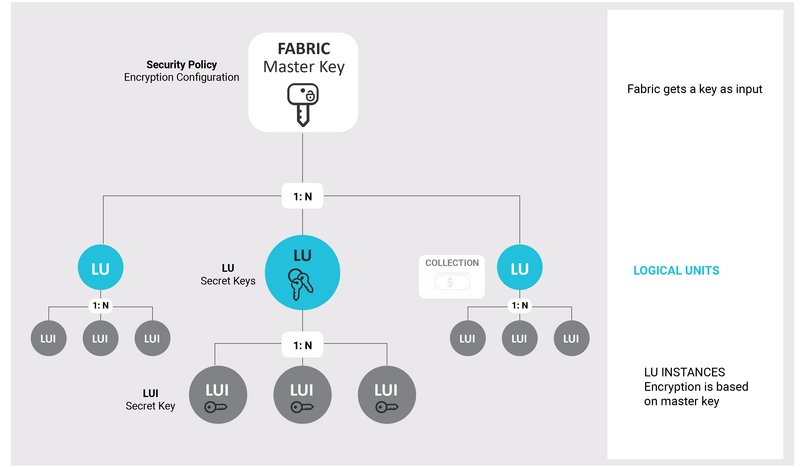

# **Fabric Data: Secured-By-Design** 

## Table of Contents

- [Logical Unit Encryption](#logical-unit-encryption)
  - [The Logical Unit](#the-logical-unit)
  - [Logical Unit Instances Encryption](#logical-unit-instances-encryption)
- [Fabric Hashing Mechanism](#fabric-hashing-mechanism)
- [Fabric Encryption: Project Perspective](#fabric-encryption-project-perspective)
- [Key Management](#key-management)
  - [Master Key Generation](#master-key-generation)
  - [Master Key Storage](#master-key-storage)
    - [Securing the Master Key](#securing-the-master-key)
  - [Master Key Commands](#master-key-commands)
  - [Master Key Rotation](#master-key-rotation)
- [External KMS](#external-kms)
  - [Background](#background)
  - [Fabric Working-flow with external KMS](#fabric-working-flow-with-external-kms)
  - [Setup](#setup)
  - [Fabric Master Key Commands](#fabric-master-key-commands)
  - [Key Rotation](#key-rotation)
  - [Key Replacement](#key-replacement)
  - [Multi-Region Support](#multi-region-support)


## Logical Unit Encryption 

### The Logical Unit 

Most database management systems store data in silos, organized according to the type of data stored, such as customer data, financial data, address data, and device data. When data is required, hundreds or thousands of tables may need to be queried using complex joins to deliver the information. This process is very cumbersome, complex, and time-consuming. Most importantly, data safety is challenged, and security is increasingly compromised each time these tables are accessed. 

Fabric's unique data approach offers a new paradigm for data management, particularly in terms of protecting data integrity. This approach utilizes a *Logical Unit*. Fabric utilizes the Logical Unit to store and enable access to data using an entity-centric, predefined structure that considerably enhances its security and integrity, as each entity is stored separately within a Logical Unit Instance. Each time data is accessed, a *Logical Unit Instance* is created or updated based on a sync policy. 

### Logical Unit Instances Encryption

Fabric encrypts each Logical Unit Instance (LUI) using an AES-256 algorithm along with an initialization vector (IV) and creates a unique encryption key for each LUI. The LUI data can only be read using the Fabric master key, which is also always encrypted. 

This additional atomic-level encryption provides greater protection of sensitive data, in addition to eliminating the risk of a large-scale data breach of systems. Each entity is uniquely protected, and its encryption secrets do not affect the other millions (or more) of entities stored in Fabric.   


## Fabric Hashing Mechanism

As part of managing data securely, Fabric hashes keys that point to the data. For this purpose, Fabric uses the SHA-512 or SHA-512/256 algorithms for hashing: when working [with FIPS mode](18_FIPS_implementation.md), Fabric uses SHA-512/256 algorithm for hashing. If the FIPS mode is not set, Fabric uses the SHA-512 algorithm for hashing. Additionally, Fabric uses a [dedicated master key](#fabric-master-key) to salt the original value before hashing it.

Examples for hashing:

- An **Instance Key** used to encrypt LU Instances is the hashed combination of the LU name it belongs to, its own LU Instance, and the master key.
- The **Fabric Masking** utility utilizes Fabric hashing capabilities to hash the original value of any encrypted field within a given LUI. 

## Fabric Encryption: Project Perspective

The following illustration shows how Logical Unit Instances (LUIs) inherit their own private encryption keys based on the Fabric master key and the Logical Unit (LU) to which they belong.




## Key Management

The Fabric Key Management mechanism, responsible for encrypting and decrypting elements, is based on two modules: a master key generator and a master key storage, both of which are configurable.

By default, Fabric uses its built-in key management mechanism for both modules - generating and storing the master key. Fabric enables integration with external [KMS](#kms) (Key Management Services); such integration is supported since Fabric v6.5.9.

 > Note that the terminology of Fabric master key remains valid when integrating with an external KMS, as it is used internally, towards Fabric modules, as a master key responsible for encrypting and decrypting data.

### Master Key Generation

The Fabric built-in master-key generator uses strong Java methods designed for AES key generation algorithms. A master key can be regenerated via the [Master Key Rotation](#master-key-rotation) mechanism.

### Master Key Storage

Fabric stores its master key securely, using the master-key storage mechanism. 

Firstly, it encrypts the master key using a *protection key*. To do so, the JAVA_AES library randomly generates a new 256-bit key using an AES-256 algorithm. Fabric also uses an initialization vector algorithm to encrypt the master key. 

Secondly, following the master key encryption, it is broken into bytes. Each byte is stored in a separate record in a dedicated Cassandra table. Using the Cassandra distribution data logic, the parts of the key are stored across different nodes of the cluster. 

> Note: This is also done when the Fabric master key is managed externally, when Fabric is integrated with an external KMS.

#### Securing the Master Key

To secure the master key itself, along with the ability to control and rotate it, it is recommended that Fabric be configured to store the key in a KeyStore system. 

To use it:

* Set the ```MASTERKEY_KEY_STORE_ENABLED``` parameter of the config.ini file to ```true```. 

* Generate a secret key and store it in the KeyStore using ```keytool -genseckey``` command as described [here](/articles/99_fabric_infras/devops/10_fabric_definde_master_key.md ) 

  > Note: When Fabric is loaded for the first time, it checks whether such an entry exists, and if it does not, it generates it.

When used, Fabric first accesses the KeyStore, opens it using user and password credentials, retrieves the protection key stored within, and uses it in conjunction with an initialization vector (IV) to encrypt or decrypt the Fabric master key.

> Notes:
>
> * KeyStore usage can be turned on later, not from the beginning of the specific Fabric setup, where the master key will be re-generated using the KeyStore's protection key. Once the KeyStore is added to Fabric, it cannot be removed.
> * Fabric supports protection key rotation, where previous protection keys can still be used to get entities already encrypted by old ones. To support this, the KeyStore contains the history of all encryptions. Each encryption of a master key creates a record in the KeyStore with the protection key and the key description of the encrypted master key. 
> * When ``MASTERKEY_KEY_STORE_ENABLED`` is set to ``false``, Fabric still uses a protection key, which it generates, to encrypt the master key. Yet, this protection key cannot be controlled.
>


### Master Key Commands

A key can be generated using the following command:

```activatekey name='<name>' [generatorType='<generatorType>'] [storeType='<storeType>'] [WITH ARGS='<args>']```

**Examples:**

1. Rotating the logical unit instance encryption master key:
   ```activatekey name='<masterkey_key_name>' [generatorType='Java_AES'] [storeType='Stripe_AES']```

2. Rotating the master key for hashing:

   ```activatekey name='k2_hash_key' [generatorType='Java_AES'] [storeType='Stripe_AES']```

> Notes:
>
> * When Fabric is going live, it checks whether a master key already exists, and if it does not, it creates it.
> * The *generator-type* and *store-type* parameters are optional. If not specified, Fabric uses its defaults - "Java_AES" and "Stripe_AES" respectively.

### Master Key Rotation

The master key rotation supports the LUI encryption master key. Although the data is organized and encrypted on a per-instance basis, Fabric users can regenerate keys by setting a regularly scheduled daily or weekly job, calling Fabric's [rekey](/articles/26_fabric_security/03_fabric_LUI_encryption.md#lurekey) function to re-issue the master key and therefore re-encrypt data from all instances.

Note that the job does not have to be time-based; any other condition, such as the number of LUIs per node, can trigger.

Master key rotation enables the generation and activation of a new master key. The new master key affects Instance IDs saved in the LU database from the moment they are generated onwards. The new key does not impact the existing Instance IDs until they are next synced and saved in the LU database.

Upon retrieving a specific Instance ID, Fabric collects the master key's information used for encrypting the LU instance and performs on-the-fly decryption of the data.

### External KMS

Fabric supports, since the v6.5.9 release, integrations with external KMS (Key Management Services) to generate and encrypt its master key.  

#### Background

KMS is a service that provides a centralized key management with interfaces to generate, rotate, and manage cryptographic keys. KMS is supplied by various providers, with multiple capabilities, where Fabric supports integration with AWS and GCP KMS. Among the advantages of using KMS is that it is backed by hardware security modules (HSM). 

Note: While KMS providers enable working with either symmetric or asymmetric encryption types, Fabric supports only the symmetric type; therefore, the explanations below refer to this type only. 

KMS exposes a two-tiered key hierarchy to clients: 
* **Master Key** - At AWS, it is known as a CMK (Customer Master Key), and at GCP, it is referred to as a KEK (Key Encryption Key). The master key, which is protected by an HSM, resides in KMS and never leaves it. Clients cannot get it, but are aware of its identity and ask KMS to use it. 
* **Data Encryption Key** (DEK) - used by applications to encrypt and decrypt the data. The KMS does not store data keys but instead generates (at AWS) and protects them using the master keys.  

The application utilizes two forms of the data key: clear/plain and encrypted. While the encrypted form is stored and persistent, the clear or plain form must not be stored anywhere; it exists only in runtime memory.

The encryption process is a little different among providers:

* [AWS](https://aws.amazon.com/kms/) - The application calls KMS to generate a data key, and it then receives the data key in two forms. 
* [GCP](https://cloud.google.com/security-key-management) and [KMIP](http://docs.oasis-open.org/kmip/kmip-spec/v2.1/os/kmip-spec-v2.1-os.html) - the application itself generates the data key and calls the KMS to encrypt it.

Then, the application uses the clear/plain form to encrypt the data, and it also stores the encrypted data key to enable decryption later. The application determines whether to reuse a data key for subsequent encryptions or to regenerate different ones, either each time or at a predefined frequency.  

For decrypting data, the application retrieves the encrypted data key from its storage, calls the KMS to decrypt it into its clear form, and uses it to decrypt the data.

#### Fabric Working-flow with external KMS 

When a KMS integration is used, Fabric treats KMS's data key as its master key: 

When integrated with AWS, instead of generating a master key, it calls the AWS KMS to get an encrypted data key. When integrated with GCP or KMIP KMS, it generates a data key and calls the KMS to encrypt and seal it. Then, Fabric treats the *encrypted* data key as its master key.  

To encrypt or decrypt data, each Fabric node, upon going live, retrieves the stored Fabric master key, which is the encrypted data key, and calls the KMS to decrypt or unseal it. Having the data in its clear, plain form, Fabric can encrypt and decrypt data.

#### Setup 

To work with KMS, you should set its information in config.ini and then generate a new Fabric master key accordingly. For details of what should be configured and done for working with KMS, refer to [Fabric Master Key Integrated with KMS](/articles/99_fabric_infras/devops/10a_fabric_master_key_integrated_with_kms.md ).

#### Fabric Master Key Commands

As described, the Fabric master-key command refers to its two modules - the key generation and the key storage, according to its input parameters. When working with KMS, these parameters should be provided as follows:

* When integrated with AWS, use ``activatekey name='<name>' generatorType='AWS_KMS' storeType='AWS_KMS'``.
* When integrated with GCP, use ``activatekey name='<name>' generatorType='Java_AES' storeType='GCP_KMS'``.
* When integrated with KMIP, use ``activatekey name='<name>' generatorType='Java_AES' storeType='KMIP_KMS'``.

Note: At any point, these commands can be executed with these parameters or their defaults, including the self-generated and self-stored master key. From this point forward, encryptions will be performed using the newest key. Fabric will still be able to decrypt data that has been encrypted with previous keys, of any type. For example, if Fabric already works with a self-generated master key and it is required to adopt an external KMS at some point, then the configuration should be set in the config.ini file, and the above relevant ``activatekey`` command should be executed. 

#### Key Rotation

When working with an external KMS, there are two levels of key rotation: The Fabric master key rotation and the KMS master key rotation. 

* Fabric master key rotation is done in Fabric using the ``activatekey `` command and is described [here](#master-key-rotation).
* KMS master key rotation is done in the KMS according to the master key settings and policy. This rotation is transparent to Fabric, so that KMS also decrypts data keys sent by Fabric that were encrypted with older master key versions.

#### Key Replacement

When required, the KMS master key can be replaced. In such a case, a new KMS master key ID is provided and set in the Fabric configuration. Then, ``activatekey`` command shall be executed in order to generate a new Fabric master key that will use the replaced KMS master key. Fabric preserves, for each of its master keys, the KMS master key ID to which it is associated. This way, Fabric can decrypt data that was encrypted with previous KMS master keys.

> Notes:
>
> * At AWS, manual key rotation is done only by creating a new master key, that is, using a key replacement. Others, like GCP, support manual rotation similar to the automatic rotation, i.e., without replacing the key.  
> * To enable Fabric to decrypt older KMS master keys, these keys shall be preserved in the KMS. If it is required to delete them, the Fabric migration process should be performed on the data to re-encrypt it with the new master key before deletion.

#### Multi-Region Support

Cloud KMS is usually strictly isolated to a single region, with no sharing of keys, policies or audit information across regions. Yet, KMS providers have solutions that allow a key to be used in other regions. 

* AWS - key should be created as a multi-region key. AWS multi-region keys are a set of interoperable KMS keys that have the same key ID and key material, and that can be replicated to different regions. Using multi-region keys, data encrypted in one region can be decrypted in a different region using the replicated key. For more information, read [here](https://aws.amazon.com/blogs/security/encrypt-global-data-client-side-with-aws-kms-multi-region-keys/).
* GCP - supports a multi-regional key, as well as a 'general' key. Best practice recommendations are described [here](https://cloud.google.com/kms/docs/locations#choosing). 

From a Fabric perspective, while its nodes may be able to access a key in any KMS region, it should still be carefully considered due to performance aspects related to cross-region access.


[](/articles/26_fabric_security/01_fabric_security_overview.md)[](/articles/26_fabric_security/03_fabric_LUI_encryption.md)
