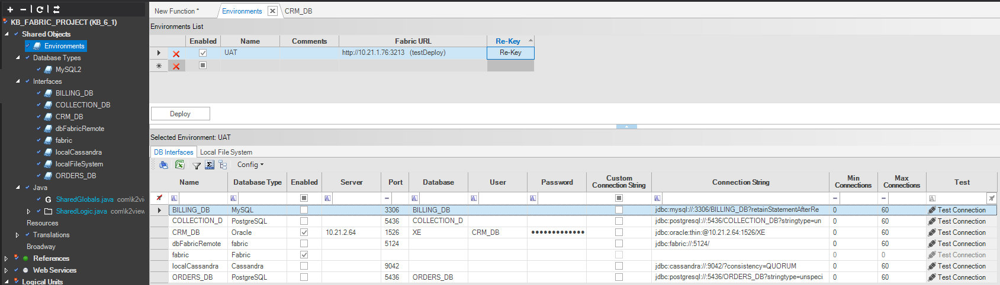

# **Fabric Environments & Interfaces Security** 

Fabric enables communication to external systems, such to source and target data, via [interfaces]("/articles/05_DB_interfaces/01_interfaces_overview.md") that define connection definitions.

The secrets, like passwords, that are a part of the interfaces definitions, are stored securely in either Fabric, where secrets are encrypted, or an external Secret Manager service that Fabric integrates with.

<studio>

## Securing Environments

Fabric enables you to define several source [environments](/articles/25_environments/01_environments_overview.md), where for each environment you can set the connection details of the interfaces.

When environment secrets are stored in Fabric, it enables users to define and apply strong, stronger and strongest levels of encryption on environment interfaces.

1. **Assigned Environment with keystore** (Protection Key) - This is the most recommended and secured method, where:

   * Encryption is done using Fabric's powerful [Key Management](/articles//26_fabric_security/02_fabric_entities_design.md#key-management) mechanism.
   * Encryption is done using each environment master key. This means that on runtime, an environment, with all its interfaces secrets, can be used only at the Fabric that this environment associated to. For example, Fabric at UAT will not able to access Production interfaces.
   * Master key itself is protected by keystore.

   >  To use this option, you need to populate the "Fabric URL" field, as describe [here](/articles/25_environments/02_create_new_environment.md).

2. **Assigned Environment without Keystore** - This option is similar to the previous #1 method, where master key is set without keystore protection.

3. **Unassigned Environment** - This option does encrypt the interfaces secrets by environment, and shall be used in case Fabric servers for the environments are not yet running and thus cannot use their master key. 

   The secrets encryption is done by using a code based mechanism and thus can be used among all Fabric environments. 

> Notes:
>
> * When changing the passwords of an interface in an environment, then on save Fabric re-encrypts the passwords.
> * When master key was rotated at an environment, you can use the "Re-Key" button, appears aside the environment. When activated, the passwords of all interfaces are re-encrypted using the most the latest master key. This is relevant to methods #1 and #2, where environment's Fabric master key is being used for encryption.

   

## Securing Interfaces Settings

Base interfaces, those which are not part of environments, are used either for development environments or by customers that does not have multiple source environments. The secrets, like passwords, for this interface is encrypted and saved in the [XML file](/articles/25_environments/04_offline_deployment.md#xml-file-example) used to stage the project's deployment onto the server. 

</studio>

<web>

Fabric enables you to define several source [environments](/articles/25_environments/01_environments_overview.md), where for each environment you can set the connection details of the interfaces. Securing environment's interface secrets are done similar to base interfaces.

</web>

## Securing File Systems Settings

Fabric enables connection to SFTP servers hosting files.
When an SFTP connection is needed to pull or push files, SSH keys exchange-based authentication can be used, in which case the password in the SFTP interface must be left blank.  

