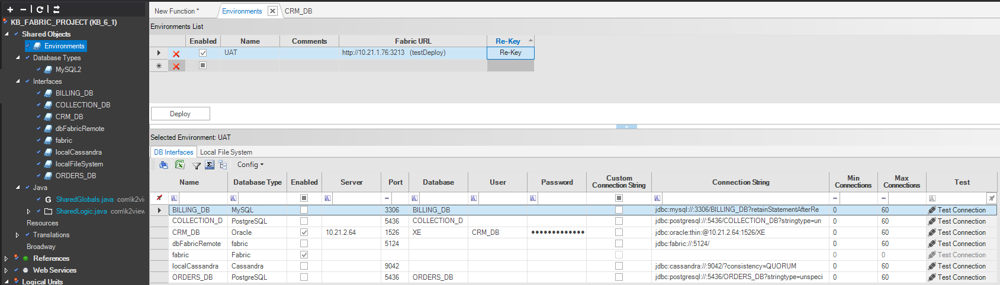

# **Fabric Environments & Interfaces Security** 

Fabric enables communication to external systems, such as source and target data, via [interfaces]("/articles/05_DB_interfaces/01_interfaces_overview.md") that define connection definitions.

The secrets, such as passwords, that are a part of the interfaces' definitions, are stored securely either in Fabric, where secrets are encrypted, or in an external Secret Manager service that Fabric integrates with.

<studio>

## Securing Environments

Fabric enables you to define several source [environments](/articles/25_environments/01_environments_overview.md), where for each environment, you can set the connection details of the interfaces.

When using Fabric for storing environment secrets, there are 3 optional encryption levels that can be defined and applied - strong, stronger, and strongest:

1. **Assigned Environment with a keystore** (Protection Key) - this is the most recommended and secured method, where:

   * Encryption is done using Fabric's powerful [Key Management](/articles/26_fabric_security/02_fabric_entities_design.md#key-management) mechanism.
   * Encryption is done using each environment's master key. This means that at runtime, an environment, along with all its interface secrets, can be used only on the Fabric to which it is associated. For example, Fabric in a UAT environment will not be able to access Production interfaces.
   * A keystore protects the master key itself.

   >  To use this option, you need to populate the "Fabric URL" field, as described [here](/articles/25_environments/02_create_new_environment.md).

2. **Assigned Environment without a Keystore** - This option is similar to the previous method (#1), where the master key is set without keystore protection.

3. **Unassigned Environment** - This option does not encrypt interface secrets by environment and should be used in cases where Fabric servers for the environments are not yet running and thus cannot use their master key. 

   Secret encryption is achieved through a code-based mechanism and can therefore be used across all Fabric environments. 

> Notes:
>
> * When changing the passwords of an interface in an environment, Fabric re-encrypts the passwords.
> * If the master key is rotated at an environment, you can use the "Re-Key" button. When activated, the passwords of all interfaces are re-encrypted by the latest master key. This is relevant to methods #1 and #2, where the environment's Fabric master key is being used for encryption.

   

## Securing Interface Settings

The base interfaces, which are not part of environments, are used for development. Their secrets are encrypted by the base level of encryption.

</studio>

<web>

Fabric enables you to define several source [environments](/articles/25_environments/01_environments_overview.md), where for each environment, you can set the interfaces' connection details. Securing an environment's interface secrets is done in a similar manner to that of the base interfaces’ secrets.

</web>

https://github.com/k2view-academy/K2View-Academy/edit/Academy_8.3/articles/26_fabric_security_sm/04_fabric_interfaces_security.md#:~:text=04_fabric_interfaces_security.md-,04a_secret_manager,-.md

## Securing File Systems Settings

Fabric enables connection to SFTP servers hosting files.
When an SFTP connection is needed to pull or push files, SSH key-exchange-based authentication protocol can be used, in which case the password in the SFTP interface should be left blank.  

