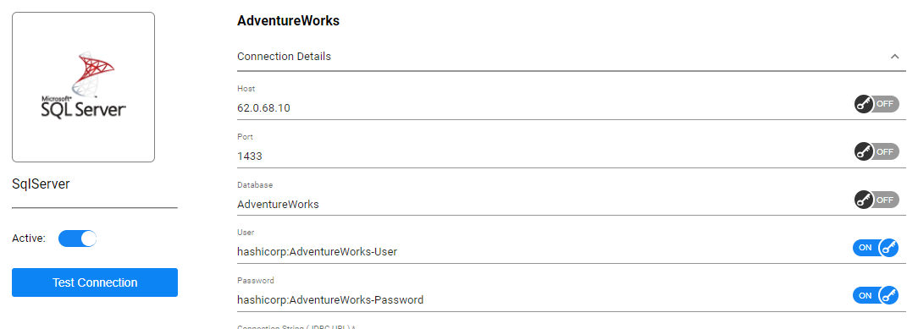

# **Secrets Management Integration**: Interface Editor 

Fabric supports integration with Secrets Management services, with the intention of not storing secrets in Fabric itself. 

In order to use a Secrets Management provider, you should provision and mark, at the Interface Editor (including Environments Editor), the required interface connection details as those that should be taken from the Secrets Management provider, as part of the project's implementation settings.

## Interface Connection Settings

* Each Secret Manager service has its own keys pattern, usually by hierarchy (e.g., with a dot sign inside the key name); you should follow that pattern.

* The Secrets Management service can be used also for interface connection details inside environments. 

  > Each one of the environments and the interfaces is independent, in a way that some environments may use Secrets Management services, whereas others such as local testing, might not. 

* You can use the *Test connection* option to validate the connection settings also when the Secrets Management service is activated.

* The following properties can be addressed to the Secrets Management provider for the DB Interface types: host, port, database, user, password. For all other interfaces, all connection details properties can be set to use the Secrets Management provider.  

To set and mark an interface's property to use a secret manager:

<studio>

Use this pattern in its value:  ${secretmanager:<id-at-secret-manager>}. For example: `${secretmanager:mysql-password}`, where mysql-password is the key as exists in the secret management service.

</studio>

<web>

1. Turn the key switch, located beside each relevant property, to be on ( &rarr; ).
1. type in the key, as exists in the secret management service.

> Notes: 
>
> * When turned on, a default value appears, as a proposed key name, which built from the name of the Interface and the property name. For example: the proposed key name for *Host* property in ASSETS_DB interface will be `ASSET_DB.Host`. This is a suggested name, but you shall strictly align with the same name as exists in the secret management service.
> * When turned on, also a property which is considered as password, it will be shown as is and characters will not be masked.

</web>

* Additional notes and considerations regarding **specific** Secrets Management providers:

  * For **CyberArk CCP**, you can specify the *folder* and/or the *safe-name* parameters by using the '&' concatenating pattern, e.g., `Safe=my-safe&Folder=my-folder&Object=mysql-password&AppID=`

     >  The AppID parameter is optional and can be added for more granularity, rather than a general AppID that can be set in the config.ini file.

  * For **Safeguard**, you should specify both the *asset name* and the *account name* parameters by using the '&' concatenating pattern, e.g., `asset_name=OracleDB&account_name=PreProd`

  

## Multi Secrets Management Providers and Instances Support

You can use several secrets management services on the same Fabric, per your need, as demonstrated [here](/articles/26_fabric_security/04b_secret_manager_config.md#multi-secrets-management-providers-and-instances-support).

### Multi Secrets Management Providers

If you provisioned several secret management providers at the config.ini file (and they are set to be enabled), then, by default, Fabric will try to acquire the secret from each of them, until succeeding to resolve it. 

For example, suppose you provision both AWS and HashiCorp sections in the config.ini, and you have a secret property which its key is "oracle-password" then Fabric will call first to AWS to look for this key. If it found - Fabric will use it and otherwise it will go and call to next provider, in our example - HashiCorp - to look for it. The call order is according to their order at the config.ini file.

In such cases of using several secret management providers, it is recommended to specify the secret manager provider per interface property, to avoid mistakes and avoid redundant calls to irrelevant enabled providers.

For this you shall give its name following a semicolon and then the name of the key. <studio>The pattern is: ${secretmanager:secretmanager_provider-name:my_secret} </studio><web>secretmanager_provider-name:my_secret</web>

For example, if you use HashiCorp Vault for storing SQL Server DB connections secrets, while GCP Secret Manager for storing BigQuery connection secrets, then the Interface property values representing the keys might looks like the following:

<web>

SQL Server DB connections secrets: "hashicorp:AdventureWorks-User" and "hashicorp:AdventureWorks-Password", assuming that at HashiCorp there are corresponding "AdventureWorks-Password" and "AdventureWorks-User" keys.

The REST API 

</web>  

<studio>

"${secretmanager:AdventureWorks-User}" and "${secretmanager:AdventureWorks-Password}", assuming that at HashiCorp there are corresponding "AdventureWorks-Password" and "AdventureWorks-User" keys. 

</studio>

### Multi Secrets Management Instances

When different secrets management service provider instances were provisioned at the configuration, you shall specify which one of them to use for  each Interface secret property.

For this you shall give its name following a semicolon and then the name of the key. The pattern is: <Stduio>${secretmanager:my_new_secretmanager:my_secret} </studio><web>my_new_secretmanager:my_secret</web>

For example: 

1. 2 sections are provisioned at the config.ini file: `[encryption_prod_sm]` and  `[encryption_qa_sm]` both with "aws" as secret manager provider type. 
2. The "prod" instance is aimed to be used for production source system secrets while "qa" is aimed for secrets related to QA target system. 
3. There are 2 environments one for Production Interfaces and one for QA interfaces.
4. One of the DBs is Oracle, both at source and target systems.

Then, at the Production environment, the value of the password property might looks like "prod:oracle1-pswd", while at the QA Environment the corresponding property will be "qa:oracle1-pswd" (of course if at the QA secret manager the key is different then accordingly it shall be at the interface key).

On runtime, Fabric will act according to theses definitions, so that for those properties with "prod" prefix, it will connect to the secrrt manager which defined at the `encryption_prod_sm` section in the config.ini file.

