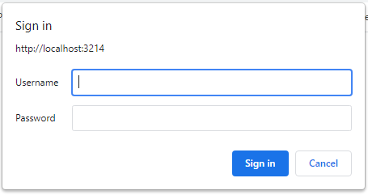
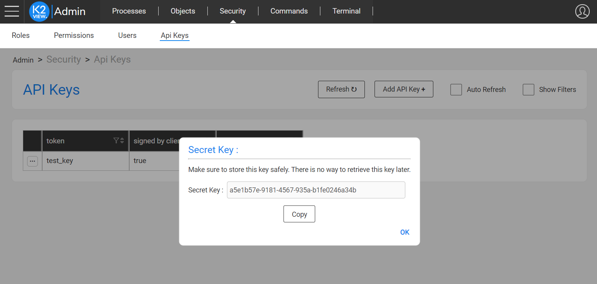

# **Fabric Web Services Security** 

## Authentication Methods

Fabric secures and controls Web Services (WS) access via an authentication and authorization mechanisms in which each API call must be verified. 

Fabric supports several methods for that purpose:

1. **API Key** - a token which is sent as `Authorization: Bearer` header

2. **JWT** (JSON Web Tokens) - an open industry standard method ([RFC 7519](https://datatracker.ietf.org/doc/html/rfc7519)) that represents claims between two parties in a secured manner. 

   The JWT authentication has 2 variant types:

   **a.** Signed by Fabric 

   **b.** Signed by the WS client

   Although the preferred way to send the JWT authentication is as an `Authorization: Bearer` header, it can also be sent as a cookie.

3. **Open Auth (OAuth)** - an authorization delegation protocol. An OAuth Access Token is a string used by a client to make requests to Fabric. This token (self-encoded JWT) is sent as `Authorization: Bearer` header.
4. **Basic Authentication** - an authentication method built into an HTTP protocol. A client provides a username and a password to make requests to Fabric. These credentials are sent as `Authorization: Basic` header.

### API Key

API key authentication is the simplest method because it can authenticate WS calls just by including a single key, where this simplicity also allows a client to make calls easily from various origins.

The API Key is sent as the token value of the `Authorization: Bearer` header, for example: `Authorization: Bearer ABC`, where API Key is "ABC".

See [here](/articles/26_fabric_security/05_fabric_webservices_security.md#generating-api-key) how to generate an API Key.

The authorization and permissions are done according to the roles which are assigned to the API Key, and their associated permissions. See [here](/articles/17_fabric_credentials/01_fabric_credentials_overview.md) for more information about API Keys, roles and permissions.

### JWT: Signed by Fabric

The authentication flow for this method works as follows:

1. Create an API Key. See [here](/articles/26_fabric_security/05_fabric_webservices_security.md#generating-api-key) for instructions. To indicate that JWT is signed by Fabric do not select the "secured" option.

2. Make a first POST call to the Fabric server's endpoint: `<SERVER-HOST>:<SERVER-PORT>/api/authenticate`, where it provides one of the following credentials in the post body:

   - user/password, using the pattern: `{"username": "<USER>", "password": "<PASSWORD>"}`.
   - API Key, using the pattern: `{"apikey": "<APIKEY>"}`. See [here](/articles/26_fabric_security/05_fabric_webservices_security.md#generating-api-key) how to generate an API Key (choose the "non secured" key).

3. Upon authentication success, Fabric responds with `{"response": "OK"}` (within 201 response code), along with the JWT which is returned as a cookie.

4. Make the next web services calls by sending this JWT as the token value of the `Authorization: Bearer` header or as a cookie, as part of each request. If requests are done via the browser, this cookie is already stored at the browser.  

   When used in the cookie, the JWT expiration is automatically extended on each call, where it is not extended when using Bearer header to pass the JWT.

The authorization and permissions are done according to the credentials that were provided during the first "/api/authenticate" call - either by the user or by the API Key and the roles which are assigned to each of them. See [here](/articles/17_fabric_credentials/01_fabric_credentials_overview.md) for more information about API Keys, roles and permissions.


### JWT: Signed by the WS Client

The authentication flow for this method works as follows:

1. Create an API Key. See [here](/articles/26_fabric_security/05_fabric_webservices_security.md#generating-api-key) for instructions. Select the "secured" option, indicating that this is the client signing method. In such case, the "/api/authenticate" call, using the API Key, will be rejected, because this call is only available for cases where JWT is signed by Fabric.
2. Generate a JWT, where:
   - It must include "apk" claim with the value of the API Key, as part of the JWT payload.
   - The secret key, provided by Fabric during the API Key generation, must be used to sign the JWT.
   - JWT is signed using HMAC-SHA256.
   - The JWT's expiration time is maintained by the client.
3. Make the web services calls by sending this JWT as the token value of the `Authorization: Bearer` header.
4. Fabric verifies that the JWT is signed with the secret that matches to the "apk".

The authorization and permissions are done according to the roles which are assigned to the API Key, and their associated permissions. See [here](/articles/17_fabric_credentials/01_fabric_credentials_overview.md) for more information about API Keys, roles and permissions.


#### External Trusted Authentication 

In some cases the client itself - a service in the organization which calls Fabric - has already authenticated the user (human or another system). For example, the client can be a service that interacts with an IDP (Identity Provider) to authenticate users by using SAML. In such a case, the client holds the actual user and the groups he is assigned to, and upon which he wants Fabric to act. For example for Fabric to use this information for roles permissions.

Fabric supports these delegated authentications:

* This option requires an extra security verification: 

  * Create a dedicated role (for example: "apikeyWithSAML") and grant it a permission for the "AUTHZ_CLAIMS" operation on all resources ("*").
  * Assign this role to the API Key, that is used and sent in the JWT. 

* The user and groups shall be sent as part of the JWT payload claims - `unm` for user and `bgr` for group list, using an array structure. Here is  a JWT example:

  ```json
  {
  	"apk": "apikeyWithSAML",
  	"unm": "jhon.doe@k2view.com",
  	"bgr": [
  		"tester1",
  		"testGroupLeaders"
  	]
  }
  ```

* When JWT is verified, Fabric sets the session with this user and roles by taking the groups and setting them as user's roles for this session.

### Open Auth (OAuth)

Fabric supports the standard Open Auth (OAuth) protocol for its web services autorization. 
Using the OAuth requires the following preparations:

* Set the JWK endpoint at the config.ini, using the JWK_ENDPOINT parameter located under oauth2 section. It should look like the following:
  ```
  [oauth2]
  ## The JSON Web Key (JWK)'s endpoint that holds the keys for the access token (JWT) verification
  JWK_ENDPOINT=https://<auth-server>/jwks
  ```

* Grant permissions according to *scopes* provided in an access token:
  1. Create roles for the scopes - each scope should be mapped to a Fabric role.
  2. Grant permission to each role, per requirements.

Fabric extends the standard OAuth authorization capabilities, beyond the provided scopes:
The access token (JWT) can be sent with an extra optional payload parameter, representing the client ID.
This ID should be mapped to APIKEY in Fabric and it should be granted permissions upon demand.
By default, the name of this optional parameter is "client_id".

Fabric follows the OAuth standards for verifying web services API calls. When a client requests a web service:
1. Fabric looks for a JWT access token at the `Authorization: Bearer` header.
2. Fabric decodes the JWT and looks for the "kid" parameter.
3. Fabric looks for the "kid" parameter in the JWK set; the set which is published by the Authorization server, is gained by Fabric.
4. Fabric verifies the JWT using the JWK matching key.

> Note: Fabric, being the Resource Server, supports both OAuth grant types, i.e. *Authorization Code* and *Client Credentials*. 


### Basic Authentication

Basic authentication, also known as *basic access authentication*, is a method for an HTTP user-agent to be authenticated by providing a user name and password, when making a request. The client sends HTTP requests with the `Authorization` header that contains the word `Basic` followed by a space and a base64-encoded string of `username:password`.

**Note:** Basic authentication should only be used together with the HTTPS/SSL mechanism. For more information refer to [Fabric Hardening](/articles/99_fabric_infras/devops/03_fabric_and_cassandra_hardening.md).

The authorization and permissions are done according to the roles which are assigned to the user, and their associated permissions. See [here](/articles/17_fabric_credentials/01_fabric_credentials_overview.md) for more information about API Keys, roles and permissions.


#### Browser Calls Helper

The Fabric Basic Authentication mechanism provides a helper when calls are originated from a web browser which does not support request header sending.

To activate the helper, add this additional parameter to the web service request: `basicAuth=true`.

When activated, a browser popup will appear, when sending the request. The user can populate the popup fields with the username and password.




## Generating API Key  

There are two options to generate an API key: either via the Web Framework Admin or by using a Fabric command. In both cases you can choose whether the API Key shall be secured or not, as described below.

* Web Framework Admin: 

  1. Open the **Admin Panel** web page and select **Admin** > **Security** and then click the **API keys** tab.
  2. Click the **Add API Key +** button on the upper right of the window.

  3. Fill in the Name (Mandatory) and choose if it shall be secured (Optional) by using the checkbox on the page.

  4. Click  **Save**.

  When the secured option has been selected, the secret key is displayed in a pop-up window and can be copied, for a later use. The secret key is used to sign the JWT.

  For example:

  

* Fabric command: `CREATE TOKEN <'token_name'> [SECURED]`.  When "SECURED" is used, the secret key is retrieved back.

  For example:

  ```text
  create token 'Secured1' SECURED;

  |Secretkey                           |
  +------------------------------------+
  |c55a86d1-9de6-4aaa-bf9e-cedf1391c95b|
  ```


If the secured option has not been selected,  the token name is used as the token value, for the API Key Authentication method.


## Web Service Authorization & Permissions 

Web services authentication is done either by user or by API key,  where each can be assigned to roles and accordingly to permissions.


Read this [article](/articles/17_fabric_credentials/01_fabric_credentials_overview.md#rbac-in-fabric) for the list of supported roles, and then click [here](/articles/17_fabric_credentials/02_fabric_credentials_commands.md#grant-ws_name-to-role-) to learn how to grant permissions to specific roles.


[](/articles/26_fabric_security/04_fabric_interfaces_security.md)[](/articles/26_fabric_security/06_data_masking.md)

