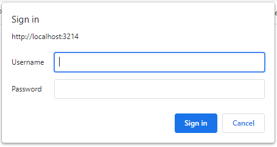
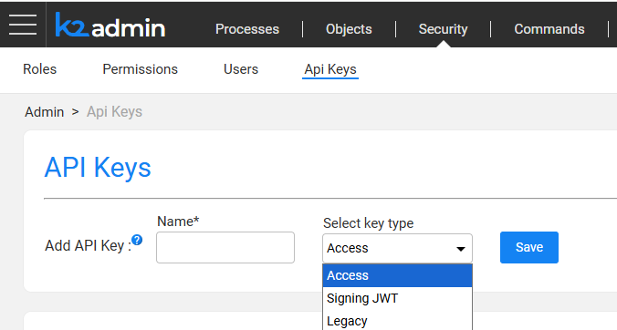

# **Fabric Web Services Security** 

## Table of Contents

- [Authentication Methods](#authentication-methods)
  - [API Key](#api-key)
  - [JWT: Signed by Fabric](#jwt-signed-by-fabric)
  - [JWT: Signed by the WS Client](#jwt-signed-by-the-ws-client)
    - [External Trusted Authentication](#external-trusted-authentication)
  - [Open Auth (OAuth)](#open-auth-oauth)
  - [Basic Authentication](#basic-authentication)
    - [Browser Calls Helper](#browser-calls-helper)
- [Generating API Key](#generating-api-key)
- [Authorization & Permissions](#authorization--permissions)


## Authentication Methods

Fabric secures and controls Web Services (WS) access through an authentication and authorization mechanism that verifies each API call. 

Fabric supports several methods for that purpose:

1. **API Key** - a token which is sent as `Authorization: Bearer` header

2. **JWT** (JSON Web Tokens) - an open industry standard method ([RFC 7519](https://datatracker.ietf.org/doc/html/rfc7519)) that represents claims between two parties in a secured manner. 

   The JWT authentication has 2 variant types:

   **a.** Signed by Fabric 

   **b.** Signed by the WS client

   Although the preferred method is to use JWT authentication with an `Authorization: Bearer` header, it can also be provided as a cookie.

3. **Open Auth (OAuth)** - an authorization delegation protocol. An OAuth Access Token is a string that a client uses to make requests to Fabric. This token (self-issued JWT) is sent in the `Authorization: Bearer` header.
4. **Basic Authentication** - an authentication method built into an HTTP protocol. A client provides a username and a password to make requests to Fabric. These credentials are sent as an `Authorization: Basic` header.

### API Key

API key authentication is the simplest method because it authenticates WS calls by including a single key, allowing a client to make calls from various origins.

The API Key is sent as the token value of the `Authorization: Bearer` header, for example: `Authorization: Bearer ABC`, where the API Key is "ABC".

See [here](/articles/26_fabric_security/05_fabric_webservices_security.md#generating-api-key) how to generate an API Key.

Authorization and permissions are assigned based on the roles associated with the API Key and its corresponding permissions. See [here](/articles/26_fabric_security/01_fabric_security_overview.md) for more information about API Keys, roles, and permissions.

### JWT: Signed by Fabric

The authentication flow for this method works as follows:

1. Create an API Key. See [here](/articles/26_fabric_security/05_fabric_webservices_security.md#generating-api-key) for instructions. To indicate that JWT is signed by Fabric, do not select the "Signed by client" option.

2. Make a first POST call to the Fabric server's endpoint: `<SERVER-HOST>:<SERVER-PORT>/api/authenticate`, where it provides one of the following credentials in the post body:

   - user/password, using the pattern: `{"username": "<USER>", "password": "<PASSWORD>"}`.
   - API Key, using the pattern: `{"apikey": "<APIKEY>"}`. See [here](/articles/26_fabric_security/05_fabric_webservices_security.md#generating-api-key) how to generate an API Key (choose the non "Signed by client" key).

3. Upon authentication success, Fabric responds with `{"response": "OK"}` (within 201 response code), along with the JWT, which is returned as a cookie.

4. Make the following web service calls by sending this JWT as the token value of the `Authorization: Bearer` header or as a cookie, as part of each request. If requests are made via the browser, this cookie is already stored in the browser.  

   When used in the cookie, the JWT expiration is automatically extended on each call, whereas it is not extended when using the Bearer header to pass the JWT.

Authorization and permissions are determined by the credentials provided during the initial "/api/authenticate" call, either by the user or by the API Key, along with the assigned roles for each. See [here](/articles/26_fabric_security/01_fabric_credentials_overview.md) for more information about API Keys, roles, and permissions.


### JWT: Signed by the WS Client

The authentication flow for this method works as follows:

1. Create an API Key. See [here](/articles/26_fabric_security/05_fabric_webservices_security.md#generating-api-key) for instructions. Select the "Signed by client" option to indicate that the client is signing. In such a case, the "/api/authenticate" call using the API Key will be rejected because it is only available when Fabric signs the JWT.
2. Generate a JWT, where:
   - It must include an "apk" claim with the value of the API Key, as part of the JWT payload.
   - The secret key, provided by Fabric during the API Key generation, must be used to sign the JWT.
   - JWT is signed using HMAC-SHA256.
   - The client maintains the JWT's expiration time.
3. Make the web services calls by sending this JWT as the token value of the `Authorization: Bearer` header.
4. Fabric verifies that the JWT is signed with the secret that matches the "apk".

Authorization and permissions are assigned based on the roles associated with the API Key and its corresponding permissions. See [here](/articles/26_fabric_security/01_fabric_credentials_overview.md) for more information about API Keys, roles, and permissions.


#### External Trusted Authentication 

In some cases, the client itself, a service within the organization that calls Fabric, has already authenticated the user (human or another system). For example, the client can be a service that interacts with an IDP (Identity Provider) to authenticate users by using SAML. In such a case, the client holds the actual user and the groups to which they are assigned, and upon which Fabric is to act. For example, Fabric uses this information for role permissions.

Fabric supports these delegated authentications:

* This option requires an extra security verification: 

  * Create a dedicated role (for example: "apikeyWithSAML") and grant it a permission for the "AUTHZ_CLAIMS" operation on all resources ("*").
  * Assign this role to the API Key that is used and sent in the JWT. 

* The user and group lists shall be sent as part of the JWT payload claims - `unm` for the user and `bgr` for the group list, using an array structure. Here is  a JWT example:

  ```json
  {
  	"apk": "apikeyWithSAML",
  	"unm": "jhon.doe@k2view.com",
  	"bgr": [
  		"tester1",
  		"testGroupLeaders"
  	]
  }
  ```

* When JWT is verified, Fabric sets the session with this user and roles by taking the groups and setting them as the user's roles for this session.

### Open Auth (OAuth)

Fabric supports the standard Open Auth (OAuth) protocol for its web services authorization. 
Using the OAuth requires the following preparations:

* Set the JWK endpoint in the config.ini, using the JWK_ENDPOINT parameter located under the oauth2 section. It should look like the following:
  ```
  [oauth2]
  ## The JSON Web Key (JWK) endpoint that holds the keys for the access token (JWT) verification
  JWK_ENDPOINT=https://<auth-server>/jwks
  ```

* Grant permissions according to *scopes* provided in an access token:
  1. Create roles for the scopes - each scope should be mapped to a Fabric role.
  2. Grant permission to each role as required.

  > By default, it is expected that the scope's claim name is "scope". If another is sent, add this parameter ACCESS_TOKEN_SCOPE_PROPERTY_NAME to the config.ini and set its value (for example: ACCESS_TOKEN_SCOPE_PROPERTY_NAME="scp" ).


Fabric extends the standard OAuth authorization capabilities beyond the provided scopes:
The access token (JWT) can be sent with an optional payload parameter that represents the client ID.
This ID should be mapped to the APIKEY in Fabric and granted the necessary permissions.
By default, the name of this optional parameter is "client_id".

Fabric adheres to the OAuth standards for verifying web service API calls. When a client requests a web service:
1. Fabric looks for a JWT access token at the `Authorization: Bearer` header.
2. Fabric decodes the JWT and looks for the "kid" parameter.
3. Fabric looks for the "kid" parameter in the JWK set; the set, which is published by the Authorization server, is gained by Fabric.
4. Fabric verifies the JWT using the JWK matching key.

Note: Fabric, as the Resource Server, supports both OAuth grant types, i.e., Authorization Code and Client Credentials. 


### Basic Authentication

Basic authentication, also known as Basic Access Authentication, is a method for an HTTP user agent to authenticate itself by providing a username and password in the request. The client sends HTTP requests with the `Authorization` header that contains the word `Basic` followed by a space and a base64-encoded string of `username:password`.

**Note:** Basic authentication should only be used together with the HTTPS/SSL mechanism. For more information, refer to [Fabric Hardening](/articles/99_fabric_infras/devops/03_fabric_api_and_ui_hardening.md).


#### Browser Calls Helper

The Fabric Basic Authentication mechanism provides a helper when calls are originated from a web browser that does not support sending request headers.

To activate the helper, add this additional parameter to the web service request: `basicAuth=true`.

When activated, a browser pop-up will appear when the request is sent. The user can populate the pop-up fields with the username and password.




## Generating API Key  

There are two ways to generate an API key: either through the Web Framework Admin or with a Fabric command. In both cases, you can choose whether to use HMAC-based symmetric signing of the API Key, as described below.

* Web Framework Admin: 

  1. Open the **Admin Panel** web page and select **Admin** > **Security** and then click the **API keys** tab.
  2. Click the **Add API Key +** button on the upper right of the window.

  3. Fill in the Name (Mandatory) and choose if you need to perform HMAC-based symmetric signing (Optional) by using the checkbox on the page.

  4. Click  **Save**.

  When the "Signed by client" option has been selected, the secret key is displayed in a pop-up window and can be copied for later use. The secret key is used to sign the JWT.

  For example:

  

* Fabric command: `CREATE TOKEN <'token_name'> [SECURED]`.  When "SECURED" is used, the secret key is retrieved.

  Note: "SECURED" is equivalent to the use of "Signed by client" shown in the Admin Panel.

  For example:

  ```text
  create token 'Secured1' SECURED;
  
  |Secretkey                           |
  +------------------------------------+
  |c55a86d1-9de6-4aaa-bf9e-cedf1391c95b|
  ```


If the SECURED option has not been selected, the token name is used as the token value for the API Key Authentication method.


## Authorization & Permissions 

Web service authorization is performed using the roles attached to the API call. This can be either a user or an API key, each of which can be assigned to roles, or by roles which provided in the JWT. Permissions are granted according to the attached roles.


Read this [article](/articles/26_fabric_security/01_fabric_security_overview.md#rbac-in-fabric) for the RBAC mechanism, and then [here](/articles/17_fabric_credentials/02_fabric_credentials_commands.md#grant-ws_name-to-role-) to learn how to grant permissions to specific roles.

In addition, IID-Based access control can be applied, restricting a session to a single LUI. Read [here]() for more information.


[](/articles/26_fabric_security/04_fabric_interfaces_security.md)[](/articles/26_fabric_security/18_FIPS_implementation.md)

