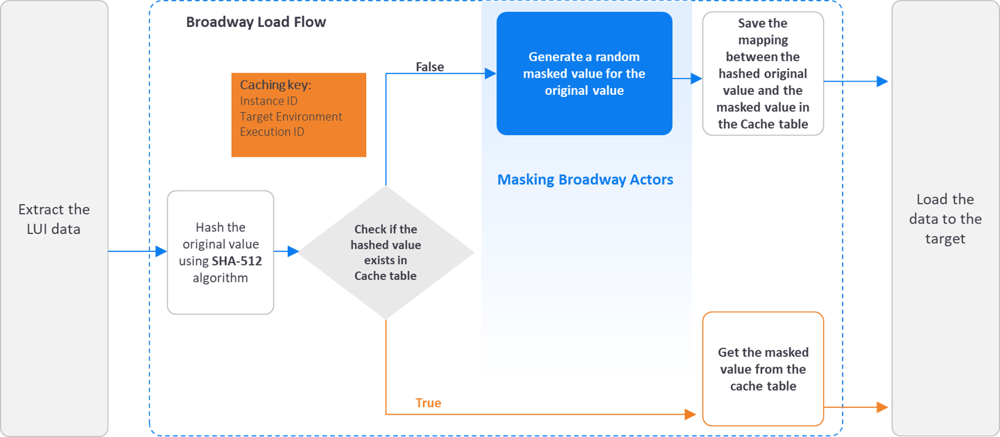

# Fabric Data Masking

Data Privacy laws compliancy requires the ability to mask data by hiding original values with modified content. 
Fabric provides a field-level API to protect data classified as Personal Identifiable Information, sensitive personal data, or commercially sensitive data.

To ensure that the data is still valid for you data lifecycle management, the data will look real and appear consistent.

This capability can be used to conduct tests, implement data transformations, or serve anonymized data to external third parties via web services or queue messages.

## Masking Flow

 The masking of a sensitive data can be done either by the [LUI sync](/articles/14_sync_LU_instance/01_sync_LUI_overview.md) using the [LU Table Population Broadway Flow](/articles/07_table_population/14_table_population_based_Broadway.md) (which masks the data before it is saved into Fabric), or by using a Broadway flow to mask the LUI data before it is loaded to the target.

The following diagram describes the masking process of a sensitive data **by the LUI sync**:

The following diagram describes the masking process of a sensitive data **before loading the data to the target**:

### Broadway Masking Actors

Broadway provides a various number of masking actors that can be used to mask sensitive fields like SSN, credit card numbers, email addresses, zip code or sequences, before they are loaded into a target Database or even into Fabric.

#### Customized Masking Logic 

K2view enables the users to create their own masking functions. The **MaskingLuFunction** Broadway actor can be used to call a customized function to mask the required field.  The use of **MaskingLuFunction** guarantees the usage of the K2view masking mechanism including the **SHA-256 hashing** and the caching.  The user does not need to handle them by their customized function.

### Masking Actors Properties

#### Target Value Uniqueness

- The user can decide whether the masked value is unique per original value (hashed value) or it can be used for more than one original value. For example, masked SSN must be unique, but masked Family Name can be the masked value of different original values. 

#### Cache with Expiration date

- Each cached link of hashed value to masked value can have TTL (Time To Leave) and it will be expired once the TTL is reached, and the original value will be masked again

#### Caching Level Parameters

- The caching of the masked values can be saved on different levels based on the user’s input. Each one of the following parameters can be enabled or disabled from being part of the **Caching key**:
  - Instance ID
  - Target Environment
  - Execution ID

Click [here](/articles/19_Broadway/actors/07_masking_and_sequence_actors.md) to read how to use fabric's masking Broadway actors.

## De-Anonymization

In some cases there is a business need to get the original value of the masked LUI. For example, get the mail address to contact the customer. 

We recommend on two alternatives to get the original value of the masked field (de-anonymization):

- Keep the source Instance ID in Fabric and use to retrieve the original data from source system.

- Keep the original values in Fabric and send the anonymized (masked) data to target system. Encrypt the LUI in Fabric to protect the sensitive data. where In Fabric each instance is encrypted separately.

  Click [here](/articles/26_fabric_security/03_fabric_LUI_encryption.md) for more information about the LUI encryption.

